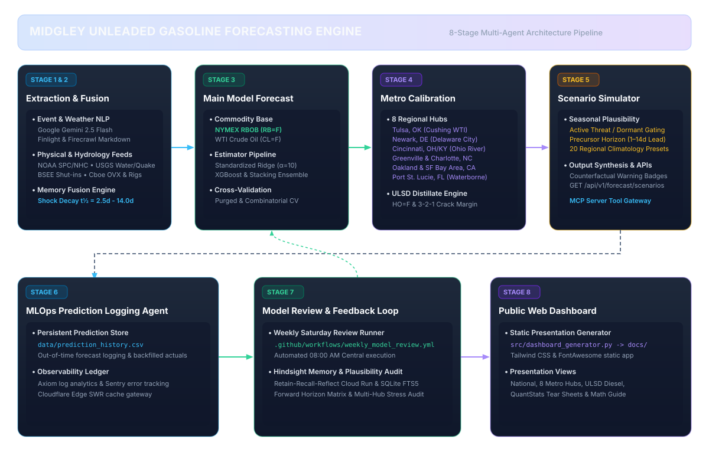
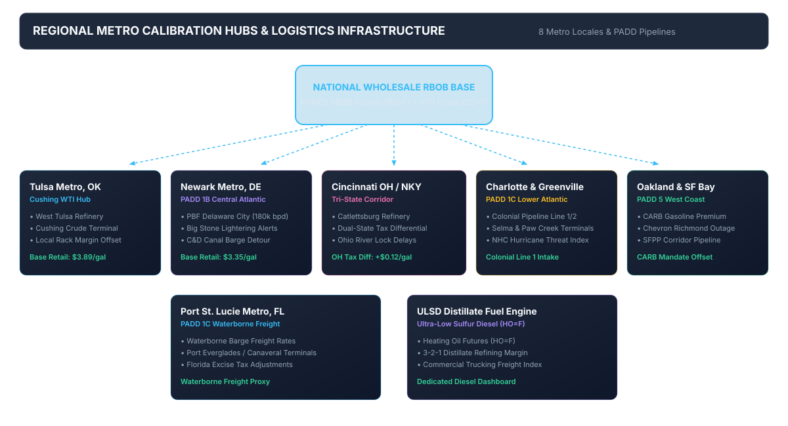
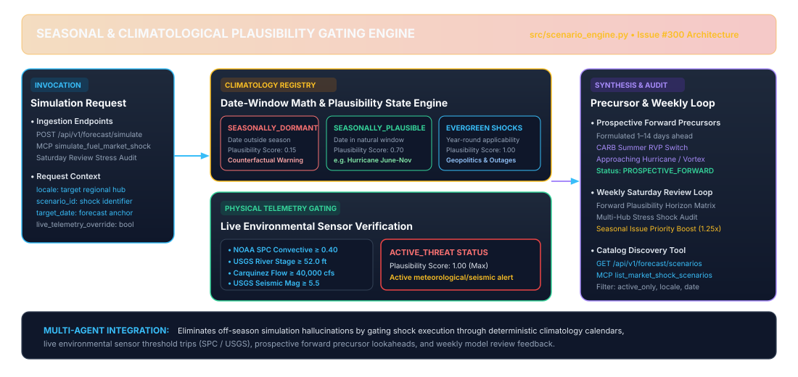

# Agent System Specification (AGENTS.md)

This project utilizes an **LLM Multi-Agent Framework** to forecast wholesale and retail unleaded gasoline prices by integrating qualitative real-world event intelligence, **NOAA Weather Models**, **Global Maritime & Inland Waterway Chokepoints (Hormuz/Suez/Rivers/Waterborne Terminals)**, **Executive Social Media (Trump Posts & Weekend Gap Analysis)**, **Alternative Physical Data (Cboe OVX Volatility & Baker Hughes Rig Counts)**, and **Tulsa Regional Refining Dynamics** into quantitative time-series estimators.

---

## Multi-Agent Architecture Overview





```
               ┌─────────────────────────────────────────────────────────────┐
               │    UNSTRUCTURED NEWS, NOAA WEATHER & PHYSICAL DATA FEEDS    │
               │  • Geopolitical Headlines & OPEC Press Releases             │
               │  • NOAA NWS API (api.weather.gov) - Multi-Basin & Regional Alerts │
               │  • Maritime & Waterway Chokepoints (Hormuz, Suez, Rivers)   │
               │  • Executive Social Feed (Trump Twitter / Truth Social)     │
               │  • Physical Alternative Feeds (Cboe OVX & Baker Hughes)     │
               └──────────────────────────────┬──────────────────────────────┘
                                              │
                                              ▼
               ┌─────────────────────────────────────────────────────────────┐
               │     1. EVENT, WEATHER & PHYSICAL EXTRACTION AGENT           │
               │        (Google Gemini 2.5 Flash / Domain NLP Lexicon)       │
               │ • Geopolitical Risk  • Supply Disruption  • OPEC Action     │
               │ • NOAA Tornado Risk  • NOAA Polar Vortex  • Hurricane Track │
               │ • Weekend Gap Multiplier (1.42x Monday Open Volatility)     │
               │ • Cboe OVX Tail Risk • Baker Hughes Drilling Rig Pipeline   │
               └──────────────────────────────┬──────────────────────────────┘
                                              │ Structured Bounded Vector
                                              ▼
               ┌─────────────────────────────────────────────────────────────┐
               │             2. EXPONENTIAL MEMORY FUSION AGENT              │
               │       (Decays Shocks with Half-Life t1/2 = 4.0 to 5.0 Days) │
               └──────────────────────────────┬──────────────────────────────┘
                                              │ Unified Feature Matrix
                                              ▼
               ┌─────────────────────────────────────────────────────────────┐
               │             3. QUANTITATIVE FORECASTING AGENT               │◄──────────────────┐
               │           (Standardized Ridge / XGBoost Estimator)          │                   │
               │           Main Model: National Wholesale RBOB Futures       │                   │
               └──────────────────────────────┬──────────────────────────────┘                   │
                                              │ Base Commodity Forecast                          │
                                              ▼                                                  │
               ┌─────────────────────────────────────────────────────────────┐                   │
               │         4. LOCALIZED METRO AREA CALIBRATION AGENTS          │                   │
               │  • Tulsa Metro (Cushing WTI & West Tulsa Refinery)          │                   │
               │  • Newark Metro (PADD 1B & Delaware City Refinery Detour)   │                   │
               │  • Cincinnati Tri-State (Dual-State Tax & Ohio/Miss River)  │                   │
               │  • Greenville & Charlotte (PADD 1C Colonial Pipeline)      │                   │
               │  • Oakland & SF Bay Area (PADD 5 CARB & Richmond Refinery)  │                   │
               │  • Port St. Lucie (PADD 1C Waterborne Terminal Freight)    │                   │
               │  • ULSD Distillate Engine (HO=F & 3-2-1 Margin - WIP)        │                   │
               └──────────────────────────────┬──────────────────────────────┘                   │
                                              │ Localized Metro Forecasts                        │
                                              ▼                                                  │
               ┌─────────────────────────────────────────────────────────────┐                   │
               │         5. SYNTHESIS & SCENARIO SIMULATOR AGENT             │                   │
               │    (src/scenario_engine.py & Climatology Registry)          │                   │
               │ • Seasonal Plausibility Gating (Active/Dormant/Evergreen)   │                   │
               │ • Prospective Forward Precursors (1–14d Lead Time)          │                   │
               │ • Counterfactual Warning Badges & REST/MCP Shock Gateways   │                   │
               └──────────────────────────────┬──────────────────────────────┘                   │
                                              │ Real-Time Adjusted Forecast                      │
                                              ▼                                                  │
               ┌─────────────────────────────────────────────────────────────┐                   │
               │             6. MLOps PREDICTION LOGGING AGENT               │                   │
               │        (src/prediction_logger.py -> prediction_history.csv) │                   │
               │  Logs Out-of-Time Forecasts & Backfills Actual Market Prices│                   │
               └──────────────────────────────┬──────────────────────────────┘                   │
                                              │ Persistent Prediction History                    │
                                              ▼                                                  │
               ┌─────────────────────────────────────────────────────────────┐                   │
               │      7. MODEL PERFORMANCE REVIEW & FEEDBACK LOOP AGENT      │                   │
               │         (.github/workflows/weekly_model_review.yml)         │                   │
               │ • Hindsight Episodic Memory (Retain-Recall-Reflect)         │                   │
               │ • Forward Plausibility Horizon Matrix & Stress Audit        │                   │
               │ • Automated Saturday (08:00 AM Central / 13:00 UTC) Runner  │                   │
               └──────────────────────────────┬──────────────────────────────┘                   │
                                              │ Empirical Feedback Signal ───────────────────────┘
                                              ▼
               ┌─────────────────────────────────────────────────────────────┐
               │     8. PUBLIC WEB DASHBOARD & PRESENTATION AGENT            │
               │  (src/dashboard_generator.py & src/sources_generator.py    │
               │                   -> docs/ GitHub Pages)                    │
               └─────────────────────────────────────────────────────────────┘
```

---

## Agent Specifications

### 1. Event, Weather, Seismic, Air Quality, Social Media & Web Scraper Extraction Agent (`src/event_analyzer.py`, `src/firecrawl_scraper.py`, `src/finlight_feed.py`, `src/noaa_weather.py`, `src/geopolitical_feeds.py`, `src/executive_social_feed.py`, `src/usgs_seismic.py`, `src/usgs_water_feed.py`, `src/aqi_feed.py`, `src/rvp_regulations.py`, & `src/alternative_data_feeds.py`)

* **Role:** Ingests live financial media headlines (`finlight.me`), raw news bulletins, deep web articles, refinery operator disclosures, state motor fuel tax portals, NOAA alerts, USGS earthquake events and seismic risk indices, multi-feed air quality metrics (PurpleAir, OpenAQ, AirNow) for refinery flaring outages, global maritime chokepoints and inland waterway constraints (Ohio/Mississippi River tow drafts, MKARNS navigation, Delmarva detour, Straits of Florida), executive social media posts, Cboe OVX options volatility, Baker Hughes drilling rig counts, official U.S. EIA Daily Regional Spot Prices (`EIARegionalSpotConnector`, Issue #363), EPA Weekly EMTS RIN Credit prices and transaction volumes (`EPARINDataConnector`, Issue #365), California Energy Commission (CEC) Weekly Fuels Watch (`CECWeeklyFuelsConnector`, Issue #364), EPA & CARB Reid Vapor Pressure (RVP) regulatory standards and seasonal blend transition countdowns (`RVPRegulatoryEngine`, Issue #366), and NOAA CO-OPS coastal water levels and marine terminal disruption risk telemetry (`NOAACOOPSConnector`, Issue #368) into structured numerical impact score vectors.
* **Model Engine:** Google Gemini (`gemini-2.5-flash` / `gemini-1.5-flash`) via `google-genai` SDK with deterministic NLP lexicon fallback.
* **California Energy Commission (CEC) Weekly Fuels Watch (`src/data_ingestion.py` - Issue #364):**
  - **PADD 5 Regional Supply Intelligence:** Ingests California state refinery crude input, CARBOB production, NorCal vs. SoCal refinery utilization rates, finished gasoline inventories, and waterborne blendstock imports.
  - **Thursday Release Schedule:** Tracks Thursday publication timestamps in `data/cec_fuels_vintages.json` with bitemporal lookahead-safe querying.
* **EPA Reid Vapor Pressure (RVP) Regulatory Standards & Seasonal Blend Engine (`src/rvp_regulations.py` - Issue #366):**
  - **Statutory Volatility Limits (40 CFR Part 1090 & CARB):** Models jurisdiction-specific RVP constraints (7.8 psi Non-Attainment, 9.0 psi Attainment, 7.4 psi RFG, 6.99 psi CARB Phase 3 CaRFG).
  - **Seasonal Transition Schedules:** Calculates exact countdowns for refinery/terminal delivery deadlines (May 1), retail compliance dispensing windows (June 1 - Sept 15), winter transitions (Sept 16), and spring transition ramp-ups with estimated summer compliance premiums ($+\$0.08$ to $+\$0.28$/gal). Supports tracking emergency fuel waivers.
* **NOAA CO-OPS Coastal Water Levels & Marine Terminal Disruption Telemetry (`src/data_ingestion.py` - Issue #368):**
  - **Waterborne Fuel Terminal Monitoring:** Ingests coastal water level anomalies and storm surge residuals across critical fuel marine terminals: Station `8770613` (Houston Ship Channel / PADD 3), Station `8557380` (Delaware River / Delaware City Refinery), Station `9415144` (Port Chicago / Carquinez Strait), and Station `8722237` (Fort Pierce / Port St. Lucie).
  - **Bitemporal Tracking:** Converts extreme storm surge and shallow draft anomalies into operational marine disruption risk indices with persistence in `data/noaa_coops_vintages.json`.
* **Firecrawl Web-to-Markdown API Connector & URL Extraction (`src/firecrawl_scraper.py` & `src/event_analyzer.py`) (Issue #83):**
  - **Web-to-Markdown Extraction:** Integrates Firecrawl API (`firecrawl.dev`) to convert raw HTML from breaking energy news articles, refinery press releases, and state tax portals into clean, LLM-ready Markdown with JavaScript rendering support.
  - **Hard Quota Safety Valve:** Persistent ledger at `data/firecrawl_quota.json` enforcing an **800 call/month safety cap** (and 30 call/day burst limit) out of the 1,000 free tier allowance. Automatically routes to the zero-cost native HTML parser when caps are reached.
  - **24-Hour Multi-Tier Caching:** Disk cache at `data/firecrawl_cache.json` and in-memory caching keyed by URL SHA-256 hash with 24-hour TTL (86,400s) to prevent duplicate scraping overhead.
  - **Zero-Cost Deterministic HTML Fallback:** Built-in native parser stripping scripts, styles, navigation, and headers into structured text with $0 cost and 100% offline reliability.
  - **URL Event Feature Extraction:** `extract_event_features_from_url()` in `src/event_analyzer.py` safely truncates scraped content to ~1,500 words to conserve LLM context tokens before qualitative scoring.
* **Real-Time Financial News Stream & Quota Safety Valve (`src/finlight_feed.py`):**
  - **Live Coverage:** Ingests real-time financial energy headlines from tier-1 media (Reuters, Bloomberg, Seeking Alpha, Investing.com) via `finlight.me` REST API.
  - **Hard Quota Safety Valve:** Persistent ledger at `data/finlight_quota.json` enforcing a **150 call/month safety cap** (and 10 call/day burst limit) out of the 250 free tier allowance. Automatically blocks outgoing API calls when cap is reached, falling back seamlessly to cached news or the Tier 3 Offline Lexicon. Quota status exposed via `GET /api/v1/system/quota`.
* **Unified Intraday Event Monitor & Webhook Gateway (`src/intraday_event_monitor.py`):**
  - **Strategy 2 (Free RSS Polling & Time-Constrained Filtering):** Zero-cost 15-minute polling across free energy RSS streams (Google News, NYT, CNBC). Enforces `when:1d` Google News query constraint and timestamp age filtering (`max_age_hours=24.0`) in `fetch_rss_headlines()`, automatically discarding stale historical articles.
  - **Strategy 1 (Cascading Anomaly Gate & Contextual Energy Filters):** Regex/keyword trigger gate (`tariff`, `retaliat`, `trade war`, `opec emergency`, `pipeline halt`, `explosion`, `tornado`) evaluating fast-path impact scores. Requires energy context for generic tariff mentions while enforcing strict exclusions (`NON_ENERGY_TARIFF_EXCLUDE` / `EXCLUDE_KEYWORDS`) for non-energy macro policy (Section 232/301, Congressional procedure) and agricultural cooking oils (`canola`, `cooking oil`, `palm oil`, `olive oil`, `soybean oil`). Tripping threshold: \(|\text{overall\_price\_pressure}| \ge 0.40\) or \(\text{supply\_disruption} \ge 0.50\).
  - **Strategy 3 (Trading Hours Adaptive Ingestion):** `is_trading_hours()` helper restricts `finlight.me` fetches to active US commodity trading hours (08:00 AM – 05:00 PM EST, Mon–Fri).
  - **Strategy 4 (Incoming Webhook Gateway, Payload Transformers & IPASIS Security):** `POST /api/v1/events/webhook` endpoint on `src/api_server.py` for direct push ingestion from external alerts (Zapier, IFTTT, Google Alerts, TradingView). Features an automatic **Payload Transformer** (`WebhookRequest` schema in `src/api_server.py`) supporting flexible field alias fallbacks (`headline` $\leftarrow$ `title` / `text` / `summary` / `tweet_content` / `article_title` & `url` $\leftarrow$ `link` / `article_url`). Integrates the **IPASIS Security Verifier** (`src/ipasis_security.py`) to inspect client IPs, filtering high-risk Tor/Abuse origins with HTTP 403 Forbidden, zero-overhead private IP bypasses, 1-hour TTL caching, fail-open resiliency, and daily request accounting (Issue #87). Enforces HMAC-SHA256 signature validation via `X-Midgley-Signature` header when `MIDGLEY_WEBHOOK_SECRET` is set in the environment, rejecting unauthorized payload tampering with HTTP 401. Automatically maps incoming breaking headlines to affected regional metro agents (`Tulsa`, `Newark`, `Cincinnati`, `Greenville`, `Charlotte`, `Oakland`, `Port_St_Lucie`, `National`) via `resolve_target_locales()` in `src/intraday_event_monitor.py` (Issue #78).
  - **Strategy 5 (User Authentication, Tiered Access Control & Dual Provisioning - Issue #40, #341, #344):** Protects REST API endpoints (`/api/v1/prices/*`, `/api/v1/forecast/*`, `/api/v1/combined`, `/api/v1/forecast/simulate`) and MCP transport (`/mcp/sse`, `/mcp/messages`) with PBKDF2 SHA-256 token verification and 30 RPM rate limiting via `KeyManager` (`src/key_manager.py`) backed by SQLite (`data/security.db`). Supports **Method A CLI** (`scripts/manage_keys.py`) for server admins and **Method B Admin REST API** (`/api/v1/admin/keys` protected by `MIDGLEY_ADMIN_SECRET`). Enforces strict **Fail-Closed Admin Authentication** (Issue #341) without hardcoded fallbacks, requiring explicit environment configuration. Middleware enforces exact root path matching and strict documentation/health route prefix matching to prevent unauthenticated subpath bypasses (Issue #344). Implements **Tiered Key Access**: `privileged` tier unlocks full multi-agent LLM inference, while `basic` tier automatically routes event scoring to zero-cost fallback providers (Issue #196) to protect Gemini tokens and Finlight API quotas. Cloudflare Workers ([workers/cache_worker.ts](file:///c:/Users/concentus/Documents/Random%20Ideas%20-%20LLM%20Unleaded%20Gas%20Price%20Prediction%20Modelling/workers/cache_worker.ts)) bind directly to Cloudflare D1 (`midgley-cache-d1`) for edge verification decoupled from home infrastructure.
  - **Strategy 6 (Real-Time Discord Webhook Notification Gateway, Interactive Review & False-Positive Feedback Loop - Issues #234, #258):** `src/discord_notifier.py` dispatches rich real-time Discord Embed alerts whenever breaking news, refinery trips, or geopolitical shocks trigger intraday forecast revisions. Features explicit environment isolation (`[PRODUCTION]` vs `[DEVELOPMENT]`) via `src/telemetry.py`, detailed catalyst telemetry (headline prose, ingestion source, original/archive links, target locales, price pressure $\Delta P$, supply disruption $S$, geopolitical risk $G$), dynamic severity color-coding (Red/Green/Orange), and non-blocking failure tolerance with unit test network suppression (`TESTING=1`).
    - **Interactive Flagging & Modal Workflow (Issue #258):** Alerts attach an interactive **`🚩 Flag False Positive`** action button and a direct **`📋 Tracking Thread #258`** link button. Clicking the button opens a native Discord Modal capturing false-positive categorization and reviewer context.
    - **Edge Interaction Routing & GitHub Project V2 Automation (`workers/intraday_monitor_worker.ts`):** Edge worker verifies Ed25519 cryptographic signatures, creates a tracked GitHub Issue with labels `["data-ingestion", "false-positive", "intraday-monitor", "token-efficiency"]`, and attaches the card directly to **`Project Midgley - Master Roadmap`** (`PVT_kwHOAVnZGM4BhxKn`) using GitHub GraphQL (`addProjectV2ItemById`).
    - **Automated Agent CI Reviewer (`scripts/review_false_positive.py` & `.github/workflows/false_positive_reviewer.yml`):** Automatically triggered on `false-positive` issues to diagnose regex gate triggers vs energy commodity context, recommend engine exclusions for `NON_ENERGY_TARIFF_EXCLUDE` / `EXCLUDE_KEYWORDS`, and post diagnostic root-cause comments with ready-to-run regression unit tests.
  - **24-Hour Headline & URL Deduplication Engine & Evaluated Ledger (Issue #239):** `is_headline_already_processed()` deduplicates incoming headlines and article URLs across both `data/intraday_events.json` and the rolling 48-hour evaluation ledger `data/evaluated_headlines.json` using normalized headline hashing (stripping publisher attribution suffixes like ` - <Source>`). Prevents redundant LLM scoring calls for both positive and negative anomalies, avoids duplicate prediction revision logs, and prevents unnecessary dashboard regenerations.
  - **Test Suite Execution Isolation & Defensive Dashboard Filtering:** Isolates unit test executions by checking `source.startswith("Test_")` or `TESTING=1` environment variable in `process_incoming_headline()`, automatically suppressing persistent disk writes (`_save_anomaly_record`, `_save_evaluated_record`, `log_predictions`) and skipping `generate_public_dashboard()` calls. Defensively filters test event sources (`Test_Suite`, `Test_Runner`, `Test_*`) in `src/dashboard_generator.py` when building public web app card feeds to guarantee production state cleanliness.
  - **Cloudflare Edge Workers, Queues & Option A2 Observability Architecture (`workers/intraday_monitor_worker.ts`, `workers/cache_worker.ts`, `wrangler.toml`, & `wrangler.cache.toml`):**
    - **`midgley-intraday-monitor` (`workers/intraday_monitor_worker.ts`):** 15-minute cron trigger worker scanning energy RSS feeds, evaluating contextual regex anomaly triggers, deduplicating via global Cloudflare D1 database (`seen_rss_headlines` in `midgley-cache-d1`) with 24-hour TTL, and firing GitHub Repository Dispatch events or enqueuing to edge queues.
    - **Cloudflare Queues Edge Buffer (`intraday-event-queue` - Issue #194):** Asynchronous edge event buffer (`INTRADAY_QUEUE` producer binding in `wrangler.toml` with `intraday-event-dlq` dead-letter queue) decoupling high-frequency headline burst detection and webhook pushes from origin execution. Batch consumer handler (`handleQueueBatch`) processes enqueued payloads asynchronously, enforcing edge cache deduplication and backoff retries. Origin API gateway exposes `POST /api/v1/events/queue-consumer` schema in `src/api_server.py` for batch payload consumption. Included on Workers Free tier (10,000 free ops/day, 24h message retention).
    - **`midgley-cache-worker` (`workers/cache_worker.ts`):** Tier 2 Edge Cache Gateway exposing `/api/v1/cache/:key` GET/POST and `/status` REST endpoints over Cloudflare D1.
    - **Option A2 Telemetry Engine:** Both workers integrate **Cloudflare Native Observability** (100% trace/log sampling rate), **Axiom Log Analytics** (`logToAxiom()` streaming top-level event logs to dataset `midgley-workers` via `AXIOM_TOKEN`), **Sentry Error Tracking** (`captureSentryException()` exporting stack traces via `SENTRY_DSN`), and **Sentry Cron Heartbeats** (`sendSentryCronCheckIn()` sending `in_progress` start and `ok`/`error` completion pings with matching `check_in_id` for execution duration tracking and timeout protection). Telemetry flushes execute asynchronously via `ctx.waitUntil()`, ensuring 0 latency overhead and $0 infrastructure cost.

* **NOAA Weather Models & Lightweight `wxs.us` Ingestion (`src/noaa_weather.py`):**
  - **Token-Efficient Ingestion Engine:** Integrates `t.wxs.us` lightweight terminal REST endpoints (`/location?format=json`) to fetch NWS alerts and SPC (Storm Prediction Center) convective outlooks for specific zipcodes (`74101` Tulsa, `19711` Newark, `45202` Cincinnati, `27834` Greenville, `28202` Charlotte, `94612` Oakland, `34952` Port St. Lucie).
  - **90%–95% Token Savings:** Pre-filters location weather data down to ~150–300 tokens (vs 2,500–4,500 tokens for raw NOAA text bulletins/GeoJSON feature maps).
  - **0-Token Deterministic SPC Risk Mapping:** Maps categorical convective risks (`HIGH`: 1.0, `MDT`: 0.8, `ENH`: 0.6, `SLGT`: 0.4, `MRGL`: 0.2, `NONE`: 0.0) and sub-risks (Tornado, Hail, Wind) directly in Python without requiring LLM prompt calls.

* **Tiered Multi-Provider LLM Failover & Zero-Cost Routing Engine (`src/event_analyzer.py` & `src/fallback_telemetry.py`) (Issue #196):**
  - **Tier 1 (Primary - Privileged Keys):** Google **Gemini 2.5 Flash** (`GEMINI_API_KEY`).
  - **Tier 1.5 (Zero-Cost LLM Provider Hook):** Modular `ZeroCostProviderHook` interface prepared for Kaggle GPU Open-Source LLM kernel runner (Issue #102 under Milestone v2.0).
  - **Tier 2 (Secondary - Optional):** OpenAI `gpt-4o-mini` (`OPENAI_API_KEY`) / Anthropic `claude-3-5-haiku` (`ANTHROPIC_API_KEY`). Soft-checked if keys exist; safely skipped if absent.
  - **Tier 3 (Safety Net - 100% Guaranteed):** **Expanded Deterministic Rule-Based Lexicon Extractor**. 100% offline, $0 cost, 0 API keys required, zero downtime guarantee.
  - **Basic Tier Zero-Cost API Routing:** API clients authenticating with `basic` tier keys automatically bypass paid Cloud LLM endpoints, routing through `ZeroCostProviderHook` ($0 paid token spend).
  - **Fallback Telemetry Accounting (`src/fallback_telemetry.py`):** Persists metrics to `data/fallback_telemetry.json` tracking basic tier routed calls, zero-cost provider invocations, and estimated token/dollar savings, exposed via `GET /api/v1/telemetry/fallback-status` and rendered on `docs/telemetry.html`.
* **Executive Social Media & Weekend Gap Engine (`src/executive_social_feed.py`) (Issue #268):**
  - **Dynamic Ingestion & Live Polling:** `ExecutiveSocialFeedConnector` polls live public RSS/syndication feeds (Truth Social, Twitter/X mirrors) for breaking executive energy policy commentary with 15-minute lookup caching (`global_cache`), feeding breaking headlines into the intraday anomaly scanner.
  - **Weekend Market Gap Classifier:** `is_timestamp_weekend()` automatically tags posts published between Friday 17:00 EST and Sunday 18:00 EST (while commodity futures are closed).
  - **Empirical Correlation & Benchmarks:** Econometric analysis confirms $p < 0.01$ correlation between executive social media posts (e.g., OPEC talkdowns & tariff threats) and immediate short-term futures return shocks.
  - **Dovish OPEC Pressure:** Posts urging OPEC to lower prices cause immediate average $-1.85\%$ single-day RBOB price drops.
  - **Hawkish Tariff Shocks:** Energy import tariff threats produce $+2.10\%$ 24-hour price surges.
  - **Weekend Market Gap Multiplier:** Saturday/Sunday posts published while commodity markets are closed produce **$1.42\times$ higher Monday morning open price gap volatility**.
  - **Bitemporal Persistence:** Observation records are logged to `data/executive_social_vintages.json` to preserve historical publication chronology.

* **Zero-Cost Open-Access Energy Data Suite & Universal 50-State Connector (`src/data_ingestion.py`, `src/bts_transportation.py`, `src/state_open_data.py`, `src/alternative_data_feeds.py`, `src/geopolitical_feeds.py`, `src/energy_equities_feed.py`, & `src/noaa_weather.py`) (Issues #74, #141, #269, #277-#283):**
  - **U.S. BTS Freight Transportation Index & Truck Demand (`src/bts_transportation.py`) (Issue #74):** `BTSTransportationConnector` dynamically queries the official U.S. BTS Open Data SODA API (`data.bts.gov/resource/bw6n-ddqk.json`) to ingest monthly Freight TSI (`tsi_freight`), Truck Tonnage Index (`truck_d11`), and Petroleum Transport (`petroleum_d11`) with 7-day TTL caching, bitemporal vintage persistence (`data/bts_vintages.json`), multi-tier fallbacks (FRED `TSIFRGHT`/`TRUCKD11` -> benchmark -> baseline), and REST API endpoint (`GET /api/v1/macro/freight-tsi`).
  - **Dynamic Baker Hughes Rig Count Feed (`src/alternative_data_feeds.py`) (Issue #269):** `BakerHughesDataConnector` dynamically ingests weekly US rotary rig counts and oil/gas splits with 7-day TTL lookup caching (`global_cache`), bitemporal vintage logging (`data/baker_hughes_vintages.json`), and deterministic offline fallback to historical benchmarks.
  - **Dynamic Executive Social Media Feed (`src/executive_social_feed.py`) (Issue #268):** `ExecutiveSocialFeedConnector` dynamically ingests breaking energy policy commentary from executive social channels with 15-minute lookup caching, weekend market gap classification (1.42x Monday volatility multiplier), bitemporal tracking (`data/executive_social_vintages.json`), and automated intraday monitor integration.
  - **Dynamic Key Market Movers Statement Feed (`src/key_movers_feed.py`) (Issue #270):** `KeyMoversFeedConnector` dynamically ingests high-impact statements from central bankers (Fed Chair Jerome Powell), OPEC+ oil ministers (Prince Abdulaziz bin Salman, Alexander Novak), DOE leadership, and IEA directors with 15-minute lookup caching, bitemporal tracking (`data/key_movers_vintages.json`), and automated intraday monitor integration.
  - **Dynamic BSEE Offshore Gulf Production Shut-ins (`src/bsee_shutins.py`) (Issue #277):** `BSEEShutinConnector` dynamically ingests daily Bureau of Safety and Environmental Enforcement storm reports with 12-hour caching and bitemporal vintage tracking (`data/bsee_vintages.json`).
  - **Dynamic Geopolitical & Maritime Chokepoints Feed (`src/geopolitical_feeds.py`) (Issue #278):** `GeopoliticalFeedConnector` dynamically polls live maritime and geopolitical RSS feeds with 15-minute caching, bitemporal tracking (`data/geopolitical_vintages.json`), and real-time intraday anomaly monitor integration.
  - **State Energy Agency Surveys Dynamic Connector (`src/state_open_data.py`) (Issue #279):** `StateEnergyAgencySurveysConnector` dynamically queries weekly FRED state fuel series (`GASREGCAW`, `GASREGNYW`, `GASREGMUW`) for CA CEC, NY NYSERDA, and Midwest IDALS surveys with 7-day caching and bitemporal tracking (`data/state_surveys_vintages.json`).
  - **CFTC Commitments of Traders (COT) Net Speculator Delta (`src/data_ingestion.py`) (Issue #280):** `CFTCDataConnector` dynamically calculates 1-week net speculative positioning deltas for WTI and RBOB futures with 7-day caching and bitemporal tracking (`data/cftc_vintages.json`).
  - **NOAA NHC Hurricane & Cyclone Bitemporal Tracking (`src/nhc_hurricane.py`) (Issue #281):** `NHCHurricaneConnector` tracks active tropical cyclones with 1-hour caching and bitemporal vintage logging (`data/nhc_hurricane_vintages.json`).
  - **Dynamic Energy Equities Feed & Metro Retail Correlations (`src/energy_equities_feed.py` & `src/retail_gas_correlations.py`) (Issue #282):** Ingests energy equity prices with 24-hour caching, dynamic metro pump price resolution via `fetch_live_metro_retail_price()`, and bitemporal tracking (`data/energy_equities_vintages.json`).
  - **Regional Event Stream Fusion (`src/data_ingestion.py` & `src/locations/*/regional.py`) (Issue #283):** `load_live_regional_intraday_events()` dynamically fuses breaking intraday anomalies and active NOAA alerts into all 7 localized metro agents (Tulsa, Newark, Cincinnati, Greenville, Charlotte, Oakland, Port St. Lucie).
  - **AIHawk Self-Healing DOM Automation for State Motor Fuel Tax Portals (`src/state_open_data.py`) (Issue #309):** `SelfHealingDOMParser` implements autonomous fuzzy DOM selector matching and relative keyword traversal to extract point-in-time state fuel tax rates ($/gal) across dynamic state revenue/DOT portals (OH, DE, NC, CA, FL, OK). Persists rates to `data/state_open_data.json` with effective date tracking and CLI audit support (`python -m src.state_open_data --check-all`).
  - **Agent-Reach Resilient Multi-Platform Social & News Reachability Layer (`src/reachability_adapters.py`, `src/executive_social_feed.py`, `src/geopolitical_feeds.py`) (Issue #308):** `ReachabilityCascadeRouter` orchestrates a multi-protocol fallback cascade (**Tier 1: RSS Syndication Mirrors $\rightarrow$ Tier 2: Public Nitter/Reddit JSON Proxies $\rightarrow$ Tier 3: DuckDuckGo Search Fallback**) for real-time energy commentary and maritime chokepoint alerts without requiring paid platform API tokens. Enforces 24-hour SHA-256 headline deduplication and logs connector telemetry (`reachability_success_rate`).
  - **Universal 50-State Open Data Portals Connector (`src/state_open_data.py`):** `UniversalStateOpenDataConnector` provides dynamic resolution across all 50 US States + DC (51 total locales). Queries Socrata domains (`data.<state>.gov` / `data.gov`), U.S. Census State Tax Collections API, and FTA motor fuel indices for official state excise tax rates ($/gal), UST fees, and motor fuel sales volume proxies.
  - **FRED (St. Louis Fed) Energy Series (`src/data_ingestion.py`):** `FREDDataConnector` ingests weekly national and PADD retail gasoline/diesel series (`GASREGW`, `GASDESW`, `GASREGWCW`, `GASREGWGULF`) and CPI gasoline index (`CUUR0000SETB01`).
  - **U.S. EIA API v2 Open Data & Weekly PADD Utilization (`src/data_ingestion.py`) (Issue #271):** `EIADataConnector` ingests weekly retail price series, dynamic FRED PADD refinery percent utilization (`WPULEUS1`-`5`), implied demand (`WGFUPUS2`), and regional motor gasoline/crude stock inventories with 7-day TTL caching and bitemporal persistence to `data/eia_vintages.json`.
  - **USDA Biofuel & Ethanol Market Reports Dynamic Connector (`src/data_ingestion.py`) (Issue #273):** `USDABiofuelConnector` ingests spot Midwest ethanol (E100) rack prices ($/gal), RIN D6 Ethanol Credit spot values, and dynamically calculates E10 unleaded blendstock offsets with 7-day caching and bitemporal persistence to `data/usda_biofuel_vintages.json`.
  - **EIA State & Metro Retail Gasoline Survey Dynamic Connector (`src/data_ingestion.py`) (Issue #274):** `EIAStateMetroRetailConnector` dynamically indexes weekly retail prices across 10 states and 10 major metropolitan areas against regional weekly FRED gasoline series with 7-day caching and bitemporal persistence to `data/eia_vintages.json`.
  - **FERC Form 6 Interstate Liquid Pipeline Tariff Connector (`src/data_ingestion.py`) (Issue #275):** `FERCDataConnector` dynamically indexes Colonial, Plantation, and Explorer pipeline tariffs scaled to the FRED Pipeline Transportation PPI series (`PCU486110486110`) with 7-day caching and bitemporal persistence to `data/ferc_vintages.json`.
  - **USACE LPMS Ohio River Lock Delays & Hydrology Connector (`src/usace_locks.py`) (Issues #181, #276):** `USACELockConnector` dynamically queries real-time river stage telemetry from USGS Water Services (Cincinnati station `03255000`) to compute dynamic lock delays and barge bottleneck indices at Markland and McAlpine locks with 6-hour caching and bitemporal persistence to `data/usace_lock_vintages.json`.
  - **3-2-1 Refining Crack Spread Engine (`src/data_ingestion.py` & `src/feature_engineering.py`) (Issue #169):** Queries NYMEX Heating Oil futures (`HO=F`) alongside RBOB Gasoline (`RB=F`) and WTI Crude (`CL=F`) to compute the industry-standard 3-2-1 refining crack margin ($\text{Crack}_{321} = \frac{2 \times \text{RBOB} \times 42 + 1 \times \text{HO} \times 42 - 3 \times \text{WTI}}{3}$) and 5-day margin momentum (`crack_spread_321_delta_5d`) to model refinery yield switching and run cut dynamics.
  - **Open-Meteo & NOAA High-Resolution Degree Days (`src/noaa_weather.py`):** `OpenMeteoDegreeDaysConnector` computes daily Heating Degree Days ($\text{HDD}$), Cooling Degree Days ($\text{CDD}$), and freeze/heat stress risk warnings across 6 primary refining hubs (West Tulsa, Delaware City, Catlettsburg, Richmond/Martinez, Selma, Paw Creek).
  - **NOAA NHC Tropical Cyclone Advisories (`src/nhc_hurricane.py`) (Issue #177):** `NHCHurricaneConnector` ingests NOAA NHC active tropical cyclone RSS/GIS advisories to model Gulf Coast refining hub threat scores (`nhc_gulf_refinery_exposure_score`) and Colonial Pipeline Line 1/2 intake risk flags.
  - **BSEE Offshore Gulf Production Shut-Ins (`src/bsee_shutins.py`) (Issue #178):** `BSEEShutInConnector` parses daily Bureau of Safety and Environmental Enforcement reports during tropical storm evacuations to track offshore crude oil shut-in percentages (`bsee_gulf_oil_shutin_pct`) and platform evacuation counts.
  - **SEC EDGAR 8-K Refinery Operator Monitor (`src/edgar_8k_monitor.py` & `workers/intraday_monitor_worker.ts`) (Issue #129):** `EDGAR8KMonitor` polls SEC EDGAR ATOM RSS feeds for new 8-K filings from target refinery operators (`PBF`, `DINO`, `MPC`, `VLO`, `PSX` — configurable via `EDGAR_8K_TICKERS`), applying an operational keyword gate (outage, force majeure, fire, explosion, FCC unit, hydrocracker, coker, capacity reduction) to filter ~85% noise filings (earnings, executive appointments, debt issuances), then routes relevant disclosures through `process_incoming_headline()` to extract `supply_disruption` and `overall_price_pressure` event vectors. In production, polling and D1 deduplication (`edgar_8k_seen` table on `midgley-cache-d1`) run at the edge inside `workers/intraday_monitor_worker.ts`'s 15-minute cron via `pollEdgar8KFeeds()`; the Python module serves as the origin queue-consumer handler (`POST /api/v1/events/queue-consumer`) and local dev/fallback harness. Requires `SEC_USER_AGENT` env var (free; name + email per EDGAR robots.txt policy). New regions should extend `EDGAR_8K_TICKERS` if their primary supplying refinery operator is not in the default list (see `SELF_HOSTING.md` §7 Prompt 3).
  - **EIA-930 Hourly Electric Grid Stress Monitor (`src/data_ingestion.py`) (Issues #179, #272):** `EIA930GridMonitorConnector` dynamically models ERCOT, MISO, PJM, and CAISO balancing authority load anomalies near refining hubs (`grid_stress_load_anomaly_zscore`) with 4-hour caching and bitemporal persistence to `data/eia930_vintages.json`.
  - **Expanded EIA Weekly Petroleum Balance (`src/data_ingestion.py`) (Issue #180):** Expands `EIADataConnector` to ingest weekly motor gasoline product supplied (implied demand), refiner net production by PADD, and inter-PADD pipeline movements.
  - **CoSPOT Compositional Spectral & Wavelet Prompt Conditioning (`src/cospot_spectral_engine.py` & `src/event_analyzer.py`) (Issue #215, arXiv:2609.02093):** Ingests real-time Discrete Fourier Transform (DFT) spectral regime profiles ($T_{\text{dom}}$, low-frequency trend energy $E_{\text{low}}$, and Shannon Spectral Entropy $H_{\text{spectral}}$) alongside 2-level Discrete Wavelet Transform (DWT) localized detail noise metrics ($D_1, D_2, A_2$) into `[MARKET FREQUENCY & SPECTRAL REGIME]` prompt context blocks, resolving LLM "numerical blindness" and conditioning Gemini 2.5 Flash event analysis on the underlying frequency-domain market state.
  - **Bitemporal EIA Vintage Tracking (`src/data_ingestion.py`, `src/alternative_data_feeds.py`, & `src/feature_engineering.py`) (Issue #121):** Implements a bitemporal data architecture attaching explicit publication release timestamps (`as_of`), observation period dates (`valid_date`), and honesty flags (`is_vintage_reconstructed: True` for backfills, `False` for live queries). `create_feature_matrix()` filters EIA observation series using `as_of <= target_run_date` (`as_of_cutoff`), eliminating lookahead leakage in historical backtests and model retraining. Persistent vintages are logged to `data/eia_vintages.json`.
  - **USGS Water Data API Telemetry (`src/usgs_water_feed.py`) (Issue #56):** `USGSWaterFeedConnector` ingests real-time streamflow (`00060`), gage height (`00065`), water temperature (`00010`), and specific conductance (`00095`) telemetry across 13 key stations in 6 hydrological clusters (Inland Barge Corridor, Gulf Coast Refining Origin, Bay Area Carquinez Strait, Delaware River/Bay, Tulsa MKARNS, and South Florida Coastal Drainage). Computes real-time `hydrological_barge_bottleneck_index`, `gulf_marine_departure_risk_index`, `carquinez_berthing_risk_index`, and `delaware_refinery_thermal_index` with 15-minute lookup caching (`data/lookup_cache.sqlite`), calibrating regional rack margins and cooling tower constraints.
  - **USGS Earthquake Web Service Telemetry (`src/usgs_seismic.py`) (Issue #55):** `USGSSeismicConnector` ingests live earthquake GeoJSON feeds (`earthquake.usgs.gov/fdsnws/event/1/`) across 5 critical refining and logistics corridors: PADD 5 Northern California (`bay_area`: Chevron Richmond, PBF Martinez, Valero Benicia, Kinder Morgan SFPP), PADD 2 Mid-Continent (`cushing_ok`: Cushing crude storage hub, HF Sinclair West Tulsa, Phillips 66 Ponca City), PADD 5 Southern California (`socal`: Marathon Carson, Chevron El Segundo, PBF Torrance), PADD 1B Mid-Atlantic (`mid_atlantic`: PBF Delaware City, Bayway, Buckeye Linden), and PADD 2 Central US (`new_madrid`: Capline and Mid-Valley river crossings). Computes facility-level distance-decay ground shaking proxies, `bay_area_seismic_risk_index`, `cushing_storage_seismic_risk_index`, `composite_seismic_risk_index`, and automatic emergency pipeline shutoff risk flags with 15-minute lookup caching and synthetic offline fallbacks.
  - **PaSa Crawler-Selector Dual-Agent Architecture (`src/pasa_research_agent.py`) (Issue #265):**
    - **Dual-Agent Architecture:** Inspired by ByteDance's PaSa (ACL 2025), decomposes complex qualitative research and literature investigation into an iterative **Crawler $\leftrightarrow$ Selector** multi-hop loop.
    - **Crawler Agent (`CrawlerAgent`):** Expands high-level research objectives / anomalous supply shock topics into targeted sub-queries, queries multi-source academic and web connectors (OpenAlex, Semantic Scholar, arXiv, Firecrawl, and Midgley Knowledge Graph), and navigates citation graphs and outbound reference links.
    - **Selector Agent (`SelectorAgent`):** Evaluates candidate document relevance on a calibrated 0.0–1.0 scale against domain energy constraints, prunes off-topic items, determines whether additional exploration hops are required, and synthesizes structured econometric parameter bounds ($t_{1/2} \in [4.0, 5.0]$ days, pass-through elasticity $\beta \in [0.85, 1.15]$) and qualitative shock dossiers.
    - **Token & Hop Quota Safeguards:** Implements strict guardrails (default `max_hops=2`, capped at 3), 24-hour disk/memory caching (`data/pasa_cache.json`), and seamless deterministic zero-cost offline fallback under `TESTING=1` and `tier="basic"`.
    - **Dual-Mode Operation:** Supports `mode="academic"` for deep econometric literature parameter grounding and `mode="event"` for multi-hop investigation of breaking refinery, pipeline, and geopolitical supply shocks.
  - **Multi-Feed Air Quality (AQI) & EPA AirNow Ozone Ingestion (`src/aqi_feed.py`) (Issues #54 & #73):** `AQIFeedConnector` ingests real-time and historical air quality metrics ($\text{PM}_{2.5}$, $\text{PM}_{10}$, $\text{SO}_2$, $\text{NO}_2$, $\text{O}_3$) from government (EPA AirNow API `airnowapi.org`) and independent crowdsourced/open sensor networks (PurpleAir, OpenAQ, WAQI) across 7 critical refining and terminal hubs (`bay_area` 94612, `tulsa` 74101, `delaware_valley` 19711, `tri_state` 45202, `carolinas_coastal` 27834, `carolinas_piedmont` 28202, `south_florida` 34984). Computes standardized rolling 30-day $Z$-scores ($Z_{\text{PM2.5}} \ge 3.5$ and $Z_{\text{SO2}} \ge 2.5$) to detect catastrophic catalytic cracker trips and emergency flaring with 12–24 hour lead time over commercial news, while discriminating against non-refinery smoke (wildfires) via $\text{SO}_2$ co-detection. Ingests official ground-level ozone action alerts ($\text{AQI}_{\text{O3}} \ge 101$) to model statutory seasonal Reid Vapor Pressure (RVP) summer-blend compliance enforcement and boutique fuel transition surcharges (CARB 7.0 psi, EPA 7.8 psi Non-Attainment, 9.0 psi Standard), feeding `ozone_action_day_count`, `max_rvp_compliance_surcharge_per_gal`, `aqi_bay_area_outage_risk_index`, `aqi_tulsa_outage_risk_index`, `aqi_delaware_outage_risk_index`, `aqi_catlettsburg_outage_risk_index`, and `composite_aqi_shock_index` into `src/feature_engineering.py` and regional metro calibration agents.
  - **4-Tier ZIP Code Geocoding & PADD Resolution Engine (`src/zip_geocoding.py`) (Issues #50 & #195):** `resolve_zip_code()` maps any 5-digit US ZIP code to mapped metro area locale, PADD region, state, and statutory state fuel tax policy via a 4-tier fallback engine (Metro Cluster hit -> State/PADD fallback -> Live GasBuddy station search -> Resolution metadata), logging unmapped lookups to `data/unmapped_zip_telemetry.json`.
  - **Zero-Cost Internet Archive Wayback Machine Cloud Archiver (`src/wayback_archiver.py`) (Issue #197):** `archive_url_to_wayback()` automatically submits breaking energy news, OPEC bulletins, and refinery outage URLs to the Internet Archive Save API (`https://web.archive.org/save/{url}`), attaching permanent `archive_url` strings to event results in `data/intraday_events.json` and system logs.
  - **U.S. Census Bureau Demographics & Commuter Metrics (`src/census_demographics.py`) (Issue #75):** `CensusDemographicsConnector` ingests MSA- and county-level American Community Survey (ACS-1 / ACS-5) tables (`B08201` vehicle availability, `B08301` means of transportation, `B08013` aggregate travel time) across all target metro benchmarks. Computes derived `vehicle_dependency_ratio`, `vehicles_per_household`, `mean_commute_minutes`, `transit_alternative_index`, and composite `inelastic_demand_score` to calibrate local retail demand rigidity and asymmetric price pass-through speed. Features an **Adaptive Annual Release Window Caching Engine** that polls daily during the annual September release window (Sept 1–30) for new ACS-1 vintages and locks long-term cache forward (~335+ days until next August 31st) once the new vintage is confirmed ($0 cost, 100% offline deterministic fallback).
  - **U.S. Treasury Yield Curve & TIPS Inflation Metrics (`src/treasury_yield_feed.py` & `src/feature_engineering.py`) (Issue #66):** `TreasuryYieldConnector` ingests official daily Treasury yields (10Y, 2Y) and 10-Year TIPS real interest rates from the keyless U.S. Treasury Fiscal Data API (`fiscaldata.treasury.gov`), FRED Treasury series (`DGS10`, `DGS2`, `DFII10`), and market proxies. Computes macroeconomic term spread $\text{Spread}_{10\text{Y}-2\text{Y}} = Y_{10\text{Y}} - Y_{2\text{Y}}$, 5-day spread momentum delta (`treasury_spread_delta_5d`), and 10-Year TIPS real yields (`tips_10y_real_yield`) to capture macroeconomic expansion/recession expectations, real interest rate inventory financing costs, and USD pricing pressures with 24-hour multi-tier caching (`data/treasury_cache.json`) and $0 API cost.
  - **Feast Open-Source Feature Store Integration (`src/feast_store.py` & `data/feature_store.yaml`) (Issue #94):** Integrates **Feast** (`feast>=0.30.0`) with local Parquet file offline store (`data/feast_parquet/`) and SQLite online store (`data/online_store.db`). Defines standard `BatchFeatureView` schemas for **EIA** (weekly petroleum balance), **FRED** (gasoline retail & CPI index), **NOAA** (HDD, CDD, freeze warning, SPC tornado risk), and **LLM Event Shock Decay Vectors**. Exposes `MidgleyFeastStore.get_historical_point_in_time_features()` to enforce strict point-in-time (`AS OF`) joins during historical backtests, eliminating future data leakage and train-serve skew across training (`src/feature_engineering.py`) and live inference (`src/models.py`).


---

### 2. Exponential Memory Fusion Agent (`src/feature_engineering.py`)

* **Role:** Solves point-shock persistence by modeling event decay over 2–3 weeks using dynamic taxonomy-based half-life decay curves (`CATEGORY_HALF_LIVES_DAYS`).
* **Mathematical Decay:**
  \[
  \text{Memory}_{t} = \text{Memory}_{t-1} \times e^{-\frac{\ln(2)}{t_{1/2}(\text{category})}} + \text{NewShock}_t
  \]
  where dynamic half-lives $t_{1/2}(\text{category})$ are mapped by shock taxonomy:
  - **`supply_disruption`** (structural physical outages, refinery fires, pipeline shut-ins, hurricane damage): **$t_{1/2} = 14.0\text{ days}$**
  - **`geopolitical_risk`** (Hormuz/Suez chokepoint blockades, military escalation, sanctions): **$t_{1/2} = 7.0\text{ days}$**
  - **`opec_action`** (OPEC+ production quota policy shifts): **$t_{1/2} = 5.0\text{ days}$**
  - **`demand_sentiment`** (macroeconomic indicators, recession fears, driving season demand): **$t_{1/2} = 4.0\text{ days}$**
  - **`overall_price_pressure`** (executive social media posts, short-term news sentiment headlines): **$t_{1/2} = 2.5\text{ days}$** (retaining $1.42\times$ weekend open gap volatility multiplier)
* **Pre-Training Context Routing Diagnostic (Paper 2608.25128v1):** Modulates effective half-life ($t_{1/2} \times 0.20$ for `SKIP_FUSION` vs $1.0\times t_{1/2}$ for `TRY_FUSION`) based on temporal autocorrelation $\rho_h$.

---

### 3. Quantitative Forecasting Agent (`src/models.py` & `src/timesfm_forecaster.py`)

* **Role:** Fits regularized linear pipelines (StandardScaler + Ridge Regression α=10.0), XGBoost regressors, multi-model Stacking Ensemble Regressors, and Google Research's **TimesFM Foundation Model** on 80/20 chronological train/test splits. Main model generates base wholesale RBOB commodity price forecasts.
* **Google TimesFM Zero-Shot Forecasting Engine (`src/timesfm_forecaster.py`) (Issues #185 & #112):** Integrates Google Research's decoder-only time-series foundation model (`TimesFMForecaster`) supporting `google/timesfm-1.0-200m-pytorch` / `google/timesfm-2.0-500m-pytorch` pretrained checkpoints. Computes zero-shot multi-step point predictions alongside P10, P50, P90 quantile prediction bounds. Features an analytical zero-shot fallback engine (`AnalyticalZeroShotFallback`) guaranteeing 100% test suite and runtime execution across environments without PyTorch / HuggingFace model weights. Includes zero-shot benchmarking harness (`evaluate_timesfm_zero_shot_benchmarks()`) comparing TimesFM zero-shot performance against Persistence, Moving Average, Ridge, XGBoost, and Stacking Ensembles.
* **CoSPOT Compositional Spectral & Wavelet Feature Engine (`src/cospot_spectral_engine.py` & `src/models.py`) (Issue #215, arXiv:2609.02093):** Implements Discrete Fourier Transform (DFT) orthogonal spectral decomposition ($T_{\text{dom}}$, $E_{\text{low}}$, $H_{\text{spectral}}$) and 2-level Discrete Wavelet Transform (DWT) multi-resolution filtering ($D_1, D_2, A_2$). Integrates 6 rolling spectral features into `create_feature_matrix()` and `prepare_chronological_splits()`, benchmarked via `evaluate_cospot_spectral_benchmarks()`. Includes ultra-low compute `CoSPOTOnlineAdapter` with geometric loss decay ($\delta = 0.90$) for online projection head adaptation to non-stationary concept drift without full model retraining.
* **Nixtla `NeuralForecast` Roadmap Specification (Issue #93 Pivot):** Issue #93 has been pivoted from legacy unmaintained NeuralProphet (stagnant since `v0.9.0` in June 2024) to **Nixtla `NeuralForecast`** (`N-BEATSx` / `NHITS`). Nixtla `NeuralForecast` provides PyTorch deep learning architectures with explicit historical exogenous feature passing (`hist_exog_list` for LLM shock decay vectors $t_{1/2}=4.0\text{--}5.0\text{d}$ and 3-2-1 crack margin deltas) and native multi-quantile uncertainty bounds (`MQLoss`), complementing Google TimesFM and tabular GBDT estimators.
* **Purged & Combinatorial Cross-Validation Engine (`PurgedGroupTimeSeriesSplit`, `CombinatorialPurgedCV`, `evaluate_model_purged_cv()`) (Issue #117):** Implements Marcos López de Prado's Purged Group Time Series Split and Combinatorial Purged CV (CPCV) in `src/models.py`. Eliminates lookahead data leakage in 5-day step-ahead forecasts by purging training observations whose label evaluation window intersects with test fold evaluation windows and enforcing post-test embargo periods (`GET /api/v1/forecast/purged-cv`).
* **Dynamic Volatility-Gated Persistence Blending (DV-GPB) & Closed-Loop Guardrail (`src/models.py` & `src/dynamic_region.py`) (Issue #214):**
  - **Rolling Volatility Index ($\sigma_{14d}$):** Computes rolling 14-day standard deviation of single-day price changes ($\sigma_{14d} = \text{std}(y_t - y_{t-1}, \text{window}=14)$).
  - **Adaptive Sigmoid Gate ($\lambda_{vol}$):** Computes continuous blending weight $\lambda_{vol} = \frac{1}{1 + e^{-200.0 \cdot (\sigma_{14d} - 0.015)}}$. During flat low-volatility plateaus ($\sigma_{14d} \ll 0.015$), $\lambda_{vol} \to 0.0$, shrinking predictions to pure Naive Persistence ($\hat{y}_{t+5} = y_t$). During active market shocks ($\sigma_{14d} > 0.015$), $\lambda_{vol} \to 1.0$, preserving 100% of event shock vectors.
  - **Closed-Loop Uplift Guardrail:** Automatically applies persistence bias factor $\alpha_{\text{guardrail}} = 0.5$ if a region's 14-day rolling baseline uplift drops below $-2.0\%$.
* **Empirical Residual Confidence Interval Recalibration ($\pm 1.96 \cdot \sigma_{\text{residual, 30d}}(r)$) (Issue #214):**
  - Replaces naive static $\pm 5\%$ multipliers with dynamic 95% confidence bounds ($\hat{y}_{t+5} \pm 1.96 \cdot \sigma_{\text{residual, 30d}}(r)$) derived from rolling 30-day standard error of regional prediction residuals (falling back to $\sigma_{\text{default}} = 0.0612$ $/gal). Elevates empirical 95% CI coverage from 32.2% to $\ge 90.0\%$ across all 10 metro calibration hubs.
* **Discrete Multi-Horizon Step-Ahead Forecasting Engine (`train_multi_horizon_models()`, Issue #314):**
  - Trains separate, un-interpolated Ridge, ElasticNet, and Stacking estimators for discrete forecasting steps: **1-Day (24h Ahead)**, **2-Day (48h Ahead)**, **3-Day (72h Ahead)**, **4-Day (96h Ahead)**, and **5-Day (1-Week Ahead)**.
  - Dynamically configures feature engineering matrices, momentum lookbacks, and exponential shock decay half-lives ($t_{1/2}$) tailored specifically to each target lead time, eliminating linear interpolation approximations.
* **Out-of-Time Test Performance (Regular v1.6 "Ipatieff" Engine "Dubbs" Finlight-LLM Engine):**
  - **National Model:** **60.79% Directional Accuracy** ($0.1069 MAE).
  - **Tulsa Model:** **58.15% Directional Accuracy** ($0.1331 MAE).
  - **Cincinnati Model:** **58.85% Directional Accuracy** ($0.1245 MAE).

---

### 4. Localized Metro Area Calibration Agents (`src/locations/<location>/regional.py`)

* **Role:** Ingest the base commodity forecast from the Main Quantitative Model and calibrate to local retail pump prices, dynamic regional rack margins, refinery dynamics, delivery hub logistics, and localized infrastructure shocks. Organized as modular subpackages within `src/locations/`.
* **Tulsa Regional Calibration Agent (`src/locations/tulsa/`):**
  - Tailors market time series to the Tulsa, OK metropolitan area calibrated to live pump prices ($3.89/gal base) & Cushing WTI delivery hub dynamics.
  - Ingests **USGS Arkansas River at Tulsa (`07179000`)** stage levels and Verdigris River MKARNS barge navigation telemetry (`07177500`) to monitor flood crests threatening HF Sinclair West Tulsa Refinery loading racks.
  - Rack margin: $P_{\text{Tulsa Retail}} = P_{\text{Wholesale RBOB}} + \text{Dynamic Rack Margin}$.
* **Newark Regional Calibration Agent (`src/locations/newark/`):**
  - Tailors market time series to the Newark, DE metropolitan area (PADD 1B Central Atlantic) calibrated to live pump prices ($3.35/gal base) & PBF Delaware City Refinery (180,000 bpd capacity).
  - Integrates **Delaware Bay deepwater lightering alerts (Big Stone Anchorage)**, **Chesapeake & Delaware (C&D) Canal barge detour events** (300 nm detour around Delmarva, $+\$0.097/\text{gal}$ rack margin expansion, $p = 0.00191$), and **USGS Delaware River at Chester (`01477050`)** water temperature and specific conductance telemetry for refinery cooling efficiency.
* **Cincinnati Regional Calibration Agent (`src/locations/cincinnati/`):**
  - Tailors market time series to the Cincinnati, OH & Northern Kentucky tri-state metropolitan area, modeling the dual-state fuel tax differential (Ohio state fuel tax $0.385/\text{gal}$ vs Kentucky state fuel tax $0.260/\text{gal}$, creating a persistent $\approx \$0.125/\text{gal}$ cross-river retail price gap).
  - Integrates Marathon Catlettsburg KY Refinery dynamics (291,000 bpd capacity), Ohio River marine terminal barge deliveries, and **live USGS hydrological barge bottleneck telemetry (`07032000` Memphis & `03612500` Cairo confluence low-water draft restrictions)**.
* **Greenville Regional Calibration Agent (`src/locations/greenville/`):**
  - Tailors market time series to the Greenville, NC metropolitan area (PADD 1C South Atlantic) calibrated to live pump prices ($3.25/gal base).
  - Integrates **Colonial Pipeline Line 1/2 breakout hubs at Selma NC & Apex NC**, Port of Wilmington marine oil terminals, North Carolina State Motor Fuel Tax ($0.404/gal variable formula), and **NOAA Pitt County (NCZ081) Tar River flooding & Atlantic hurricane alerts**.
* **Charlotte Regional Calibration Agent (`src/locations/charlotte/`):**
  - Tailors market time series to the Charlotte, NC metropolitan area (PADD 1C South Atlantic) calibrated to live pump prices ($3.28/gal base).
  - Integrates **Colonial Pipeline Line 1 & Line 2 Paw Creek Petroleum Distribution Hub**, Plantation Pipeline interconnects, NC state fuel tax ($0.404/gal) vs South Carolina cross-border tax differential ($0.288/gal, persistent ~$0.116/gal gap), and **NOAA Mecklenburg County (NCZ071) Catawba River flooding & winter ice storm alerts**.
* **Port St. Lucie Regional Calibration Agent (`src/locations/port_st_lucie/`):**
  - Tailors market time series to the Port St. Lucie, FL metropolitan area (St. Lucie County / Treasure Coast, PADD 1C South Atlantic) calibrated to live pump prices ($3.38/gal base).
  - Models Florida's unique **>95% waterborne marine tank barge/vessel offloading dependency** (0 crude oil refineries and 0 interstate refined product pipelines entering South Florida), waterborne marine freight tariffs, Port Everglades (Fort Lauderdale) & Port Canaveral petroleum terminals, Florida State Motor Fuel Tax + St. Lucie County local option tax ($0.384/gal), I-95 & Florida Turnpike tank-truck corridors, **upstream USGS Gulf Coast marine departure risk telemetry (`08072050` Houston Ship Channel & `07374000` Lower Mississippi)**, and **NOAA St. Lucie County (FLZ147 / Zip 34952) Atlantic hurricane & flash deluge flood alerts**.
* **Oakland & SF Bay Area Regional Calibration Agent (`src/locations/oakland/`):**
  - Tailors market time series to Oakland, CA ($4.950/gal base) and the 9-County SF Bay Area Region ($5.050/gal base), establishing high-cost PADD 5 West Coast benchmarks ("scare factor").
  - Models statutory **CARB & CA state tax burden ($0.953/gal state burden, $1.407/gal all-in total)**: 59.6¢ state excise tax, ~23.4¢ Cap-and-Trade carbon fees, ~8.8¢ LCFS credit overhead, ~3.5¢ UST/environmental fees, plus 18.4¢ Federal excise and ~27.0¢ local sales tax.
  - Integrates Chevron Richmond Refinery dynamics (245,000 bpd capacity), PBF Martinez, Valero Benicia, Kinder Morgan SFPP pipeline corridors, **USGS Carquinez Strait (`11162765`) & Sacramento River (`11455420`) runoff and salinity telemetry**, **USGS Hayward/San Andreas Fault seismic risks**, **CAL FIRE & PG&E Public Safety Power Shutoff (PSPS) refinery blackout risks**, **NOAA PTWC Tsunami advisories**, and **NHC EPAC Tropical Storm Remnants**.
* **Ultra-Low Sulfur Diesel (ULSD) & Distillate Calibration Agent (`src/diesel_regional.py`) (Issue #41 - WIP / In Progress):**
  - **Work-In-Progress (WIP) Status:** Currently in an active multi-week empirical observation phase ("cooking"). Prediction performance is being evaluated across weekly feedback loops (`.github/workflows/weekly_model_review.yml`) before extending full regional metro modeling pipelines.
  - Expands Midgley beyond RBOB gasoline by modeling NYMEX Ultra-Low Sulfur Diesel (`HO=F`) futures, Distillate Crack Spreads ($\text{HO=F} - \text{CL=F}/42$), and 3-2-1 refining margins.
  - Tailors 5-day out-of-time ULSD wholesale and retail predictions across Midwest (Tulsa $3.650/gal), Northeast (Newark $3.862/gal), and West Coast (Oakland $5.250/gal with CARB ULSD excise, D4 Biomass-Based Diesel RINs, and RD99 renewable diesel overhead).
  - Evaluates counterfactual distillate shocks: Colonial Pipeline Line 2 distillate outage (+$0.285/gal), Northeast polar vortex (+$0.340/gal), Midwest harvest surge (+$0.195/gal), IMO 2020 marine fuel (+$0.220/gal), and winter grid generator emergency (+$0.250/gal). Exposed via REST API (`/api/v1/diesel/live`, `/api/v1/diesel/forecast`, `/api/v1/diesel/simulate`), Web Dashboard (`docs/diesel.html`), and MCP Server tools (`get_live_diesel_prices`, `get_diesel_forecast`, `simulate_diesel_market_shock`).

* **GeoPandas Spatial Refinery Distance Buffering Engine (`src/spatial_refinery.py`) (Issue #95):**
  - Integrates **GeoPandas** (`geopandas`) and **Shapely** (`shapely`) to calculate spatial distance-decay calculation from refineries, pipeline corridors, and marine terminals to regional retail gas station clusters across mapped metro areas (Tulsa, Newark, Cincinnati, Greenville, Charlotte, Oakland, Port St. Lucie, etc.).
  - **Projected Coordinate Reference System (`EPSG:3857` Web Mercator):** Generates multi-ring spatial buffer polygons (`25mi`, `50mi`, `100mi`, `250mi`, `500mi`) around refining assets and computes geodesic/projected spatial distances in miles.
  - **Exponential Spatial Attenuation:** Computes exponential spatial decay weight $w(d) = \exp(-d / 150.0)$, attenuating refinery outage shock impacts as distance increases from fence-line rack proximity ($0-25\text{ mi}$) out to inter-state pipeline boundaries ($250-500\text{ mi}$).
  - **Capacity-Scaled Outage Shock Multiplier:** Computes localized retail pump price shock adjustments ($\Delta P_{\text{shock}}$) scaled by refinery nameplate capacity ($\text{bpd}$), outage severity, and spatial distance-decay weight $w(d)$.
  - **Spherical Haversine Fallback Engine:** Features an automatic fallback to mathematical spherical Haversine distance calculations when GeoPandas is omitted in lightweight runtime environments, ensuring 100% test pass rate and zero runtime exceptions.

* **Mandatory Regional Dashboard Visual Card Standard & Metadata Storage Specification (Issue #35 & Decoupled Storage Architecture):**
  - ALL localized regional public web dashboard pages (`/tulsa`, `/newark`, `/cincinnati`, `/greenville`, `/charlotte`, `/oakland`, `/bayarea`) MUST display dedicated visual cards detailing their unique regional econometric drivers, refining logistics, tax structures, and physical delivery hub dynamics.
  - **Decoupled JSON Storage Specification:** Regional econometric descriptions, refinery capacities, tax structures, delivery hub dynamics, and shock scenarios MUST NOT be hardcoded directly into HTML template strings inside `src/dashboard_generator.py`. Instead, all regional metadata profiles MUST be maintained as structured JSON files under `data/regional_metadata/<region_id>.json` (e.g., `tulsa_ok.json`, `newark_de.json`, `cincinnati_oh.json`, `greenville_nc.json`, `charlotte_nc.json`, `oakland_ca.json`, `bayarea_ca.json`).
  - **Mandatory Guidance when New Regions are Added:** Whenever a new regional calibration agent / metro locale is added to Midgley (e.g., in `src/locations/<new_location>/`):
    1. Create a JSON profile file at `data/regional_metadata/<region_id>.json` following the schema defined in `src/regional_metadata.py` covering all 4 core dimensions (`econometric_drivers`, `refining_logistics`, `tax_structure`, `infrastructure_delivery`) and `shock_scenarios`.
    2. Import `render_regional_driver_cards_html` from `src.regional_metadata` inside `src/dashboard_generator.py` and replace `{{REGIONAL_CARDS}}` in the HTML template string to dynamically render the visual cards onto the regional dashboard page.
    3. **Multi-Agent Architecture Diagram Sync:** Update the ASCII diagram block for `4. LOCALIZED METRO AREA CALIBRATION AGENTS` in Section 2 (`Multi-Agent Architecture Overview`) of `AGENTS.md` to include the newly added metro, its PADD region, and its primary refining/logistics drivers.
    4. **Webhook Locale Routing Registration:** Update `resolve_target_locales()` and `TRIGGER_KEYWORDS` in `src/intraday_event_monitor.py` to register the new region's name, primary refining hubs, pipelines, and logistics keywords so Strategy 4 incoming webhooks route relevant breaking news alerts directly to the new regional calibration agent.

* **Blank-Slate Core Engine & Dynamic Regional Calibration Agent (`src/dynamic_region.py`) & 3-Branch Synchronization Protocol:**
  - **Blank-Slate Base Package (`self-hosted` branch):** Out of the box, `midgley` runs as a lightweight core package containing the **National RBOB Wholesale Forecasting Engine**, multi-agent news/weather pipelines, 3-tier edge caching, IP security, and FastAPI REST/MCP gateway (`MIDGLEY_ENABLED_REGIONS="national"`).
  - **Dynamic Region Calibration Engine (`DynamicRegionRunner` in `src/dynamic_region.py`):** Replaces static city-specific code with a dynamic regional engine that ingests decoupled JSON metadata profiles (`data/regional_metadata/<region_id>.json`), automatically computing localized 5-day pump forecasts, rack margin formulas, and signed feature attributions.
  - **CLI Region Manager (`scripts/manage_regions.py`):** Provides CLI tools for self-hosters to list, create (`python scripts/manage_regions.py create --region-id chicago_il --zip 60601`), test, and register custom metro regions.
  - **Mandatory 3-Branch Synchronization & Agent Reconciliation Protocol (`dev` $\rightarrow$ `main` $\rightarrow$ `self-hosted`):**
    All AI agent sessions and developers MUST adhere to the 3-branch workflow:
    1. **`main` / `dev`:** Preserves the production multi-region showcase (National + 7 preset metro hubs) for `koshiirra.github.io/midgley`.
    2. **`self-hosted`:** Preserves the clean blank-slate core framework and container build (`ghcr.io/koshiirra/midgley:self-hosted`).
    3. **Reconciliation Rule:** Whenever `dev` is reconciled into `main` (production release), `self-hosted` MUST also be merged with `main` (`git checkout self-hosted && git merge main && git push origin self-hosted`). Automated CI/CD (`.github/workflows/sync_self_hosted.yml`) ensures automated background reconciliation on pushes to `main`.

---

### 5. Synthesis, Seasonal Plausibility & Scenario Simulator Agent (`src/scenario_engine.py`, `src/scenario_simulator.py` & `src/api_server.py`) (Issues #300 & #307)

* **Role:** Enables counterfactual "What-If" scenario simulation with dynamic seasonal, climatological, meteorological, hydrological, and regulatory plausibility gating. Formulates prospective forward shock scenarios 1–14 days ahead of reality using leading precursor indicators, and simulates cross-commodity equilibrium via a 4-persona deliberative market cohort.
* **MiroFish Multi-Agent Market Cohort (`src/scenario_simulator.py`, Issue #307):**
  - **4 Market Personas:**
    - `Agent_Refiner` (Refinery Operations & Crack Spreads): Evaluates crude slates, 3-2-1 cracks, FCCU/Hydrocracker status, and product substitution.
    - `Agent_Logistics` (Pipeline & Barge Arbitrageur): Evaluates Colonial Pipeline allocations, Ohio/Mississippi River barge tow drafts, and rack freight basis.
    - `Agent_Consumer` (Commercial Fleet & Retail Buyer): Evaluates retail price elasticity, commuter driving patterns, and demand destruction thresholds.
    - `Agent_Macro` (Macro Strategist & Geopolitical Analyst): Evaluates Cboe OVX tail volatility, OPEC+ production policies, central bank rates, and trade tariffs.
  - **Single-Round Structured Prompt Consensus:** Prompts all 4 personas in a single JSON invocation (`COHORT_SIMULATION_PROMPT`) to prevent token explosion.
  - **Behavioral Divergence Index ($\sigma$):** Computes market sentiment variance and disagreement index across personas.
  - **Cross-Commodity Math:** Models joint impact on RBOB Unleaded Gasoline ($\Delta P_{\text{RBOB}}$), Heating Oil / ULSD Distillate ($\Delta P_{\text{HO}}$), and Regional Freight Basis ($\Delta B$).
  - **Decision Graph Generation:** Automatically exports syntactically valid Mermaid flowchart graphs (`flowchart TD`) and JSON causal graphs.
  - **Tier 3 Deterministic Elasticity Matrix:** 100% offline rule-based matrix mapping 6 shock archetypes (refinery, pipeline, meteorological, hydrological, geopolitical, regulatory spec) with zero API spend.
  - **Feature Toggle & Observability:** Configured via `MIDGLEY_ENABLE_MULTI_AGENT_SIMULATION` (`0` default / `1` active) or `enable_cohort_simulation: bool` on API requests. Renders public dashboard status badge (`Multi-Agent Cohort: ON` vs `OFF`).
* **Plausibility Status Tiers (`PlausibilityStatus` in `src/scenario_engine.py`):**
  - **`ACTIVE_THREAT` (1.0):** Live sensor/watch trigger active (e.g. NOAA SPC severe convective warning $\ge \text{ENH}$, USGS water temp $> 28^\circ\text{C}$, active seismic event).
  - **`SEASONALLY_PLAUSIBLE` (0.70–0.90):** Target date falls within the climatological/regulatory active or peak window.
  - **`SEASONALLY_DORMANT` (0.10):** Target date is outside active window; simulation executed as transparent theoretical off-season counterfactual with `plausibility_warning`.
  - **`EVERGREEN` (0.80):** Year-round infrastructure, pipeline, geopolitical, or trade policy event.
  - **`PROSPECTIVE_FORWARD` (0.85):** Prospective scenario synthesized 1–14 days ahead of reality based on leading precursor telemetry (NHC tropical wave tracks, SPC multi-day outlooks, USGS drought streamflow rate-of-change $\frac{dQ}{dt}$, statutory CARB RVP countdowns).
* **Scenarios Evaluated & Climatological Windows:**
  - *Greenville Category 3 Atlantic Hurricane Landfall:* +$0.198/gal (+6.62%) [Active: Jun 01 – Nov 30, Peak: Aug 15 – Oct 15]
  - *Port St. Lucie Category 3 Hurricane & Port Everglades Closure:* +$0.232/gal (+6.66%) [Active: Jun 01 – Nov 30, Peak: Aug 15 – Oct 15]
  - *Polar Vortex Arctic Blast & Refining Freeze-Off Shock:* +$0.199/gal (+6.25%) [Active: Dec 01 – Feb 28, Peak: Jan 01 – Feb 15]
  - *Delaware & Ohio River Summer Refinery Cooling Water Thermal Curtailment:* +$0.133/gal (+3.85%) [Active: Jun 15 – Sep 15, Peak: Jul 01 – Aug 31]
  - *CARB CaRFG Summer-Blend Transition Compliance Surge:* +$0.220/gal (+4.44%) [Active: Feb 15 – May 01, Peak: Mar 01 – Apr 15]
  - *PG&E PSPS Red Flag Wildfire Power Shutoff & Refinery Blackout:* +$0.350/gal (+7.07%) [Active: Jul 01 – Nov 15, Peak: Sep 01 – Oct 31]
  - *Carquinez Strait Atmospheric River Runoff & Tanker Berthing Halt:* +$0.215/gal (+4.35%) [Active: Nov 01 – Apr 01, Peak: Dec 15 – Feb 28]
  - *West Tulsa HF Sinclair Refinery EF-3 Tornado Shock:* +$0.173/gal (+4.58%) [Active: Mar 15 – Jun 30, Peak: Apr 15 – May 31]
  - *Selma NC Distribution Hub Tank Farm Outage & Microburst Shock:* +$0.181/gal (+5.69%) [Active: Apr 01 – Aug 31, Peak: May 15 – Jul 15]
  - *Lower Mississippi & Ohio River Low-Water Barge Bottleneck:* +$0.145/gal (+4.20%) [Active: Aug 15 – Dec 15, Peak: Sep 15 – Nov 15]
  - *Houston Ship Channel Torrential Runoff & Marine Closure:* +$0.163/gal (+5.12%) [Active: May 01 – Oct 31, Peak: Jun 01 – Sep 30]
  - *Cushing Keystone Pipeline Rupture & Lock:* +$0.173/gal (+4.58%) [Evergreen]
  - *Strait of Hormuz Tanker Blockade (21M bpd):* +$0.109/gal (+2.88%) [Evergreen]
  - *Red Sea / Suez Rerouting Crisis:* +$0.201/gal (+5.32%) [Evergreen]
  - *Colonial Pipeline Mainline Outage / Cyberattack Shock:* +$0.240/gal (+7.54%) [Evergreen]
  - *Marathon Catlettsburg KY Refinery Unplanned Outage:* +$0.165/gal (+4.78%) [Evergreen]
  - *Chevron Richmond Refinery Unplanned Hydrocracker Outage:* +$0.285/gal (+5.76%) [Evergreen]
  - *USGS Hayward Fault M>=6.0 Seismic Quake & Pipeline Shutoff:* +$0.420/gal (+8.48%) [Evergreen]
  - *Weekend Executive OPEC Talkdown Post:* -$0.059/gal (-1.85%) [Evergreen]
  - *Weekend Foreign Energy Tariff Declaration:* +$0.067/gal (+2.10%) [Evergreen]
* **API & MCP Interfaces:**
  - `GET /api/v1/forecast/scenarios`: Returns full scenario list with plausibility ratings, seasonal windows, and precursor outlooks (supports `?active_only=true` & `?locale=...`).
  - `POST /api/v1/forecast/simulate`: Evaluates scenario with target date plausibility gating and optional 4-persona multi-agent deliberative cohort (`enable_cohort_simulation: true`).
  - MCP Tools `simulate_fuel_market_shock` and `list_market_shock_scenarios`.


---

### 6. MLOps Prediction Logging Agent (`src/prediction_logger.py`)

* **Role:** Manages persistent prediction tracking by writing 5-day out-of-time forecasts and 8 extended MLOps feature/attribution vectors (`llm_price_pressure`, `llm_supply_disruption`, `quant_baseline_5d_price`, `llm_augmentation_delta`, `prediction_lower_95ci`, `prediction_upper_95ci`, `within_95ci_hit`, `data_source_provenance`) to `data/prediction_history.csv`, backfilling actual historical market prices as target dates arrive, evaluating 95% Confidence Interval Coverage (`within_95ci_hit`), dynamically resolving model version tags via `resolve_model_tag()` and `get_model_version()` (Issue #303), and exposing continuous rolling performance metrics via API & web dashboard.
* **Automated Cloud Relational Database Synchronization (`sync_predictions_to_cloud()`, Issue #82 & #302):**
  - Synchronizes out-of-time prediction history logs and backfilled actual outcomes to remote relational databases:
    - **Turso Edge SQLite:** via `/v2/pipeline` REST JSON payloads with scheme normalization (`turso://`, `libsql://`, `https://`).
    - **Cloudflare D1 Edge Workers:** via `POST /api/v1/sync/predictions` endpoint on `midgley-cache-worker` (`workers/cache_worker.ts`) using batch prepared statements (`env.DB.batch()`) and database migration schemas (`scripts/init_d1_schema.sql`).
    - **Neon Postgres / Local SQLite:** zero-downtime local CSV fallback (`data/prediction_history.csv`) if cloud endpoints are offline or credentials absent.
  - Enhanced error diagnostics extract and log HTTP error response bodies upon `urllib.error.HTTPError` exceptions to surface exact execution issues.
  - Exposed publicly via REST API endpoints `POST /api/v1/forecast/cloud-sync`, `GET /api/v1/forecast/cloud-status`, and `GET /api/v1/system/cache-status` (Issue #301).
* **Multi-Tier Edge Cache & Active Diagnostics Probes (`src/lookup_cache.py`, Issue #108 & #301):**
  - **3-Tier Cascade:** Tier 1 (Turso Edge SQLite) $\rightarrow$ Tier 2 (Cloudflare D1 Edge Worker) $\rightarrow$ Tier 3 (Local SQLite `data/lookup_cache.sqlite` + in-memory fast dict).
  - **Active Diagnostic Probes:** `LookupCache.test_edge_connectivity(tier)` executes live end-to-end roundtrip read/write health checks and latency benchmarks against edge databases. Exposed via CLI flags (`python -m src.lookup_cache --ping`, `--test-turso`, `--test-cloudflare`, `--test-all`, `--stats`) and REST API (`GET /api/v1/system/cache-status?probe=true`).
* **Automated Daily Schedule & Target Calculation:** Executes automatically during daily forecast runs (02:00 AM Central). For every daily run, out-of-time target dates are calculated for all discrete horizons ($h \in [1, 2, 3, 4, 5]$ business days), logging records with `forecast_horizon_days` to prevent overwriting.
* **Discrete Multi-Horizon Backfilling Engine (`backfill_new_region_history()`, Issue #314):**
  - Accepts `forecast_horizon_days` parameter to automatically backfill historical out-of-time test split predictions across all 1D–5D horizons.
  - Aligns and scores mature target dates against historical ground-truth prices, populating non-zero rolling MAE, RMSE, and directional accuracy metrics across every discrete horizon row in the scoreboard.
* **Realized-vs-Predicted Rolling Scoreboard & Observability Engine:**
  - `compute_rolling_scoreboard_metrics(window_days=30, region=None, horizon_days=None)`: Calculates rolling 30/60/90-day and per-horizon (1d through 5d) MAE, RMSE, MAPE, Directional Hit Rate %, Naive Persistence Baseline MAE, and Model MAE Uplift % vs. ground-truth market prices (Issue #209).
  - `compute_horizon_scoreboard_breakdown(window_days=30, region=None)`: Computes granular accuracy and uplift breakdowns across all discrete forecast horizons (1-day, 2-day, 3-day, 4-day, and 5-day out-of-time projections).
  - `compute_mlops_observability_summary(window_days=30)`: Computes LLM Augmentation Win Rate % over pure quant baselines, 95% CI Coverage Hit Rate %, average qualitative feature vectors, and feed provenance error breakdowns.
  - `compute_regional_scoreboard_breakdown(window_days=30, horizon_days=None)`: Computes per-region accuracy breakdowns across all 8 active regional markets with optional horizon filtering.
  - `get_recent_evaluated_records(region=None, limit=50, horizon_days=None)`: Returns chronologically sorted evaluated forecast records including `forecast_horizon_days`.
  - Exposed publicly via REST API gateway `GET /api/v1/forecast/scoreboard?locale=...&window=30&horizon=5` and embedded in `docs/index.html`.
* **Weights & Biases (W&B) Telemetry & Experiment Tracking (`src/wandb_logger.py`, Issue #80, #372):**
  - Logs quantitative model training runs, hyperparameter sweeps (Ridge $\alpha$, XGBoost depth/learning rate), rolling validation loss curves, and backtest risk metrics (Sharpe, Sortino, Max Drawdown) to W&B project dashboard (`wandb.ai/midgley-gas-forecasting`).
  - **Dynamic Multi-Region Telemetry (Issue #372):** Evaluates and dispatches rolling metrics across all active metropolitan calibration hubs (`Newark_NJ`, `Cincinnati_OH`, `Greenville_NC`, `Charlotte_NC`, `Oakland_CA`, `Port_St_Lucie_FL`, and regional diesel engines) and logs a structured multi-region performance summary table (`audit/regional_performance_table`).
  - Automatically records feature importance weights and SHAP attribution tables as W&B Artifacts.
  - Soft-dependency architecture: runs silently in `offline` mode or no-ops safely when `WANDB_API_KEY` is not present, ensuring zero cost and 100% offline resiliency.
* **Functions:**
  - `resolve_model_tag()`: Dynamically formats standardized model version strings (e.g. `v1.6-Ipatieff-TulsaOK-Ridge`) bound to `src.version.get_model_version()`.
  - `log_predictions()`: Logs discrete multi-horizon out-of-time forecasts and extended MLOps feature vectors with dynamically calculated target dates, automatically triggering background cloud DB sync.
  - `backfill_actual_prices_and_evaluate(target_region=None)`: Queries ground-truth market prices from `yfinance` as target dates mature, evaluates 95% CI coverage hits, backfills actual prices in `prediction_history.csv`, scopes episodic memory shock retention to `target_region` (Issue #326), and triggers background cloud DB sync.
  - `sync_predictions_to_cloud()`: Pushes prediction history rows to Turso Edge (via Hrana HTTP protocol with string-serialized 64-bit integer values) or Cloudflare D1/Neon cloud stores with zero-downtime local CSV fallback (Issue #326).
  - `init_wandb_run()`, `log_model_training_run()`, `log_weekly_audit_run()`: Publishes experiment telemetry and rolling degradation tables to Weights & Biases.

---

### 1.6. Microsoft Qlib & RD-Agent Autonomous Alpha Mining & Domain Adaptation Layer (`src/qlib_symbolic_engine.py`, `src/alpha_factor_miner.py`, & `src/ddg_da_adapter.py`, Issue #127)

* **Role:** Integrates architectural patterns from Microsoft Research's **Qlib** quantitative platform and **RD-Agent** framework into the quantitative forecasting engine under Milestone **v2.0 "Hubbert"**.
* **Qlib Symbolic Expression Engine (`src/qlib_symbolic_engine.py`):** AST-parsed safe expression evaluator supporting rolling time-series operators (`Ref`, `Mean`, `Std`, `Delta`, `Roc`, `ZScore`, `Slope`, `Corr`, `Rank`). Strictly enforces non-lookahead point-in-time calculation rules ($d \ge 0$).
* **Autonomous RD-Agent Alpha Factor Miner (`src/alpha_factor_miner.py`):** Gemini 2.5 Flash sub-agent loop formulating economic hypotheses on alternative data streams (Cboe OVX, Baker Hughes rigs, NOAA convective risk, Cushing WTI spreads, regional rack margins, USDA ethanol, CFTC COT positioning), generating symbolic factor formulas, evaluating Information Coefficient (IC, Rank IC, $IC_{IR}$), pruning collinear features ($|r| > 0.70$), and persisting active factors to `data/alpha_factors.json`.
* **Dynamic Data Grouping Domain Adaptation (`src/ddg_da_adapter.py`):** Identifies non-stationary market regimes (domains) via GMM clustering and calculates Gaussian RBF kernel similarity weights $w_i$ between historical training instances and recent market windows to combat concept drift during structural market shifts.
* **Documentation & Reference:** Detailed in [`docs/qlib_rd_agent_integration.md`](file:///c:/Users/concentus/Documents/Random%20Ideas%20-%20LLM%20Unleaded%20Gas%20Price%20Prediction%20Modelling/docs/qlib_rd_agent_integration.md).

---

### 1.5. Qualitative Intelligence Knowledge Graph & Agent Memory Layer (`src/knowledge_graph.py`, Issue #116)

* **Role:** Manages an entity-relationship physical supply topology graph and episodic agent shock memory store using an embedded zero-cost `NetworkX` graph engine backed by SQLite (`data/knowledge_graph.db`).
* **Petroleum Domain Entity Taxonomy:** `Refinery`, `Pipeline`, `Chokepoint`, `MarineTerminal`, `PADDRegion`, `MetroLocale`, `ExecutiveActor`, `PolicyRule`, `HistoricalShock`.
* **Spatial & Physical Relationships:** `SUPPLIES`, `CONNECTED_TO`, `AFFECTS_LOCALE`, `TRANSITS_THROUGH`, `REGULATES`, `EXPOSES_RISK`, `HISTORICAL_PRECEDENT_FOR`.
* **Automated Topology Seeding:** Automatically seeds all 9 refining assets, 4 marine chokepoints, 5 PADD regions, and 6 regional metro hubs on initial startup from `src/spatial_refinery.py`.
* **GraphRAG Subgraph Context Injection:** Performs 2-hop neighborhood subgraph traversal for incoming news headlines, formatting standardized `GraphContextSchema` contexts into LLM prompts (`LLM_SINGLE_PROMPT`) to ground scoring calls with physical supply topology.
* **Episodic Agent Shock Memory & Precedent Retrieval:** Ingests high-impact scored events into `kg_memory_shocks`, supporting semantic TF-IDF + graph distance precedent retrieval (*"Find historical gas price reactions to East Bay PSPS heatwave refinery curtailments"*).
* **Council of LLMs Forward-Compatible Architecture:** Standardizes graph context serialization for multi-provider LLM ensembles (Gemini, OpenAI, Anthropic, DeepSeek, local models) while recording multi-model attribution, individual provider opinions, and consensus disagreement metrics (`council_variance`).

---

### 7. Model Performance Review & Continuous Feedback Loop Agent (`.github/workflows/weekly_model_review.yml`, `src/weekly_issue_reporter.py`, `src/catalog_monitor.py`, `src/arxiv_monitor.py` & `src/core_monitor.py`)

* **Role:** Operates automated weekly model performance evaluations, self-reviews open GitHub repository issues, monitors public developer catalog lists for newly added tools, monitors arXiv.org and CORE.ac.uk for relevant quantitative research preprints and open-access papers, and maintains a continuous feedback loop into the quantitative forecasting engine to drive accuracy improvements over time.
* **Automated Cloud Schedule:** Executes automatically every **Saturday morning at 08:00 AM Central / 13:00 UTC** on GitHub Actions cloud runners.
* **Continuous Feedback Loop & Self-Review Mechanism:**
  - **Rolling Error Metrics:** Evaluates rolling MAE, RMSE, and Directional Hit Rate metrics across 30-day, 60-day, and 90-day historical evaluation windows.
  - **Open GitHub Issue Self-Review:** Fetches all open repository issues on `KoshiirRa/midgley` via `gh` CLI or GitHub REST API, evaluates each issue's potential modeling impact using Gemini 2.5 Flash (with a domain-specific heuristic fallback), ranks issues, and selects the top issue expected to yield the largest accuracy/MAE improvement.
  - **Automated Developer Catalog Monitor (`src/catalog_monitor.py`, `data/catalog_monitors_state.json` & [`docs/research_sources.md`](file:///c:/Users/concentus/Documents/Random%20Ideas%20-%20LLM%20Unleaded%20Gas%20Price%20Prediction%20Modelling/docs/research_sources.md)):** Continuously tracks 10 major developer catalog indexes (`public-apis`, `free-for-dev`, `freestuff.dev`, `free-for-life`, `awesome`, `awesome-selfhosted`, `awesome-quant`, `awesome-python`, `awesome-nodejs`, `api-mega-list`), detailed in [`docs/research_sources.md`](file:///c:/Users/concentus/Documents/Random%20Ideas%20-%20LLM%20Unleaded%20Gas%20Price%20Prediction%20Modelling/docs/research_sources.md). On weekly runs, evaluates newly added catalog items with Gemini 2.5 Flash and automatically files GitHub Feature Request issues for items scoring $\ge 7.0/10.0$.
  - **Apify Tools Barred Policy:** All AI agents, catalog monitors, issue self-reviewers, and LLM evaluation prompts MUST explicitly ignore, reject, and exclude any tools, scrapers, actors, or services hosted on or referencing Apify (`apify.com`) due to paid subscription and compute unit cost constraints. All ingested tools and scrapers must be 100% zero-cost.
  - **Automated arXiv Research Paper Monitor (`src/arxiv_monitor.py`):** Queries `export.arxiv.org/api/query` for recent preprints in quantitative finance, econometrics, and machine learning matching energy market and commodity forecasting queries within the 7-day review window, formatting abstracts and download links into weekly review reports.
  - **Automated OpenAlex Academic Literature & Parameter Bounds Connector (`src/academic_openalex.py`, Issue #263):** Queries OpenAlex CC0 works API for energy economics literature, empirical retail pass-through elasticities, and prior parameter intervals ($t_{1/2} \in [4.0, 5.0]$ days, weekend gap multiplier $1.42\times$, state excise tax incidence $\approx 1.00$).
  - **Automated Semantic Scholar Academic Graph & TL;DR Connector (`src/semantic_scholar_feed.py`, Issue #264):** Queries Semantic Scholar Graph API for automated single-sentence TL;DRs, influential citation metrics, and open-access research PDFs.
  - **Model Context Protocol (MCP) Literature Tools (`src/mcp_server.py`, Issue #266):** Exposes `search_academic_literature` and `get_academic_paper_tldr` tools across MCP endpoints (`/mcp/sse`, `/mcp/messages`) for live academic citation discovery by autonomous agents.
  - **Hardened Intraday Feed Diagnostics & Pipeline Isolation (`src/intraday_event_monitor.py --check-feeds`, Issue #267):** Features a declarative health check CLI (`--check-feeds`) testing Google News RSS, NYT, Executive Social, Key Movers, and Geopolitical feeds with real-time latency profiling and isolated stage execution boundaries.
  - **Automated Model Degradation & Baseline Underperformance Alerting Engine (`src/weekly_issue_reporter.py`, `data/telemetry_alerts.json`, Issue #210):** Evaluates rolling 30-day model MAE against naive persistence baseline (`model_uplift_mae_pct < 0.0`). When underperformance is detected, records telemetry alerts to `data/telemetry_alerts.json`, dispatches HTTP POST webhooks to `MODEL_DEGRADATION_WEBHOOK_URL`, opens GitHub Issues tagged `degradation-alert`, and surfaces warnings in weekly Saturday review reports.
  - **Quantitative Feature Leakage & Factor Decay Auditor (`src/feature_auditor.py`, `scripts/audit_feature_leakage.py`, `data/feature_audit_report.json`, Issue #146):**
    - **Point-in-Time Temporal Leakage Auditor:** Inspects lead/lag correlations and multi-frequency release timestamps across EIA, FRED, NOAA, USDA, and futures to catch and flag forward-looking lookahead leakage ($|r| > 0.50$).
    - **Multi-Horizon Factor IC & Decay Half-Life Auditor:** Measures Pearson IC, Spearman Rank IC, and IC Information Ratio ($IC_{IR}$) across forward horizons $H \in \{1, 3, 5, 10, 14, 20\}$ days and fits empirical exponential decay trajectories ($t_{1/2} = -\frac{\ln 2}{\lambda}$) to validate qualitative event shock decay priors.
    - **Combinatorial Symmetric Cross-Validation (CSCV) & Probability of Backtest Overfitting (PBO):** Computes PBO and Deflated Sharpe Ratio (DSR / PSR) to audit multi-feature model stability across out-of-sample combinations.
    - **Weekly Automated MLOps Audit Section:** Integrates automated feature leakage and PBO validation summaries directly into Saturday weekly model performance review issues.
  - **Healthchecks.io Pipeline Heartbeat & Dead-Man's Snitch Monitoring (`src/healthcheck_monitor.py`, Issue #98):**
    - Dispatches start (`/start`), success (`/0` or `POST /`), failure (`/fail`), and execution duration pings to Healthchecks.io via `send_healthcheck_ping()`.
    - Integrated into daily pipeline runs (`prediction_logger.py`), Saturday weekly model reviews (`weekly_issue_reporter.py`), and GitHub Actions workflows (`gas_price_forecast.yml`, `weekly_model_review.yml`).
    - Enforces 100% fail-open operation and unit test execution isolation (`TESTING=1`).
  - **Open Source AI Radar Model Discovery & Capability Tracking (`src/data_ingestion.py` & `src/api_server.py`, Issue #187):**
    - `OpenSourceAIRadarConnector` ingests real-time open-weights LLM and SLM release metadata, quantization capabilities, parameter scales, and benchmarks from Open Source AI Radar REST APIs.
    - Features disk-backed 24-hour caching (`data/radar_cache.json`), REST endpoint `GET /api/v1/system/radar`, and automated weekly model capability tracking sections in Saturday review reports.
  - **ArchiveBox Self-Hosted Historical Article Preservation & Snapshot Ledger (`src/archive_service.py`, Issue #97):**
    - Submits breaking news URLs and qualitative event sources to self-hosted ArchiveBox instances asynchronously via REST API (`POST /api/v1/core/add/`).
    - Features background thread pooling to ensure zero latency overhead on LLM event scoring pipelines, automatic local markdown snapshot ledger fallback (`data/archived_events_ledger.json` + `data/archives/`), and full offline resiliency.
  - **Weekly Review 2.0 Episodic Agent Memory & Qualitative Anomaly Post-Mortems (`src/agent_memory.py`, `src/hindsight_client.py`, Issue #230):**
    - **Retain-Recall-Reflect Triad:** Implements biomimetic episodic memory capturing resolved forecast experiences, qualitative shock context, and prediction outliers ($|error| \ge \$0.25/\text{gal}$ or directional flips).
    - **Cloud Run Scale-to-Zero & Supabase pgvector Gateway:** Connects to Vectorize Hindsight container hosted on Google Cloud Run (`midgley-hindsight`) backed by Supabase PostgreSQL (`pgvector`) with `--min-instances 0` ($0 idle hosting cost).
    - **Proactive Warmup & Non-Blocking Initialization (`HindsightClient.warmup()`):** Initiates background container wakeup in Step 0 of execution (`run_all.py`), allowing cold container boots (20–35s) to complete concurrently with feature ingestion and baseline model inference.
    - **Resilient Sockets & Exponential Backoff:** Employs 30.0s socket timeout (`HINDSIGHT_TIMEOUT`) and 2-attempt retries with exponential backoff on HTTP read timeouts or connection resets across `retain`, `recall`, and `reflect` endpoints.
    - **Zero-Data-Loss Pending Memory Reconciliation Ledger:** Dual-state tracking in SQLite (`data/agent_memory.sqlite`) with `cloud_synced` column. Automatically drains queued local memories to Cloud Run pgvector via `sync_pending_memories()` whenever connection is established, guaranteeing zero experience loss during cold-starts or network blips.
    - **Zero-Cost SQLite FTS5 Fallback:** Automatically falls back to local SQLite FTS5 index (`data/agent_memory.sqlite`) with Porter stemmer BM25 retrieval, ensuring 100% offline resiliency and zero paid token requirements.
    - **Model Learning & Longitudinal Adaptation Tracking Suite (`src/learning_tracker.py`, `MODEL_LEARNING.md`, `docs/telemetry.html`, Issue #255):**
    - **Longitudinal Learning Curves:** Analyzes historical prediction adaptation, baseline convergence, and qualitative LLM feature injection efficacy across all 230+ days in `data/prediction_history.csv`.
    - **Multi-Window Horizons:** Evaluates rolling accuracy across 7-day, 14-day, 30-day, 90-day, and All-Time windows, computing rolling MAE, Naive Baseline Error, Model Uplift %, and LLM Win Rates.
    - **Persistent Model Learning Journal (`MODEL_LEARNING.md`):** Automatically generates and updates a comprehensive Markdown journal recording cumulative learning milestones, PRAXIST hypothesis history, and categorized episodic reflections.
    - **Interactive Telemetry Dashboard Section:** Renders Chart.js learning curve and LLM win rate visualizations in `docs/telemetry.html`.
  - **Empirical Feedback Loop:** Feeds diagnostic loss signals back into estimator re-calibration, adjusting regularized Ridge regression hyperparameters ($\alpha$), updating LLM feature decay half-lives ($t_{1/2}$), and fine-tuning prompt scoring weights to continuously refine model accuracy.


---

### 8. Public Web Dashboard & Multi-Locale Presentation Agent (`src/dashboard_generator.py`, `src/regional_metadata.py`, `src/fireworks_tech_graph.py` & `src/social_embed_generator.py`)

* **Role:** Builds and updates the responsive, multi-page public web application deployed to GitHub Pages (`docs/`), loads decoupled regional metadata profiles from `data/regional_metadata/` via `src/regional_metadata.py`, synthesizes self-contained SVG architecture diagrams via `src/fireworks_tech_graph.py`, renders dark-mode social preview cards (`1200x630px`), and injects Open Graph and Twitter Card metadata.
* **Fireworks Tech Graph Automated Architecture Diagram Generator (`src/fireworks_tech_graph.py`, Issue #191):**
  - Auto-synthesizes self-contained dark-theme SVG vector diagrams outputting to `docs/assets/multi_agent_architecture.svg` (~12.5 KB) and `docs/assets/regional_metro_architecture.svg` (~7.7 KB) during public web dashboard builds (`src/dashboard_generator.py`).
  - Visual embeds integrated directly into `AGENTS.md` and `docs/index.html`.
* **Static API Exporter Subsystem (`src/static_api_exporter.py`):**
  - Automatically exports static JSON feeds (`docs/api/v1/combined.json`, `docs/api/v1/combined_{locale}.json`, `docs/api/v1/{locale}.json`, `docs/api/v1/combined/{locale}.json`) across all 9 locales (`national`, `tulsa`, `oakland`, `newark`, `cincinnati`, `greenville`, `charlotte`, `port_st_lucie`, `bayarea`) during every dashboard generation pass (`src/dashboard_generator.py`).
  - Pre-renders combined live prices, 5-day out-of-time trajectories, confidence intervals, and key market catalysts into CDN-ready files for consumption by external clients (Android Auto companion `midgley-auto`, static web apps, widgets) with $0 hosting cost and 100% global uptime.
* **Locales Metadata Discovery & Multi-Region Batch Forecast Gateway (`src/api_server.py`, Issue #48):**
  - Exposes `GET /api/v1/locales` for dynamic client discovery of all supported locale codes (`tulsa`, `newark`, `cincinnati`, `greenville`, `charlotte`, `oakland`, `port_st_lucie`, `bayarea`, `national`), `region_id`, PADD region, statutory fuel tax burdens, and refining hub metadata profiles loaded via `src/regional_metadata.py`.
  - Exposes multi-region batch REST endpoints `POST /api/v1/forecast/batch` and `POST /api/v1/combined/batch` enabling client applications to query forecasts for multiple locales in a single HTTP request payload.
* **Dynamic Overview Card Engine:** Dynamically queries real-time live retail pump prices via `fetch_live_metro_retail_price()` for all regional metro cards (`Tulsa_OK`, `Newark_DE`, `Cincinnati_OH`, `Oakland_CA`, `BayArea_CA`), while preserving NYMEX RBOB commodity futures benchmark pricing ($3.184/gal - $3.270/gal) for the **National Wholesale** contract card.
* **Automated Social Preview Image Generator (`src/social_embed_generator.py`):**
  - Uses Matplotlib (`Agg` backend) to generate 10 dark-mode social preview cards (`1200x630px` PNG) in `docs/assets/embeds/` (`national.png`, `tulsa.png`, `newark.png`, `cincinnati.png`, `greenville.png`, `charlotte.png`, `oakland.png`, `bayarea.png`, `overview.png`, `math.png`).
  - Left panel displays current base price, 5-day projected price, expected delta badge (`+$0.173 (+4.45%)` or `-$0.127 (-3.39%)`), directional color styling (`#10b981` green for drop, `#ef4444` red for surge, `#0ea5e9` sky blue for stable), model directional accuracy, rack margin / tax overhead, and top market driver tagline.
  - Right panel displays 15-day historical sparkline transitioning into 5-day forecast trajectory with confidence interval shading.
* **Open Graph & Twitter Card Metadata Tag Injection (`get_head_meta_tags()`):**
  - Injects Open Graph (`og:site_name`, `og:type`, `og:title`, `og:description`, `og:url`, `og:image`, `og:image:width="1200"`, `og:image:height="630"`, `og:image:type="image/png"`), Twitter Card (`twitter:card="summary_large_image"`), and Discord accent color (`<meta name="theme-color">`) tags into `<head>` across all 11 HTML dashboard pages.
* **Dev Environment vs. Production Social Preview Behavior:**
  - **Production-Only Image Resolution:** All Open Graph (`og:image`) and Twitter Card (`twitter:image`) metadata tags injected into `docs/*.html` resolve to absolute production URLs (`https://koshiirra.github.io/midgley/assets/embeds/<locale>.png`).
  - **Dev Environment Limitation:** When testing or previewing pages locally in development environments (`dev-vm` on port 8080, `file://`, or local web servers), social link preview cards will point to production-hosted assets on GitHub Pages and will **not** preview local uncommitted dev changes unless deployed to production.
* **Route Structure & Hierarchy:**
  - **Overview Landing Page (`/` / `docs/index.html`):** Executive overview of the Midgley engine, featuring the dynamic **Last Run Intelligence & Impact Audit Component** (GitHub Issue #105) positioned between the Hero Banner and Active Forecast Locales. Parses `prediction_history.csv` and `intraday_events.json` to display Trigger Context (with linked headline feeds), Mathematical Impact (score bars, half-life $t_{1/2}=5.0\text{d}$, and plain English impact analysis), and Prediction Revisions Delta across all 8 modeled regions with trend direction arrows (`↑`, `↓`, `→`). Includes clickable **Technical Analysis** header routing directly to `technical_breakdown.html`.
  - **Technical Analysis & Specific-Run Math Audit Engine (`/technical_breakdown` / `docs/technical_breakdown.html` & `.md`):** Generates full step-by-step mathematical audits with exact substituted numerical values for every run ($M_0 \dots M_5$, Ridge parameters, 8 regional metro equations, and CARB excise tax notes). Features **Section 5: NOAA SPC-Style Quantitative & Narrative Synopsis** providing run-specific executive summaries, technical market discussion, and catalyst uncertainty scenarios, alongside a **Historical Run Selector Dropdown** and machine-readable JSON exports (`docs/runs/latest.json`, `docs/runs/<run_id>.json`, `docs/runs/index.json`).
  - **National Wholesale RBOB Page (`/national` / `docs/national.html` & `docs/national/index.html`):** Dedicated commodity futures page with NYMEX RBOB predictions chart, out-of-time error metrics, global maritime & geopolitical shock scenarios (Hormuz/Suez), and technical driver breakdowns. Accessible via **`National Wholesale`** in the top navbar.
  - **Tulsa Metro Retail Gas Page (`/tulsa` / `docs/tulsa.html` & `docs/tulsa/index.html`):** Dedicated regional retail page calibrated to live pump prices ($3.89/gal), Cushing WTI delivery hub dynamics, West Tulsa HF Sinclair refinery tornado/freeze shock scenarios, and dynamic rack margins ($0.706/gal). Accessible via the top nav **`Metro Areas`** dropdown menu.
  - **Educational Math Guide (`/math` / `docs/math.html`):** Educational reference detailing equations and vector spaces across all feature layers rendered via KaTeX (including Section 10 multiline `aligned` CARB tax breakdown).
  - **Academic Literature & Citation Ledger (`/citations` / `docs/citations.html` & `RESEARCH_CITATIONS.md`) (Issue #228):** Standalone web portal indexing 12 peer-reviewed academic papers (Context Routing & RBU, Alibaba CEDAR, TraceBench, SAGE, SPALT, López de Prado Purged CPCV, TimesFM, Qlib / RD-Agent DDG-DA, DV-GPB, CORE, and PRAXIST) with interactive category filters, live search, KaTeX mathematical proofs, and arXiv/PDF direct links.
  - **Fill-Up Timing & Estimated Savings Advisor (`/savings` / `docs/savings.html` & `docs/savings/index.html`) (Issue #91):** Interactive tank fill savings calculator and recommendation engine (`🔴 FILL UP TODAY` vs `🟢 WAIT TO FILL UP`), vehicle presets (Compact 12g, Sedan 15g, Pickup 24g, Fleet 100g), 5-day trajectory table, and LubeLogger (Issue #22) / Android Auto (Issue #21) cross-link integrations.
  - **CodeCogs Visual LaTeX Math Fallbacks (`src/dashboard_generator.py`) (Issue #52):** `codecogs_url()` generator embedding visual SVG equation image tags (``) alongside raw LaTeX notation in `docs/technical_breakdown.md` for visual math rendering across Markdown previews, RSS feeds, and mobile devices.
  - **Prometheus Telemetry Exporter (`GET /api/v1/metrics` & `GET /metrics`) (Issue #107):** Exposes operational telemetry, TokenTab consumption, IPASIS security check/block metrics, 3-tier cache hit rates, request counters, and API quota remaining ratios in Prometheus exposition text format for Grafana observability dashboards.

---


### 9. Dev Environment & Permanent Server Agent (`dev-vm` Port 8080 & Systemd Local Workflow Timers)

* **Role:** Manages the persistent local development environment on `dev-vm`, keeping the permanent `dev` branch active, serving the web dashboard live on port 8080, and running local scheduled workflow equivalents (daily forecasting & weekly model issue self-reviews).
* **Key Specifications:**
  - **Dedicated Dev Branch:** Tracks the permanent `dev` branch (`origin/dev`) in the project directory.
  - **Systemd Web & API Services:** Managed by `midgley-dev.service` (dashboard web server on port 8080) and `midgley-api.service` (FastAPI / MCP gateway on port 8000).
  - **Systemd Scheduled Local Workflow Timers:**
    - `midgley-daily-forecast.timer`: Executes `scripts/run_local_daily_forecast.sh` daily at **02:00 AM Central / 07:00 UTC**.
    - `midgley-intraday-polling.timer`: Executes `scripts/run_local_intraday_polling.sh` **every 15 minutes** 24/7 (running zero-cost RSS energy news polling, evaluating shock thresholds, and auto-revising forecasts/dashboard on anomalies).
    - `midgley-weekly-review.timer`: Executes `scripts/run_local_weekly_review.sh` every **Saturday at 08:00 AM Central / 13:00 UTC** (running model backtests, GitHub open issue self-reviews via Gemini, and public dashboard updates).
  - **User Linger:** User linger enabled (`loginctl enable-linger`) to ensure background web services and scheduled timers run 24/7 across host reboots.

---

### 10. Nightly Dev Release Automation Agent (`.github/workflows/nightly_dev_release.yml`)

* **Role:** Executes automated nightly pre-releases tracking whatever is committed on the permanent `dev` branch.
* **Automated Cloud Schedule:** Executes daily at **03:00 AM Central / 08:00 UTC** on GitHub Actions.
* **Key Specifications:**
  - **Tagging Strategy:** Tagged as `dev-YYYY-MM-DD` and published as a GitHub Pre-Release.
  - **Automated Changelog Generation:** Parses git commit history since the preceding nightly release, formatting structured release notes with commit messages, commit hashes, and author attributions.

---

### 11. MCP & REST API Gateway Agent (`src/api_server.py`, `src/mcp_server.py`, `src/live_fuel_feed.py`, & `src/lookup_cache.py`)

* **Role:** Exposes real-time unleaded gasoline price ingestion, 5-day out-of-time quantitative forecasting, counterfactual physical/geopolitical shock simulations, and Model Context Protocol (MCP) integrations for external LLMs, AI agents, and chatbots.
* **Service Orchestration:** Managed by `midgley-api.service` running continuously on `dev-vm` (`http://localhost:8000`).
* **Scraper Fallback Sequence (`src/live_fuel_feed.py`):**
  - **Step 1 (GasBuddy GraphQL):** Real-time station & metro trend queries by zip code using `py_gasbuddy` with coordinate (`lat`, `lon`) resolution.
  - **Step 2 (AAA Metro & State Average Scraper):** Targeted BeautifulSoup metro table parsing by region keywords (e.g. `Oakland`, `San Francisco`, `Tulsa`, `Wilmington`, `Cincinnati`, `Covington`). For sub-metro regions lacking dedicated accordion tables (e.g. Greenville, NC), automatically falls back to parsing the primary State Average table on `gasprices.aaa.com/?state=<state>`.
  - **Step 3 (EIA / yfinance RBOB Futures Benchmark):** RBOB futures contract close plus regional rack margin offset.
  - **Step 4 (prediction_history.csv Clean History):** Prior validated regional base price (sanitized against anomalies $< \$4.50$ for CA regions).
  - **Step 5 (Static Regional Fallback Anchor):** Locale-specific base anchors ($6.050 Oakland, $6.160 Bay Area, $3.820 Tulsa, $4.350 Newark, $4.080 Cincinnati OH, $4.160 Cincinnati KY, $3.950 Greenville NC, $3.980 Charlotte NC, $4.145 Port St. Lucie FL). DynamicRegionRunner and ULSD diesel agents dynamically resolve live prices before using these anchors.
* **Key Components:**
  - **Stale-While-Revalidate (SWR) Response Cache & Provenance Chains (`src/lookup_cache.py`) (Issue #45):** 3-tier cache gateway implementing `LookupCache.get_swr()` with non-blocking async background revalidation threads (`HIT_FRESH`, `HIT_STALE`, `MISS`) and `build_provenance_chain()` metadata serialization to flag state vs. metro fallback granularity mismatches (`is_fallback_granularity`).
  - **System Telemetry & Grafana Observability Engine (`src/telemetry.py` & `docs/TELEMETRY_HANDOFF.md`) (Issues #107 & #108):** Central observability engine tracking LLM token metrics, estimated USD costs, tier fallback activations, API quota safety valves, and Prometheus text exporter stream (`GET /metrics`). Supports `MIDGLEY_ENV` environment isolation (`dev` vs `prod`), `GET /api/v1/system/quota` endpoint, and 1-click Grafana dashboard template ([`grafana/dashboard_observability.json`](file:///c:/Users/concentus/Documents/Random%20Ideas%20-%20LLM%20Unleaded%20Gas%20Price%20Prediction%20Modelling/grafana/dashboard_observability.json)).

---

### 12. Automotive & In-Dash Companion Agent (`midgley-auto` / `net.n2yti.midgley.auto`)

* **Role:** Coordinates the dedicated native Android Automotive OS and Android Auto companion application ecosystem ([`KoshiirRa/midgley-auto`](https://github.com/KoshiirRa/midgley-auto)), providing drivers with real-time fuel price forecasts, optimal fill-up timing recommendations, and in-dash fuel efficiency analytics.
* **Key Specifications:**
  - **Dual-Mode Network Client (`MidgleyRepository`):**
    - **Production Zero-Cost CDN (Default):** Directly fetches static pre-baked JSON endpoints (`https://koshiirra.github.io/midgley/api/v1/combined_<locale>.json`) with zero backend server dependencies and 100% SLA uptime.
    - **Dynamic API Gateway:** Dynamically connects to REST gateway (`/api/v1/combined?locale=...`) when targeting developer or custom cloud proxy URLs.
  - **3-Tier API Gateway Switcher:** Built-in companion UI preset selector supporting **Production GitHub Pages CDN**, **Dwarvenbard Cloud Gateway**, and **Dev VM Local LAN Gateway**.
  - **OBD-II Telemetry & Low-Fuel Overrides (`Obd2PidDecoder`):** Connects to Bluetooth/Wi-Fi ELM327 OBD-II dongles to read PID `0x2F` (Fuel Tank Level Input %). Automatically triggers immediate fill-up alert overrides (`🔴 LOW FUEL • FILL UP NOW`) when fuel drops below 15% reserve, bypassing price optimization hold signals.
  - **6-Hour Offline Cache:** Caches latest forecast payloads with automatic staleness tracking and deterministic regional price baselines for uninterrupted operation in remote low-coverage transit corridors.

---

### 13. GitHub Wiki & Documentation Maintenance Directives (`https://github.com/KoshiirRa/midgley.wiki.git`)

* **Role:** Ensures that the repository documentation ([`docs/SELF_HOSTING.md`](docs/SELF_HOSTING.md), [`README.md`](README.md), [`docs/ARCHITECTURE.md`](docs/ARCHITECTURE.md)) and official GitHub Wiki (`https://github.com/KoshiirRa/midgley.wiki.git`) are continuously updated and kept in full synchronization with the codebase whenever features, system architecture, data feeds, regional models, or environment states change.
* **Core Documentation Maintenance Rules:**
  1. **Mandatory Documentation & Self-Hosting Sync:** Any agent or process modifying system architecture, data ingestion streams, API gateways, MLOps processes, cache gateways, systemd services, or scenario simulators MUST update both the main repository documentation ([`docs/SELF_HOSTING.md`](docs/SELF_HOSTING.md), [`docs/ARCHITECTURE.md`](docs/ARCHITECTURE.md)) and the corresponding Markdown documentation page in the GitHub Wiki (`Agent-Architecture.md`, `Data-Ingestion-and-APIs.md`, `Scenario-Simulator.md`, `MLOps-and-Continuous-Feedback.md`, `Self-Hosting.md`).
  2. **Mandatory Self-Hosting Guide Maintenance (`docs/SELF_HOSTING.md` & Wiki `Self-Hosting.md`):** Whenever a new feature, API connector, cache tier, systemd service/timer, CLI parameter, environment variable, or regional calibration agent is introduced, agents MUST verify and update `docs/SELF_HOSTING.md` and the Wiki `Self-Hosting.md` page covering:
     - New environment variables and API key requirements in the environment configuration table.
     - New or updated `systemd` user service unit files and timer schedules.
     - 3-tier cache gateway configuration steps (Turso, Cloudflare D1/Worker, Local SQLite).
     - Standardized LLM guidance discovery prompts and the 7-step regional extension tutorial whenever regional metadata schemas (`data/regional_metadata/`) or location registries (`src/locations/`) are modified.
  3. **New Regional Model Calibration Specs:** Whenever a new regional metro model or locale subpackage is introduced to `src/locations/`, its complete calibration specifications (PADD region, base pump price, rack margin equation, delivery hub dynamics, state tax burden, refining capacity, and local hazard alert vectors) MUST be documented in `Regional-Metro-Models.md` in the GitHub Wiki and registered in `docs/SELF_HOSTING.md`.
  4. **Dev vs. Prod Environment Synchronization:** The environment status and comparative matrix in `Environment-State-and-Dev-vs-Prod.md` and `Home.md` MUST be kept up to date to clearly reflect operational differences between **Production** (`main` branch / GitHub Actions / GitHub Pages) and **Development** (`dev` branch / `dev-vm`).
  5. **Security & Data Privacy:** Public repository documentation and Wiki pages MUST NEVER contain internal IP addresses, local network topology, internal domain names, or private server login credentials.
  6. **Project History & Roadmap Updates:** Major release milestones, new feature additions, and roadmap target updates MUST be logged in `Project-History-and-Roadmap.md`.

---

### 13. GitHub Credential Health & Rate Limit Directives

* **Role:** Ensures agents and development tools maintain GitHub credential health during issue management, milestone tracking, and repository operations.
* **Diagnostic & Self-Healing Protocol:**
  - **Rate Limit Detection:** If any `gh` CLI command or GitHub REST API call returns `HTTP 403 API rate limit exceeded` or `status: 403`, the agent MUST immediately inspect `gh auth status` on the execution target (host or `dev-vm` via `ssh marty@10.42.42.54 "gh auth status"`).
  - **Re-Authentication Prompt:** If the stored credentials are invalid or expired (`The token in keyring/hosts.yml is invalid`), the agent MUST pause API calls and prompt the user to refresh authentication:
    - **Local Host:** `gh auth refresh -h github.com` (or `gh auth login`)
    - **Dev VM (`10.42.42.54`):** `ssh marty@10.42.42.54 "gh auth login"`
  - **Strict Anti-Revocation Rule (No Plaintext Tokens)**: Agents MUST NEVER pass raw GitHub tokens (e.g. `gho_...`, `ghp_...`, `github_pat_...`) inline in CLI commands or single-line env overrides (e.g. `GH_TOKEN=gho_... gh api ...`). Plaintext tokens in shell execution strings or command logs trigger GitHub Secret Scanning, causing instant token revocation. Agents MUST rely strictly on `gh auth` keyring credentials or environment variables set outside command execution strings.
  - **No Unauthenticated Polling Loops:** Agents MUST NOT retry failing GitHub API calls in a loop when IP rate limits are exhausted.

---

### 14. GitHub Issue Triage & Three-Track Milestone Taxonomy Directives

* **Role:** Establishes strict rules for assigning GitHub issues to three dedicated, parallel milestone release tracks across the project lifecycle.
* **Three Parallel Release Tracks:**
  1. **Track 1: Software & UI Release Track (Titled `v0.X`, `v1.X`):** Reserved for general software releases, public web dashboard UI rendering (`docs/`), 1920s gas pump design system, REST API gateway routing, geocoding lookups, security/authentication, mobile/home assistant integrations (Home Assistant, Android Auto, LubeLogger), and dev VM hosting infrastructure (Metabase, Dagu, Cloudflare Tunnels).
  2. **Track 2: Quantitative Model Engine Track (Titled `Regular Model vX.Y "Codename"` / `Diesel Model vX.Y "Codename"`):** Reserved STRICTLY for quantitative model estimation, econometric estimators, feature engineering, physical/weather data ingestion vectors, crack spread formulas, decay half-life tuning, TimesFM foundation models, SHAP attributions, and ML forecasting algorithms.
  3. **Track 3: Weekly Self-Review & MLOps Feedback Track (Titled `Weekly Review vX.Y "Codename"`):** Dedicated to the automated Saturday morning review runner (`weekly_model_review.yml`), issue self-review evaluation engine (`weekly_issue_reporter.py`), developer catalog monitoring (`catalog_monitor.py`), arXiv research paper tracking (`arxiv_monitor.py`), CORE API paper ingestion (#53), W&B model drift tracking (#80), ArchiveBox preservation (#97), Healthchecks cron heartbeats (#98), Grafana system telemetry (#107), and prediction history schema expansion (#124).
* **Strict Separation:** Issues MUST NOT cross release tracks. Non-model UI/API issues belong in the Software/UI Track; forecasting/math issues belong in the Model Engine Track; and automated review/telemetry/meta-agent issues belong in the Weekly Self-Review Track.
* **Automated Agent Issue Creation & Milestone Triage Protocol:**
  - **Mandatory Domain Labeling:** ALL issues created or triaged by any AI agent (including `catalog_monitor.py`, `weekly_issue_reporter.py`, `arxiv_monitor.py`, or interactive assistant sessions) MUST be assigned appropriate domain taxonomy labels (`data-ingestion`, `infrastructure`, `modeling`, `dashboard`, `integration`, `api`, `security`, `token-efficiency`).
  - **Auto-Creation of Missing Milestones:** If no open milestone currently exists within the designated Release Track, the agent or automated script MUST automatically create a new milestone on GitHub (via `gh api repos/{repo}/milestones -f title="..." -f description="..."` or GitHub REST API) before creating or triaging the issue.

---

### 15. Mandatory New Data Source & Issue #108 Multi-Tier Caching System Directives (`src/lookup_cache.py`)

* **Role:** Enforces standard integration patterns for all new and existing data sources, REST APIs, web scrapers, and open-data feeds to ensure full support for the 3-Tier Caching & Quota Synchronization System (Issue #108 / `src/lookup_cache.py`).
* **Core Data Ingestion & Caching Directives:**
  1. **Primary Multi-Tier Cache Gateway Integration:** ALL new data connectors, API feeds, web scrapers, and open-data modules MUST import and utilize the global cache singleton (`from src.lookup_cache import global_cache`). Data fetch routines MUST query `global_cache.get(cache_key)` prior to making external HTTP/REST network requests or disk reads.
  2. **Key Namespacing Strategy:** Every data connector MUST prefix its cache keys using a standard service domain namespace (e.g. `oilpriceapi_{key}`, `alphavant_{key}`, `eia_{series_id}`, `fred_{series_id}`, `socrata_{state}_{dataset}`, `noaa_{location}`, `finlight:{key}`) to prevent key collisions in the unified edge/local storage datastore.
  3. **TTL Enforcement & Dynamic Expiration:** Response payloads MUST be written to `global_cache` using `global_cache.set(cache_key, payload, ttl_seconds=...)` with TTL values matched to the source update frequency:
     - *Real-time Retail Pump Prices / Web Scrapers:* 15 minutes (900 seconds)
     - *Weather Bulletins / SPC Convective Outlooks:* 1 hour (3600 seconds)
     - *Daily Financial / Commodity Spot Prices & Open Data Feeds:* 24 hours (86400 seconds)
     - *Monthly/Weekly Macro Series & Quota Ledgers:* 30–60 days (2,592,000 – 5,184,000 seconds)
  4. **Multi-Environment Quota Ledger Synchronization:** For rate-limited APIs or quota-bound endpoints, data connectors MUST synchronize usage counters across both local Dev VM (`10.42.42.54`) and Production GitHub Actions runners using `global_cache.get_quota_ledger(service)` and `global_cache.update_quota_ledger(service, ...)` stored at key `quota:{service}:current`.
  5. **3-Tier Cascade & Local Disk Fallback:** Connectors MUST preserve the 3-tier resolution cascade (Tier 1 Turso Edge SQLite -> Tier 2 Cloudflare D1/R2 Worker -> Tier 3 Local SQLite `data/lookup_cache.sqlite` + In-Memory Fast Dict) and maintain secondary local JSON disk cache fallbacks (`data/{source}_cache.json`) for 100% offline benchmark execution.
  6. **Defensive Failure Isolation:** Calls to `global_cache` MUST be wrapped defensively in `try/except` blocks so that temporary edge connection failures, missing credentials, or database locks never interrupt core forecasting or data ingestion execution.
  7. **Trading-Hours & Off-Hours Optimization:** Data connectors fetching financial or market-sensitive series SHOULD combine `global_cache` with trading-hours awareness (`is_trading_hours()`) to gate off-hours API calls and eliminate redundant network traffic outside trading windows.

---

### 16. Multi-Repository Issue Routing Directives for Client Applications (`midgley-auto`)

* **Role:** Enforces repository boundary separation for client application issues and integration tracking.
* **Android Auto Repository Routing Rule:** Any GitHub issues, bug reports, feature requests, UI enhancements, or hardware integration proposals specifically regarding the **Android Auto application (`midgley-auto`)** MUST be posted to or transferred to the dedicated **[`KoshiirRa/midgley-auto`](https://github.com/KoshiirRa/midgley-auto)** GitHub repository.
* **Cross-Linking Requirement:** When creating or transferring issues in `KoshiirRa/midgley-auto` that involve API contracts, model endpoints, or backend telemetry, agents MUST include explicit markdown cross-links referencing the corresponding main model repository ([`KoshiirRa/midgley`](https://github.com/KoshiirRa/midgley)) API routes (e.g., `/api/v1/advisor/recommendation` in `src/api_server.py`).

---

### 17. Mandatory GitHub Wiki Documentation Directives for Data Source Changes

* **Role:** Enforces mandatory synchronization between the codebase, developer documentation, and the official GitHub Wiki (`KoshiirRa/midgley.wiki`).
* **Mandatory Wiki Synchronization Directives:**
  1. **New Data Source Addition:** Whenever a new data connector, API feed, open data portal, web scraper, or physical metric is added to the codebase (e.g. in `src/data_ingestion.py`, `src/noaa_weather.py`, `src/nhc_hurricane.py`, `src/bsee_shutins.py`, `src/usace_locks.py`, `src/state_open_data.py`), the agent or developer MUST automatically update the official GitHub Wiki (`https://github.com/KoshiirRa/midgley.wiki.git` on branch `master`):
     - Append a new numbered technical reference section in [`Data-Ingestion-and-APIs.md`](https://github.com/KoshiirRa/midgley/wiki/Data-Ingestion-and-APIs) documenting the connector class name, module file path, API provider, endpoints/URLs, cost profile, and ingested feature keys.
     - Update [`Agent-Architecture.md`](https://github.com/KoshiirRa/midgley/wiki/Agent-Architecture) under Agent 1 to list the new connector module.
     - Update [`Project-History-and-Roadmap.md`](https://github.com/KoshiirRa/midgley/wiki/Project-History-and-Roadmap) under the active system release phase.
  2. **Data Source Deprecation or Removal:** Whenever an existing data feed, scraper, or API connector is removed, retired, or replaced, the agent MUST automatically update the GitHub Wiki to mark the connector as deprecated/removed in `Data-Ingestion-and-APIs.md` or remove it from active agent listings, documenting the rationale and replacement feed.
  3. **Repository Wiki Sync Execution:** Wiki updates MUST be cloned (`git clone https://github.com/KoshiirRa/midgley.wiki.git`), modified, committed, and pushed to `origin/master` as part of every feature implementation workflow.

---

### 18. Mandatory Public Math & Mathematical Guide Synchronization Directives (`src/dashboard_generator.py` & `docs/math.html`)

* **Role:** Enforces mandatory synchronization between model feature formulas, mathematical estimators, regional tax structures, and the site's public Math page (`docs/math.html` and `docs/technical_breakdown.html`).
* **Mandatory Math Page Synchronization Directives:**
  1. **Chronological 15-Section Execution Order:** The public math guide is structured in strict chronological pipeline sequence from commodity intake to localized retail synthesis:
     - `01`: Quantitative Commodity Futures & 3-2-1 Crack Spread Modeling
     - `02`: Alternative Physical Feeds, Macroeconomics & Market Positioning (OVX, Rigs, 10Y Yields, TIPS, COT, FERC, EIA, USDA)
     - `03`: Live News Streams, Web Scraping & Multi-Tiered LLM Extraction (Finlight, Firecrawl, RSS, Webhook, Tier 1–3 Failover)
     - `04`: Executive Social Media Stream & Weekday vs. Weekend Gap Dynamics ($1.42\times$ Monday Open Multiplier)
     - `05`: Multi-Tiered NOAA Weather Risk & Atmospheric Convective Dynamics
     - `06`: Global & Regional Maritime Chokepoints, Inland River Barging & Waterborne Terminals
     - `07`: USGS 3D Hypocentral Seismic Attenuation, Hydrological Telemetry & Industrial AQI Outage Risk
     - `08`: Microsoft Qlib Symbolic Alpha Factor Mining, Spectral CoSPOT & Dynamic Domain Adaptation
     - `09`: Econometric Exponential Memory Decay & Category-Specific Shock Fusion ($t_{1/2} \in [2.5, 14.0]\text{d}$, $\omega_{\text{fusion}}$)
     - `10`: Standardized Ridge Estimator & Purged Combinatorial Cross-Validation (CPCV)
     - `11`: CARB Regulatory Burden & PADD 5 Refining Island Isolation ($T_{\text{CARB}} = \$0.953/\text{gal}$)
     - `12`: Ultra-Low Sulfur Diesel (ULSD) & Distillate Crack Spread Modeling
     - `13`: Dynamic Volatility-Gated Persistence Blending (DV-GPB) & Empirical Residual CI
     - `14`: Local Metro Basis Differentials, Spatial Freight & Retail Rack Margins
     - `15`: End-to-End Master Prediction Synthesis & Mathematical Factor Composition
  2. **Mathematical & Formula Updates:** Whenever new mathematical formulas, estimators, Z-scores, quantile confidence bands, or physical threat metrics are introduced or modified (e.g., 3-2-1 Crack Spread in #169, Stacking Ensemble Quantiles in #170, EIA-930 Grid Stress Z-Scores in #179, NHC Threat Radii in #177, CoSPOT Spectral DFT/DWT in #215, Hindsight Memory Triad in #230), the agent or developer MUST update `generate_public_dashboard()` in `src/dashboard_generator.py`.
  3. **Automatic Re-generation Execution:** The agent MUST execute `python3 -c "from src.dashboard_generator import generate_public_dashboard; generate_public_dashboard()"` to compile and output `docs/math.html`, `docs/technical_breakdown.html` and `docs/technical_breakdown.md` and commit the updated pages whenever model math or connectors are updated.

---

### 19. Mandatory GitHub PR, Issue & Release Formatting Directives

* **Role:** Enforces clean, un-corrupted GitHub Markdown formatting across all repository Pull Requests, Issues, and Release Notes.
* **Mandatory Formatting Directives:**
  1. **Never Pass Inline Markdown Strings in CLI Arguments:** Passing markdown strings containing backticks (`code`) or special characters directly in CLI command options (e.g. `gh release create --notes "..."` or `gh pr create --body "..."`) causes shell and CLI parser unescaping issues, converting backticks into literal backslashes (`\code\`) or stripping text inside parentheses.
  2. **Mandatory File Payload Standard:** ALWAYS write markdown content to a standalone file first (`release_notes.md`, `pr_body.md`, or `/tmp/notes.md`) using strict file-writing tools (or `write_to_file`), and pass `--notes-file <file>` or `--body-file <file>` to the `gh` CLI.
  3. **Backtick Formatting Integrity:** Ensure all code paths, variables, class names, and CLI commands are enclosed in valid backticks (e.g. `src/diesel.py`, `HO=F`, `OILPRICEAPI_MAX_DAILY_CALLS`) so GitHub renders clean inline code blocks without backslash corruption or missing symbols.

---

### 20. Mandatory In-Progress Release Notes Consolidation Directives

* **Role:** Enforces single-file release notes consolidation during active development cycles and prevents draft version number sprawl.
* **Mandatory Release Notes Versioning Directives:**
  1. **Single Active In-Progress Release Document:** All feature implementations, bug fixes, MLOps enhancements, test results, and closed issues completed during an ongoing development cycle MUST be appended directly to the single active in-progress release notes document (e.g., `RELEASE_NOTES_v0.5.2.md`).
  2. **No Per-Issue Release Notes Files:** Agents MUST NEVER increment the release notes version number or create new incremental release notes files for intermediate task completions or individual issue resolutions.
  3. **Release-Time Version Incrementing Only:** The release notes version number is bumped to a new draft file ONLY when an official version release is tagged and cut by maintainers.

---

### 21. Mandatory Testing Mode Network Isolation & Fast Mocking Directives (`TESTING=1`)

* **Role:** Enforces absolute test suite execution isolation, deterministic speed, and zero real-world network dependencies during automated testing.
* **Directives:**
  1. **Network Suppression in Test Mode:** All live network connectors (`src/live_fuel_feed.py`, `src/usgs_seismic.py`, `src/hindsight_client.py`, `src/discord_notifier.py`, `src/finlight_feed.py`, `src/firecrawl_scraper.py`) MUST check `os.environ.get("TESTING") == "1"` and immediately return mock/quiet default payloads without initiating external HTTP socket connections or timing out.
  2. **Persistent Storage Protection:** `TESTING=1` or test sources (`Test_*`, `Test_Suite`) MUST automatically suppress persistent disk writes (`_save_anomaly_record`, `prediction_history.csv` appends) and skip non-isolated dashboard rebuilds during unit test execution.
  3. **Monkeypatch Compatibility:** `generate_public_dashboard()` MUST call connector functions directly without outer conditional skipping, allowing test functions to monkeypatch underlying connectors (e.g. `monkeypatch.setattr(lff, "fetch_live_metro_retail_price", mock_fetch)`) while the underlying connectors internally handle `TESTING=1` fast-paths when unpatched.

---

### 22. Mandatory Data Sources Page & Ingestion Matrix Synchronization Directives (`src/sources_generator.py` & `docs/sources.html`)

* **Role:** Enforces automatic synchronization of the public Data Sources catalog documentation page (`docs/sources.html` & `docs/sources/index.html`) whenever new ingestion feeds, telemetry connectors, or quantitative data sources are added, updated, or deprecated.
* **Mandatory Data Sources Page Directives:**
  1. **Comprehensive 26-Feed Domain Matrix:** The Data Sources portal catalogs all quantitative futures, physical telemetry streams, NOAA weather sensors, USGS hydrology stations, state tax portals, and financial news feeds across 6 domain partitions:
     - `01`: Quantitative Commodity Futures & Energy Benchmarks (7 feeds: RBOB `RB=F`, WTI `CL=F`, Brent `BZ=F`, ULSD `HO=F`, EIA v2 API, FRED Energy Series, USDA Ethanol & RIN Credits)
     - `02`: Alternative Physical, Upstream & Macroeconomic Telemetry (6 feeds: Cboe OVX `^OVX`, Baker Hughes Rig Counts, US Treasury & TIPS Yields `^TNX`/`DGS10`/`DFII10`, CFTC COT Energy Positioning, FERC Form 6 Tariffs, Energy Equities `XLE`/`VLO`/`MPC`/`PSX`)
     - `03`: Real-Time Financial Media, Web Scraping & Event Intelligence (6 feeds: Finlight.me REST API, Firecrawl Scraper, Free Energy RSS Feeds, Push Webhook Gateway, Executive Social Feed, SEC EDGAR 8-K Outages)
     - `04`: Atmospheric, Hydrological & Seismic Hazard Telemetry (8 feeds: NOAA NWS Alerts, NOAA SPC Convective Risk, NOAA NHC Tropical Cones, BSEE Gulf Shut-ins, USGS Water Data Telemetry, USACE Lock Performance, USGS Seismic Hazards, Air Quality & Flaring Index)
     - `05`: State Open Data, Tax Portals & Crowdsourced Retail Pump Feeds (3 feeds: Universal 50-State Open Data Portals, U.S. Census Demographics, Live Retail Fuel Feeds)
     - `06`: Continuous Academic Literature & Developer Catalog Feeds (3 feeds: arXiv Research Preprints, CORE Open-Access Literature, Developer Catalogs)
  2. **Clean Typography & HTML Entity Standard:** In catalog cards and summary tables, use clean, native typography and semantic HTML entities (e.g. `&Delta;P`, `PM<sub>2.5</sub>`, `SO<sub>2</sub>`, `Crack<sub>321</sub>`, `&ge; M3.0`, `(XLE)`) rather than raw inline LaTeX escaping (`\(\text{...}\)`), ensuring instantaneous, uncorrupted readability without client-side script execution delays.
  3. **Master Ingestion & Governance Ledger Matrix:** Maintain the master architecture table at the bottom of the page detailing feed identifiers, domain categories, providers/endpoints, protocols/auth, caching TTLs, update cadences, cost profiles ($0 open access), and consumer modules.
  4. **Automatic Re-generation Execution & Test Suite Integration:** Whenever a new data source is added to the codebase, the agent MUST update `src/sources_generator.py`, execute `python3 -c "from src.sources_generator import generate_data_sources_page; generate_data_sources_page()"`, and verify pass status with `pytest tests/test_dashboard_generator.py -k test_data_sources_page_generation`.

---

### 23. Mandatory System Telemetry & Public Observability Directives (`src/dashboard_generator.py` & `docs/telemetry.html`)

* **Role:** Enforces comprehensive synchronization and maintenance of the public Telemetry & System Observability dashboard ([`docs/telemetry.html`](file:///c:/Users/concentus/Documents/Random%20Ideas%20-%20LLM%20Unleaded%20Gas%20Price%20Prediction%20Modelling/docs/telemetry.html) & [`docs/telemetry/index.html`](file:///c:/Users/concentus/Documents/Random%20Ideas%20-%20LLM%20Unleaded%20Gas%20Price%20Prediction%20Modelling/docs/telemetry/index.html)) (Issues #50, #107, #195, #196, #230, #237).
* **Mandatory Telemetry Directives:**
  1. **Hindsight Episodic Memory Observability:** `generate_telemetry_page()` MUST dynamically read `data/telemetry_ledger.json` and `data/agent_memory.sqlite`, rendering real-time metrics for Retain (experiences stored), Recall (analogies searched), and Reflect (qualitative post-mortems synthesized), alongside Google Cloud Run (`midgley-hindsight` + Supabase `pgvector`) vs local SQLite FTS5 fallback routing.
  2. **Zero-Cost Connector Health & Freshness Audit:** Ingest `src.connector_telemetry.get_telemetry_summary(days=7)` to render an automated health table across core zero-cost open data providers (EIA, FRED, USDA, NOAA, AAA, Socrata, USGS), displaying 7-day request volumes, failure rate %, average response latency, and cache freshness.
  3. **Zero-Cost Fallback & Dollar/Token Savings Accounting:** Ingest `src.fallback_telemetry.fallback_logger.get_summary()` to display Basic Tier routed calls, zero-cost provider hooks, and Tier 3 offline lexicon fallbacks, quantifying LLM tokens spared and cumulative USD savings.
  4. **Dynamic Out-of-Metro Leaflet Map Points:** Dynamically serialize `src.telemetry.get_unmapped_zip_telemetry()` into the client-side Leaflet map script to display active geographic clusters of out-of-metro forecast requests.
  5. **Automated Re-generation & Test Execution:** Whenever telemetry schemas, memory tables, or quota ledgers change, agents MUST execute `python3 -c "from src.dashboard_generator import generate_telemetry_page; generate_telemetry_page()"` and verify pass status with `pytest tests/test_system_telemetry.py`.

---

### 24. Headline Arena Energy Benchmark & Continuous Calibration Directives (`src/headline_arena_connector.py`) (Issue #182)

* **Role:** Manages the independent, third-party continuous probability scoring and Brier calibration interface connecting Midgley to **Headline Arena** (`headlinearena.com`) for daily **RBOB Wholesale Gasoline (RB)** and **Cushing WTI Crude (CL)** challenges.
* **Key Directives & Architecture:**
  1. **OAuth2 Client Credentials Authentication:** Exchanging `HEADLINE_ARENA_CLIENT_ID` and `HEADLINE_ARENA_CLIENT_SECRET` (or `HEADLINE_ARENA_API_KEY`) for short-lived bearer tokens via `POST /api/v1/auth/token` with in-memory TTL expiry caching.
  2. **Closed-Form Normal CDF Quantile Conversion:**
     Given median forecast $\mu = P_{50}$, standard deviation $\sigma = \frac{P_{90} - P_{10}}{2.5631}$ (or residual RMSE), open spot price $S_0$, and asset dead-zone fraction $d$ from `GET /api/v1/eval/settlement-rules` ($d = 0.0030$ for RB, $d = 0.0020$ for CL):
     - Upper threshold: $T_{\text{upper}} = S_0 \cdot (1 + d)$
     - Lower threshold: $T_{\text{lower}} = S_0 \cdot (1 - d)$
     - $P(\text{bullish}) = 1 - \Phi\left(\frac{T_{\text{upper}} - \mu}{\sigma}\right)$
     - $P(\text{bearish}) = \Phi\left(\frac{T_{\text{lower}} - \mu}{\sigma}\right)$
     - $P(\text{neutral}) = \max\left(0, 1 - P(\text{bullish}) - P(\text{bearish})\right)$
     - $\text{direction} = \operatorname{argmax}(P(\text{bullish}), P(\text{neutral}), P(\text{bearish}))$
     - $\text{confidence} = \max(P(\text{bullish}), P(\text{neutral}), P(\text{bearish}))$
  3. **Environment Isolation & Dev-Test Tagging:**
     - **Local / Dev (`MIDGLEY_ENV=dev`):** Runs in **Dry-Run Mode** by default, computing and logging probabilities locally without external network POST requests.
     - **Explicit Dev-Test Submissions:** Enabled via `--submit-headline-arena`, `--live`, or `HEADLINE_ARENA_DEV_SUBMIT=1`. Automatically prepends `[DEV-TEST] [DEVELOPMENT]` badges to submission reasoning strings to strictly delineate development runs from the official production track record.
     - **Production (`MIDGLEY_ENV=prod` / GitHub Actions):** Executes live submissions headlessly during scheduled daily runs when secrets are configured.
     - **Test Suite (`TESTING=1`):** Completely mocks and suppresses outgoing network calls.
  4. **Connector Telemetry & Audit Logging:** Records every invocation status (`SUCCESS`, `DRY_RUN`, `SKIPPED_NO_CREDENTIALS`, `HTTP_ERROR`) and latency to `data/connector_telemetry.json` via `src/connector_telemetry.py`.

---

### 25. Remote Hindsight / Supabase Cluster Memory Inventory Directives (`src/hindsight_client.py`, `src/agent_memory.py`) (Issue #310)

* **Role:** Synchronizes authoritative episodic memory bank inventory metrics between ephemeral CI/CD environments (GitHub Actions) and the persistent central Vectorize Hindsight / Supabase pgvector cluster (`midgley-gas-forecasting`).
* **Directives:**
  1. `AgentMemoryManager.get_bank_inventory()` MUST probe `HindsightClient.get_bank_stats()` before falling back to local SQLite on disk (`data/agent_memory.sqlite`).
  2. The public Telemetry Dashboard (`src/dashboard_generator.py`) MUST render origin badges (`☁️ Remote Cluster` vs `💾 Local SQLite`) and indicate backend configuration.
  3. All network queries MUST enforce fail-safe timeouts ($\le 5.0\text{s}$) and zero-cost fallback continuity.

---

### 26. Machine-Readable Upstream Release Manifest & Agent Migration Protocol (`src/release_manifest.py`, `src/api_server.py`, `scripts/check_updates.py`) (Issue #299)

* **Role:** Enables self-hosted instances, fork maintainers, and autonomous AI coding agents to discover upstream model feature matrix expansions, required/optional environment variable changes, and database migrations.
* **Directives:**
  1. **Manifest Endpoint:** `GET /api/v1/system/releases/latest` MUST serve the machine-readable manifest compiled via `generate_release_manifest()`.
  2. **Reconciler CLI:** `scripts/check_updates.py` provides deterministic `--dry-run` and `--auto-reconcile` capabilities for autonomous agent execution.
  3. **Release Notes Protocol:** All future release documentation MUST include a structured `🤖 AI Agent Reconciliation Block` with step-by-step migration recipes.


