# LLM-Augmented Unleaded Gas Price Prediction Model (`midgley` v0.5)

[](https://github.com/KoshiirRa/midgley/releases/tag/v0.5)
[](https://github.com/KoshiirRa/midgley/pkgs/container/midgley)
[](https://github.com/KoshiirRa/midgley/actions/workflows/gas_price_forecast.yml)
[](https://github.com/KoshiirRa/midgley/actions/workflows/weekly_model_review.yml)
[](https://github.com/KoshiirRa/midgley/actions/workflows/nightly_dev_release.yml)

[](https://koshiirra.github.io/midgley/)
[](LICENSE)
[](requirements.txt)

An **LLM Multi-Agent Time-Series Forecasting Framework** that integrates qualitative real-world news feeds, **NOAA Weather Models**, **Global Maritime & Inland Waterway Chokepoints (Hormuz/Suez/Rivers/Waterborne Terminals)**, **Executive Social Media (Trump Posts & Weekend Gap Analysis)**, **Alternative Physical Feeds (Cboe OVX & Baker Hughes Rigs)**, and **Tulsa Regional Refining Dynamics** with quantitative commodity futures (`RB=F`, `CL=F`, `BZ=F`) to predict wholesale and retail unleaded gasoline prices.

<!-- START_LIVE_FORECAST -->
### 📢 Live 5-Day Price Forecasts (Updated: 2026-09-12 16:43 UTC)

| Region / Market | Current Price | 5-Day Forecast | Projected Direction | Target Date | Model Version |
| :--- | :--- | :--- | :--- | :--- | :--- |
| **National Wholesale (RBOB)** | `$3.307`/gal | **`$3.441`/gal** | **UP 📈** | `2026-09-18` | `v1.4-Finlight-Ridge` |
| **Tulsa, OK Metro Retail** | `$3.818`/gal | **`$3.782`/gal** | **DOWN 📉** | `2026-09-18` | `v1.4-Finlight-Ridge` |
| **Newark, DE Metro Retail** | `$3.473`/gal | **`$3.567`/gal** | **UP 📈** | `2026-09-18` | `v1.4-Finlight-Ridge` |
| **Cincinnati, OH Retail** | `$4.120`/gal | **`$4.243`/gal** | **UP 📈** | `2026-09-18` | `v1.4-Finlight-Ridge` |
| **Northern Kentucky Retail** | `$3.448`/gal | **`$3.551`/gal** | **UP 📈** | `2026-09-18` | `v1.4-Finlight-Ridge` |
| **Greenville, NC Metro Retail** | `$3.797`/gal | **`$3.893`/gal** | **UP 📈** | `2026-09-18` | `v1.4-Finlight-Ridge` |
| **Oakland, CA Metro Retail** | `$6.028`/gal | **`$6.052`/gal** | **UP 📈** | `2026-09-18` | `v1.4-Finlight-Ridge` |
| **SF Bay Area 9-County Avg** | `$6.129`/gal | **`$6.153`/gal** | **UP 📈** | `2026-09-18` | `v1.4-Finlight-Ridge` |

*🌐 View Interactive Web Dashboard & Public Visual Analytics at [koshiirra.github.io/midgley](https://koshiirra.github.io/midgley/)*
<!-- END_LIVE_FORECAST -->

---

## 📜 Etymology & Historical Namesake

This project is named **`midgley`** in ironic homage to **Thomas Midgley Jr.** (1889–1944), the American chemical engineer who invented **tetraethyllead (TEL)** as a gasoline anti-knock additive in 1921 (and later chlorofluorocarbons/CFCs). Environmental historian J. R. McNeill famously remarked that Midgley *"had more adverse impact on the atmosphere than any other single organism in Earth's history."*

In stark contrast to Midgley's legacy of unintended consequences on atmospheric chemistry and public health, this project harnesses modern **LLM intelligence and NOAA atmospheric weather models** to forecast unleaded gasoline markets and mitigate supply disruption risks.

---

## 🌐 Public Interactive Web Dashboard

A live multi-page public web dashboard is automatically updated and deployed on every workflow run via GitHub Pages:

👉 **[https://koshiirra.github.io/midgley/](https://koshiirra.github.io/midgley/)**

- **`/` (Overview)**: Central Midgley overview landing page featuring summary forecast cards for all active locales, rolling accuracy improvement charts, and multi-agent system pillars.
- **`/national` (National Wholesale)**: Dedicated NYMEX RBOB futures forecast & technical analytics page.
- **`/tulsa` (Tulsa Retail Gas)**: Dedicated Tulsa metro retail gas forecast & regional refinery shock simulator, accessible via the top nav **`Metro Areas`** dropdown menu.
- **`/newark` (Newark DE Retail)**: Dedicated Newark, DE (PADD 1B Central Atlantic) metro retail gas forecast featuring Delaware City Refinery turnaround dynamics, C&D Canal maritime detours, and DE state fuel tax ($0.230/gal).
- **`/cincinnati` (Cincinnati OH/KY Cross-River Retail)**: Dedicated Cincinnati OH/KY metro retail gas forecast featuring dual-state fuel tax differential display (OH $3.45 vs NKY $3.325), live USGS river stage telemetry, and Mississippi/Ohio River low-water barge bottleneck simulator.
- **`/greenville` (Greenville NC Retail)**: Dedicated Greenville, NC (PADD 1C South Atlantic) metro retail gas forecast featuring Colonial Pipeline Selma/Apex breakout hub dynamics, NC state gas tax ($0.404/gal), and NOAA Pitt County (NCZ081) Tar River flood / hurricane alerts.
- **`/charlotte` (Charlotte NC Retail)**: Dedicated Charlotte, NC (PADD 1C South Atlantic) metro retail gas forecast featuring Colonial Pipeline Paw Creek breakout hub dynamics, NC/SC cross-border tax differential ($0.404/gal NC vs $0.288/gal SC), and NOAA Mecklenburg County (NCZ071) Catawba River flood / winter ice storm alerts.
- **`/port_st_lucie` (Port St. Lucie FL Retail)**: Dedicated Port St. Lucie, FL (PADD 1C South Atlantic) metro retail gas forecast featuring Florida >95% waterborne marine barge offloading dependency, upstream USGS Gulf Coast departure tracking, Port Everglades & Port Canaveral marine terminals, FL state fuel tax ($0.384/gal), and NOAA St. Lucie County (FLZ147) Atlantic hurricane alerts.
- **`/oakland` (Oakland CA Retail)**: Dedicated Oakland / East Bay retail gas forecast featuring CARB regulatory breakdown ($0.953/gal tax burden), USGS Carquinez Strait runoff & berthing telemetry, and physical hazard risk matrix (USGS quakes, PSPS wildfires, PTWC tsunamis).
- **`/bayarea` (SF Bay Area 9-County Region)**: Dedicated 9-county NorCal regional gas forecast featuring multi-county price matrix (San Francisco $5.12, San Jose $4.98, Oakland $4.95, North Bay $4.85).
- **`/math` (Math Guide)**: Educational guide detailing KaTeX LaTeX equations across all 15 pipeline sections (including 3-2-1 crack spreads, executive social gap multipliers, and CARB tax breakdown).
- **`/sources` (Data Sources Catalog)**: Comprehensive public catalog documenting all 26 quantitative commodity futures, NOAA weather sensors, USGS hydrology stations, state tax portals, and financial news feeds.
- **`/telemetry` (System Observability)**: Real-time telemetry dashboard featuring Vectorize Hindsight episodic memory observability, 7-day zero-cost data connector health audits (EIA, FRED, USDA, NOAA, AAA, Socrata, USGS), zero-cost LLM fallback & cumulative dollar/token savings, expanded API quota safety valves (Firecrawl, Finlight, IPASIS), and dynamic out-of-metro Leaflet demand heatmaps.
- **`/research` (Research Citations)**: Research literature bibliography cataloging academic papers, preprints, econometric models, and domain citations referenced in Midgley.
- **Weekly Review 2.0 & Episodic Agent Memory (Issue #230)**: Biomimetic Retain-Recall-Reflect memory engine on Google Cloud Run (Scale-to-Zero) + Supabase `pgvector` with local SQLite FTS5 fallback, performing automated qualitative anomaly post-mortems and historical shock analogy retrieval during Saturday reviews.
- **Automated Social Embed Cards**: Dynamic 1200x630px dark-mode Open Graph preview card PNGs (`docs/assets/embeds/*.png`) rendered for Discord, Twitter/X, and Slack link previews.


---

## 🏗️ Architecture Overview

```mermaid
flowchart TD
    subgraph FEEDS["Unstructured News, NOAA Weather & Physical Data Feeds"]
        F1["Geopolitical Headlines & OPEC Press Releases"]
        F2["NOAA NWS & SPC Weather Alerts (t.wxs.us)"]
        F3["Maritime & Waterways (Hormuz, Suez, Rivers, Waterborne Terminals)"]
        F4["Executive Social Feed (Trump Twitter / Truth Social)"]
        F5["Physical Alternative Feeds (Cboe OVX & Baker Hughes)"]
        F6["USGS Water Data Telemetry (Streamflow, Stage & Cooling Temp)"]
        F7["USGS Earthquake API Telemetry (earthquake.usgs.gov)"]
    end

    subgraph EXTRACTOR["1. Event, Weather & Physical Extraction Agent"]
        E1["Google Gemini 2.5 Flash / Domain NLP Lexicon"]
        E2["intraday_event_monitor.py & finlight_feed.py"]
        E3["noaa_weather.py (Token-Efficient Ingestion & SPC Mapping)"]
    end

    subgraph FUSION["2. Exponential Memory Fusion Agent"]
        M1["Dynamic Category Decay Accumulator (t½ = 2.5d to 14.0d)"]
    end

    subgraph MODEL["3. Quantitative Forecasting Agent"]
        Q1["Standardized Ridge (α=10.0) / XGBoost Estimator"]
        Q2["Main Model: National Wholesale RBOB Futures"]
    end

    subgraph METRO["4. Localized Metro Area Calibration Agents"]
        L1["Tulsa Metro (tulsa_main.py - Cushing WTI & HF Sinclair Outages)"]
        L2["Newark Metro (newark_main.py - PADD 1B & C&D Canal Detours)"]
        L3["Cincinnati Tri-State (cincinnati_main.py - Dual-State Tax Gap)"]
        L4["Greenville NC (greenville_main.py - Colonial Line 1/2 Hubs)"]
        L5["Charlotte NC (charlotte_main.py - Paw Creek Distribution Hub)"]
        L6["Oakland & SF Bay Area (oakland_main.py - CARB Burden & Physical Risks)"]
    end

    subgraph SIMULATOR["5. Synthesis & Scenario Simulator Agent"]
        S1["Simulates Refinery Outages, Hormuz Blockades & Weekend Posts"]
    end

    subgraph MLOPS["6. MLOps Prediction Logging Agent"]
        P1["prediction_logger.py → data/prediction_history.csv"]
    end

    subgraph REVIEW["7. Model Performance Review & Feedback Loop Agent"]
        R1[".github/workflows/weekly_model_review.yml"]
        R2["weekly_issue_reporter.py, agent_memory.py & hindsight_client.py"]
        R3["Retain-Recall-Reflect: Cloud Run (Scale-to-Zero) + Supabase pgvector & SQLite FTS5"]
    end

    subgraph DASHBOARD["8. Public Web Dashboard & Presentation Agent"]
        D1["src/dashboard_generator.py → koshiirra.github.io/midgley"]
    end

    FEEDS -->|Unstructured Streams| EXTRACTOR
    EXTRACTOR -->|Structured Bounded Vectors| FUSION
    FUSION -->|Unified Feature Matrix| MODEL
    MODEL -->|Base Commodity Forecast| METRO
    METRO -->|Localized Metro Forecasts| SIMULATOR
    SIMULATOR -->|Real-Time Adjusted Forecasts| MLOPS
    MLOPS -->|Persistent Prediction History| REVIEW
    REVIEW -->|Empirical Diagnostic Feedback Signal| MODEL
    MLOPS -->|Out-of-Time Forecast Data| DASHBOARD
    REVIEW -->|Weekly Accuracy & Issue Reports| DASHBOARD
```



### System Component Breakdown

* **1. Event, Weather & Physical Extraction Agent ([`src/event_analyzer.py`](file:///c:/Users/concentus/Documents/Random%20Ideas%20-%20LLM%20Unleaded%20Gas%20Price%20Prediction%20Modelling/src/event_analyzer.py), [`src/firecrawl_scraper.py`](file:///c:/Users/concentus/Documents/Random%20Ideas%20-%20LLM%20Unleaded%20Gas%20Price%20Prediction%20Modelling/src/firecrawl_scraper.py), [`src/finlight_feed.py`](file:///c:/Users/concentus/Documents/Random%20Ideas%20-%20LLM%20Unleaded%20Gas%20Price%20Prediction%20Modelling/src/finlight_feed.py), [`src/noaa_weather.py`](file:///c:/Users/concentus/Documents/Random%20Ideas%20-%20LLM%20Unleaded%20Gas%20Price%20Prediction%20Modelling/src/noaa_weather.py), [`src/nhc_hurricane.py`](file:///c:/Users/concentus/Documents/Random%20Ideas%20-%20LLM%20Unleaded%20Gas%20Price%20Prediction%20Modelling/src/nhc_hurricane.py), [`src/bsee_shutins.py`](file:///c:/Users/concentus/Documents/Random%20Ideas%20-%20LLM%20Unleaded%20Gas%20Price%20Prediction%20Modelling/src/bsee_shutins.py), [`src/usace_locks.py`](file:///c:/Users/concentus/Documents/Random%20Ideas%20-%20LLM%20Unleaded%20Gas%20Price%20Prediction%20Modelling/src/usace_locks.py), & [`src/alternative_data_feeds.py`](file:///c:/Users/concentus/Documents/Random%20Ideas%20-%20LLM%20Unleaded%20Gas%20Price%20Prediction%20Modelling/src/alternative_data_feeds.py)):** Ingests live financial media headlines (`finlight.me`), raw news bulletins, deep web articles and refinery disclosures converted to clean Markdown via Firecrawl Web Scraping API (`src/firecrawl_scraper.py`), NOAA alerts (`t.wxs.us`), NOAA NHC Hurricane advisories (`src/nhc_hurricane.py`), BSEE Gulf offshore platform shut-ins (`src/bsee_shutins.py`), EIA-930 hourly grid stress (`src/data_ingestion.py`), expanded EIA weekly petroleum balance series, USACE LPMS Ohio River lock delays (`src/usace_locks.py`), maritime chokepoints, executive social posts, Cboe OVX volatility, and Baker Hughes rig counts into structured numerical impact vectors. Enforces a 150 call/month Finlight quota safety valve (`data/finlight_quota.json`), an 800 call/month Firecrawl safety cap (`data/firecrawl_quota.json`), fail-closed webhook authentication (`src/api_server.py`), and 24-hour headline deduplication (`src/intraday_event_monitor.py`).
* **2. Exponential Memory Fusion Agent ([`src/feature_engineering.py`](file:///c:/Users/concentus/Documents/Random%20Ideas%20-%20LLM%20Unleaded%20Gas%20Price%20Prediction%20Modelling/src/feature_engineering.py)):** Models point-shock persistence over 2–3 weeks using a continuous mathematical decay accumulator ($\mathbf{M}_t = \mathbf{M}_{t-1} \cdot e^{-\frac{\ln 2}{t_{1/2}}} + \mathbf{V}_t$) with dynamic category-specific half-lives $t_{1/2} \in [2.5, 14.0]\text{ days}$ ($14.0\text{d}$ physical supply disruptions, $7.0\text{d}$ geopolitical risk, $5.0\text{d}$ OPEC action, $4.0\text{d}$ demand sentiment, $2.5\text{d}$ executive social posts). Enforces point-in-time `as_of` publication date joins and bitemporal vintage tracking ([`src/data_ingestion.py`](file:///c:/Users/concentus/Documents/Random%20Ideas%20-%20LLM%20Unleaded%20Gas%20Price%20Prediction%20Modelling/src/data_ingestion.py), [`data/eia_vintages.json`](file:///c:/Users/concentus/Documents/Random%20Ideas%20-%20LLM%20Unleaded%20Gas%20Price%20Prediction%20Modelling/data/eia_vintages.json)) to eliminate historical scalar broadcasting and lookahead bias during model retraining (Issue #121).
* **3. Quantitative Forecasting Agent ([`src/models.py`](file:///c:/Users/concentus/Documents/Random%20Ideas%20-%20LLM%20Unleaded%20Gas%20Price%20Prediction%20Modelling/src/models.py)):** Fits regularized linear pipelines (StandardScaler + Ridge Regression $\alpha=10.0$) and XGBoost regressors on 80/20 chronological splits to predict wholesale RBOB futures return shocks. Features **Dynamic Volatility-Gated Persistence Blending (DV-GPB)** ($\lambda_{vol} = \frac{1}{1 + e^{-200.0(\sigma_{14d} - 0.015)}}$) shrinking forecasts to Naive Persistence during low-volatility plateaus while preserving 100% of event shock vectors during active market moves (Issue #214). Computes component-level feature attribution breakdowns (`compute_locale_feature_attribution_breakdown`) allocating signed price impact ($/gal) across 6 standardized domains (*Futures & Commodity, Refining Crack Margin, Weather & Environmental, Tax & Regulatory, Unstructured Sentiment, Regional Logistics*).
* **4. Localized Metro Area Calibration Agents ([`src/locations/`](file:///c:/Users/concentus/Documents/Random%20Ideas%20-%20LLM%20Unleaded%20Gas%20Price%20Prediction%20Modelling/src/locations/)):** Subpackage calibration modules (`tulsa`, `newark`, `cincinnati`, `greenville`, `charlotte`, `oakland`) that adjust wholesale commodity baselines to regional retail pump prices, dynamic rack margins, delivery hub logistics, reconciled statutory CARB tax components ($0.953/gal total burden), state fuel tax gaps, and infrastructure shocks. Integrates **Empirical Residual CI Recalibration ($\pm 1.96 \cdot \sigma_{\text{residual, 30d}}(r)$)** achieving $\ge 90.0\%$ 95% CI empirical coverage across all 10 metro calibration hubs.
* **5. Synthesis & Scenario Simulator Agent ([`src/locations/<location>/main.py`](file:///c:/Users/concentus/Documents/Random%20Ideas%20-%20LLM%20Unleaded%20Gas%20Price%20Prediction%20Modelling/src/locations/)):** Runs counterfactual "What-If" simulations (e.g. HF Sinclair EF-3 tornado shocks, Cushing pipeline spills, Hormuz blockades, Hayward Fault quakes, PG&E PSPS power shutoffs, and weekend tariff announcements).
* **6. MLOps Prediction Logging Agent ([`src/prediction_logger.py`](file:///c:/Users/concentus/Documents/Random%20Ideas%20-%20LLM%20Unleaded%20Gas%20Price%20Prediction%20Modelling/src/prediction_logger.py)):** Logs 5-market-day out-of-time forecasts (`pd.bdate_range`) and 8 extended MLOps feature/attribution vectors (`llm_price_pressure`, `llm_supply_disruption`, `quant_baseline_5d_price`, `llm_augmentation_delta`, `prediction_lower_95ci`, `prediction_upper_95ci`, `within_95ci_hit`, `data_source_provenance`) to `data/prediction_history.csv`, automatically backfills actual ground-truth prices from `yfinance` as target dates arrive, evaluates empirical 95% Confidence Interval Coverage (`within_95ci_hit`), and computes continuous rolling 30/60/90-day MAE, RMSE, MAPE, Directional Hit Rate %, Model MAE Uplift % vs. Naive Persistence, and LLM Augmentation Win Rates via `GET /api/v1/forecast/scoreboard`.
* **7. Model Performance Review & Feedback Loop Agent ([`.github/workflows/weekly_model_review.yml`](file:///c:/Users/concentus/Documents/Random%20Ideas%20-%20LLM%20Unleaded%20Gas%20Price%20Prediction%20Modelling/.github/workflows/weekly_model_review.yml), [`src/weekly_issue_reporter.py`](file:///c:/Users/concentus/Documents/Random%20Ideas%20-%20LLM%20Unleaded%20Gas%20Price%20Prediction%20Modelling/src/weekly_issue_reporter.py), [`src/catalog_monitor.py`](file:///c:/Users/concentus/Documents/Random%20Ideas%20-%20LLM%20Unleaded%20Gas%20Price%20Prediction%20Modelling/src/catalog_monitor.py), [`src/arxiv_monitor.py`](file:///c:/Users/concentus/Documents/Random%20Ideas%20-%20LLM%20Unleaded%20Gas%20Price%20Prediction%20Modelling/src/arxiv_monitor.py) & [`docs/research_sources.md`](file:///c:/Users/concentus/Documents/Random%20Ideas%20-%20LLM%20Unleaded%20Gas%20Price%20Prediction%20Modelling/docs/research_sources.md)):** Automated Saturday runner (08:00 AM Central / 13:00 UTC) evaluating rolling MAE/RMSE metrics, performing LLM self-reviews of open GitHub issues, monitoring developer catalogs & arXiv research preprints (catalog cataloged in [`docs/research_sources.md`](file:///c:/Users/concentus/Documents/Random%20Ideas%20-%20LLM%20Unleaded%20Gas%20Price%20Prediction%20Modelling/docs/research_sources.md)), and feeding empirical diagnostic signals back into model recalibration.
* **8. Public Web Dashboard & Presentation Agent ([`src/dashboard_generator.py`](file:///c:/Users/concentus/Documents/Random%20Ideas%20-%20LLM%20Unleaded%20Gas%20Price%20Prediction%20Modelling/src/dashboard_generator.py) & [`src/regional_metadata.py`](file:///c:/Users/concentus/Documents/Random%20Ideas%20-%20LLM%20Unleaded%20Gas%20Price%20Prediction%20Modelling/src/regional_metadata.py)):** Builds the multi-page responsive public web app deployed automatically to GitHub Pages ([koshiirra.github.io/midgley](https://koshiirra.github.io/midgley/)), rendering visual driver cards dynamically from decoupled JSON metadata profiles (`data/regional_metadata/`), including interactive technical breakdown pages (`docs/technical_breakdown.html`) and run JSON payloads (`docs/runs/`).

---

## 📱 Executive Social Media & Weekend Market Gap Engine (`src/executive_social_feed.py`)

Our empirical econometric analysis of executive social media posts (Twitter/X and Truth Social energy commentary from 2018–2026) reveals statistically significant price return and volatility correlations (*p* < 0.01):

1. **Dovish OPEC Pressure Posts:** Statements urging OPEC to increase production or ease price hikes cause immediate average **-1.85% single-day wholesale RBOB drops**.
2. **Hawkish Tariff Shocks:** Announcements threatening energy import tariffs (e.g., 25% foreign crude tariffs) produce immediate average **+2.10% price return surges**.
3. **Weekend Market Gap Multiplier (1.42x):** Because commodity futures markets are closed from Friday 17:00 EST to Sunday 18:00 EST, Saturday/Sunday executive social media posts cannot be immediately priced in by spot trading algorithms. On Sunday evening 18:00 EST market reopen, weekend posts generate **42% higher Monday morning open price gap volatility** than baseline weekends.

---

## ⚡ Key Features

1. **Auto-Updating Live README Forecast Table (`src/readme_updater.py`):** Automatically injects the latest 5-day national & Tulsa forecasts into `README.md`.
2. **Public Web Dashboard Generator (`src/dashboard_generator.py`):** Builds a responsive HTML/Tailwind/Chart.js web app (`docs/index.html`) deployed automatically to GitHub Pages ([koshiirra.github.io/midgley](https://koshiirra.github.io/midgley/)).
3. **Regional Tulsa, OK Retail Model (`tulsa_main.py`):** Dedicated regional forecasting module calibrated directly to live local pump prices (**$3.89/gal**), factoring in Cushing WTI crude proximity (50 miles from Tulsa) and HF Sinclair West Tulsa Refinery (125,000 bpd) shocks.
4. **Two-Tiered NOAA Weather Integration (`src/noaa_weather.py`):**
   - **Tier 1 (National Basins):** NOAA NHC Hurricane advisories in Gulf Coast refining hubs & Permian/Bakken winter freeze warnings.
   - **Tier 2 (Localized Regional Metros):** NOAA NWS severe alerts across **Tulsa (`OKZ060/OKZ066`)**, **Newark (`DEZ001`)**, **Cincinnati (`OHZ077/KYZ091`)**, **Greenville (`NCZ081`)**, **Charlotte (`NCZ071`)**, **Oakland / SF Bay (`CAZ508/CAZ511`)**, and **Port St. Lucie (`FLZ147`)**.
5. **Global Maritime Chokepoint & Inland Waterway Logistics Feeds (`src/geopolitical_feeds.py`):** Tracks Iran conflict alerts in the **Strait of Hormuz** (21.0M bpd / 20% of global oil), Red Sea / Suez Canal tanker rerouting events, Venezuela Orinoco heavy crude sanctions, Ohio/Mississippi River tow barge draft constraints, MKARNS navigation, and coastal waterborne lightering/terminal surcharges.
6. **Real-Time Finlight Financial News Stream (`src/finlight_feed.py`):** Integrates live commodity & macroeconomic news articles from tier-1 financial media (Reuters, Bloomberg, Seeking Alpha, Investing.com) using the `finlight.me` REST API.
7. **Executive Social Media & Weekend Gap Engine (`src/executive_social_feed.py`):** Quantifies Trump Twitter/Truth Social energy posts and models Monday morning futures open price gaps (1.42x volatility multiplier).
8. **Alternative Physical Data & Key Movers (`src/alternative_data_feeds.py` & `src/key_movers_feed.py`):** Features Cboe Crude Volatility (`^OVX`), Baker Hughes Active Drilling Rig Counts, and statements from Saudi Energy Minister Prince Abdulaziz & Fed Chair Powell.
9. **MLOps Prediction Tracker, Ground-Truth Backfilling & Cloud DB Sync (`src/prediction_logger.py`, Issue #82):** Logs 5-day out-of-time forecasts to `data/prediction_history.csv`, backfills actual historical market prices from `yfinance` as target dates arrive, automatically backfills test split history for newly added regions (`backfill_new_region_history`), and synchronizes forecast records to cloud relational stores (Turso Edge SQLite, Cloudflare D1 Edge Workers, Neon Postgres) via REST API endpoints (`POST /api/v1/forecast/cloud-sync` & `GET /api/v1/forecast/cloud-status`) with 100% local CSV offline fallback.
10. **Fireworks Tech Graph Automated Architecture Diagram Generator (`src/fireworks_tech_graph.py`, Issue #191):** Synthesizes self-contained, validated SVG vector diagrams outputting to `docs/assets/multi_agent_architecture.svg` and `docs/assets/regional_metro_architecture.svg` visualizing the 8-stage multi-agent execution pipeline and 6 regional metro calibration hubs, with visual embeds in `AGENTS.md` and the public web app landing page (`docs/index.html`).
11. **Weekly Model Performance Review & Issue Self-Review Engine (`src/weekly_issue_reporter.py` & `.github/workflows/weekly_model_review.yml`):** Evaluates rolling MAE/RMSE/Hit Rate metrics across all active regions and performs an automated self-review of all open GitHub repository issues using Gemini 2.5 Flash to identify and rank the issue providing the highest potential modeling improvement.
12. **Local Dev Environment, Web Server & Systemd Timers (`dev-vm` Port 8080 & 8000):** Serves live dashboard analytics from the permanent `dev` branch on `dev-vm`, with systemd user timers (`midgley-daily-forecast.timer` and `midgley-weekly-review.timer`) running daily forecasts and weekly issue audits 24/7.
13. **Automated Nightly Dev Releases (`.github/workflows/nightly_dev_release.yml`):** Automatically builds, tags (`dev-YYYY-MM-DD`), and documents GitHub pre-releases tracking whatever is on the `dev` branch every night at 3:00 AM Central Time (08:00 UTC).
14. **3-Tier Multi-Tier Cache Gateway & Quota Sync (`src/lookup_cache.py`):** High-availability cascading cache (Turso Edge SQLite -> Cloudflare D1 Worker -> Local SQLite `data/lookup_cache.sqlite`) with SHA-256 headline deduplication ($0 token cost on repeated headlines) and cross-runner API quota ledger sync (`quota:finlight:current`).
15. **Locales Metadata & Multi-Region Batch Forecast Gateway (`src/api_server.py`, Issue #48):** Exposes `GET /api/v1/locales` for dynamic discovery of supported locale codes, statutory CARB tax burdens, and refining hub metadata, backed by multi-region batch endpoints (`POST /api/v1/forecast/batch` and `POST /api/v1/combined/batch`).
16. **ZIP Code Geocoding & System Observability Page (`src/zip_geocoding.py` & `docs/telemetry.html`, Issues #50 & #195):** Resolves any 5-digit US ZIP code via a 4-tier fallback engine (Metro Cluster hit -> State/PADD fallback -> Live GasBuddy station search -> Resolution metadata), logs unmapped lookups to `data/unmapped_zip_telemetry.json`, and exposes interactive Leaflet.js query demand heatmaps and candidate expansion metro hubs on `docs/telemetry.html`.
17. **Strategy 4 Incoming Webhook Gateway & Custom Event Triggers (`src/api_server.py` & `docs/WEBHOOK_FORMATTING_GUIDE.md`, Issue #78):** Real-time push ingestion endpoint (`POST /api/v1/events/webhook`) featuring automatic payload transformers (`headline` $\leftarrow$ `title`/`text`/`summary`/`tweet_content` & `url` $\leftarrow$ `link`/`article_url`), HMAC-SHA256 signature verification (`X-Midgley-Signature`), locale-specific target routing matrix, and provider integration recipes for Google Alerts, Zapier, IFTTT, and TradingView.
18. **CodeCogs Visual LaTeX Math UI & Markdown Fallbacks (`src/dashboard_generator.py`, Issue #52):** Generates CodeCogs SVG equation image URLs (`https://latex.codecogs.com/svg.latex?...`) embedding visual math fallbacks alongside raw LaTeX in `docs/technical_breakdown.md` for visual math rendering across GitHub Markdown views, mobile readers, and RSS feeds.
19. **Prometheus Telemetry Metrics Exporter (`src/telemetry.py` & `src/api_server.py`, Issue #107):** Exposes `/metrics` and `/api/v1/metrics` in Prometheus text exposition format, tracking TokenTab token consumption, IPASIS security check/block counts, 3-tier cache hit rates, request counters, and API quota remaining ratios for Grafana observability dashboards.
20. **Zero-Cost Internet Archive Wayback Machine Cloud Archiving (`src/wayback_archiver.py`, Issue #197):** Automatically submits breaking energy news, OPEC bulletins, and refinery outage URLs to the Internet Archive Save API (`https://web.archive.org/save/{url}`), attaching permanent `archive_url` strings to event results in `data/intraday_events.json` and system logs.
21. **GeoPandas Spatial Refinery Distance Buffering Engine (`src/spatial_refinery.py`, Issue #95):** Calculates spatial distance-decay calculation from oil refineries, pipeline corridors, and marine terminals to regional retail gas station clusters using GeoPandas & Shapely in Web Mercator projection (`EPSG:3857`), generating spatial buffer rings (`25mi`, `50mi`, `100mi`, `250mi`, `500mi`) and exponential attenuation weights ($w(d) = \exp(-d / 150.0)$) with spherical Haversine fallback.
22. **USGS Water Data API Telemetry (`src/usgs_water_feed.py`, Issue #56):** Ingests real-time streamflow, gage height, water temperature, and specific conductance across 13 key stations in 6 inland waterway and refining corridors, providing physical bottleneck risk scoring via `GET /api/v1/usgs/water_levels` and MCP tool `get_usgs_water_telemetry`.
23. **USGS Earthquake Web Service Telemetry (`src/usgs_seismic.py`, Issue #55):** Ingests live earthquake GeoJSON data from `earthquake.usgs.gov/fdsnws/event/1/` across 5 critical energy corridors (`bay_area`, `cushing_ok`, `socal`, `mid_atlantic`, `new_madrid`), calculating facility-level distance-decay ground shaking proxies, regional composite risk indices, and pipeline emergency shutoff flags via `GET /api/v1/usgs/seismic` and MCP tool `get_usgs_seismic_telemetry`.
24. **Healthchecks.io Pipeline Heartbeat Monitoring (`src/healthcheck_monitor.py`, Issue #98):** Dispatches automated start, execution duration, success, and failure pings to Healthchecks.io dead-man's snitch endpoints across daily forecasting and Saturday weekly review runs.
25. **Open Source AI Radar Model Discovery (`src/data_ingestion.py` & `src/api_server.py`, Issue #187):** Ingests open-weights LLM/SLM releases, quantization benchmarks, and capability metrics via `OpenSourceAIRadarConnector` and `GET /api/v1/system/radar`.
26. **Self-Hosted ArchiveBox Historical Article Preservation (`src/archive_service.py`, Issue #97):** Asynchronously archives breaking news and energy source URLs to self-hosted ArchiveBox instances with zero pipeline latency and local snapshot ledger fallback (`data/archived_events_ledger.json`).
27. **Sapient PRAXIST Autonomous Energy Research Engine (`src/praxist_engine.py`, Issue #188):** Programmatic research evaluation harness for formulating, backtesting, and statistically validating empirical feature engineering hypotheses and multi-parameter sweeps.
28. **Universal 50-State Open Data Portals Connector (`src/state_open_data.py`, Issue #141):** `UniversalStateOpenDataConnector` provides dynamic resolution across all 50 US States + DC (51 total locales). Queries Socrata open data domains (`data.<state>.gov` / `data.gov`), U.S. Census State Tax Collections API, and FTA motor fuel indices for official state excise tax rates ($/gal), UST environmental cleanup fees, and motor fuel sales volume indices.
29. **Cloudflare Edge Queue Buffer & D1 Cache Gateway (`workers/intraday_monitor_worker.ts` & `workers/cache_worker.ts`, Issues #194 & #196):** Edge message buffer (`intraday-event-queue` producer/consumer bindings) decoupling event burst detection and webhook pushes from origin execution. Features edge authentication over Cloudflare D1 (`midgley-cache-d1`) and Option A2 full-stack telemetry streaming to Axiom Log Analytics and Sentry error/heartbeat tracking.
30. **Zero-Cost LLM Fallback Routing & TokenTab Accounting (`src/fallback_telemetry.py` & `src/token_tracker.py`, Issue #196):** Tiered key access routing `basic` tier requests to zero-cost offline rule lexicons and Kaggle open-source LLM hooks while preserving paid Gemini API tokens for `privileged` tier keys, tracking cumulative token/dollar savings on `docs/telemetry.html`.
31. **Self-Hosted Production Docker Container Image (`ghcr.io/koshiirra/midgley:self-hosted`, Issue #198):** Multi-stage production container packaged with Python 3.13, `uv`, OpenMP runtime, and pre-configured blank-slate National Wholesale RBOB environment variables, published automatically to GitHub Container Registry (`ghcr.io/koshiirra/midgley:self-hosted` & `latest`).
32. **Real-Time Discord Webhook Notification Gateway (`src/discord_notifier.py`, Issue #234):** Automated real-time Discord webhook alerts dispatched on intraday forecast revisions with environment isolation (`[PRODUCTION]` vs `[DEVELOPMENT]`), detailed catalyst telemetry (headline, source, article/archive links, target locales, price pressure $\Delta P$, supply disruption $S$), dynamic severity color-coding, and non-blocking failure resilience.
33. **Model Data Sources & Intelligence Feeds Directory (`src/sources_generator.py` & `docs/sources.html`):** Public technical directory and governance matrix documenting all 26+ input data streams (commodity futures, options volatility, rig counts, NOAA weather, USGS hydrology, USACE locks, USGS seismic, air quality, 50-state tax portals, crowdsourced pump feeds, and academic preprints) with instant category filtering and search.

---

## 🛠️ Self-Hosting & Multi-Metro Regional Extension

For operators and developers wishing to host their own custom instance of Midgley or extend the forecasting framework to new metropolitan regions:

👉 **Read the complete [Self-Hosting & Multi-Metro Regional Setup Guide (`SELF_HOSTING.md`)](SELF_HOSTING.md)**

### 🐳 Quick Start: Docker Container Deployment

Deploy a standalone Midgley self-hosted container instance directly from GitHub Container Registry:

```bash
# Pull the latest self-hosted container image
docker pull ghcr.io/koshiirra/midgley:self-hosted

# Run the container (defaulting to blank-slate National Wholesale RBOB)
docker run -d \
  --name midgley \
  -p 8000:8000 \
  -e GEMINI_API_KEY="AIzaSy..." \
  -e FINLIGHT_API_KEY="fl_live_..." \
  ghcr.io/koshiirra/midgley:self-hosted

# Verify API server health
curl http://localhost:8000/api/v1/forecast/summary
```

Key guide coverage includes:
* **Production Docker Container:** Multi-stage image running Python 3.13, `uv`, OpenMP, and FastAPI / MCP transport.
* **Standalone Server & VM Deployment:** Systemd user service & timer unit files (`midgley-api.service`, `midgley-dev.service`, `midgley-daily-forecast.timer`, `midgley-weekly-review.timer`).
* **3-Tier Edge Cache Configuration:** Step-by-step setup for Turso Edge SQLite, Cloudflare D1/Worker, and local SQLite fallbacks.
* **LLM Discovery Prompts:** Ready-to-use LLM system prompt templates for researching econometric anchors, statutory fuel tax structures, refinery logistics, and NOAA weather alerts.
* **7-Step Developer Tutorial:** Comprehensive guide for adding new metro calibration subpackages (`src/locations/<location>/`) and decoupled JSON profiles (`data/regional_metadata/`).


---

## 📊 Model Performance Summary (v1.4 Finlight-LLM)

| Region / Target | Model Algorithm | MAE ($/gal) | RMSE ($/gal) | MAPE (%) | Directional Hit Rate |
| :--- | :--- | :---: | :---: | :---: | :---: |
| **National Wholesale (RBOB)** | Ridge (α=10.0) + Gemini 2.5 Flash | **$0.1069** | **$0.1490** | **4.76%** | **60.79%** (+4.40% boost) |
| **Tulsa, OK Metro Retail** | Ridge (α=10.0) + Localized NOAA | **$0.1331** | **$0.1880** | **4.83%** | **58.15%** |
