# LLM-Augmented Unleaded Gas Price Prediction Model (`midgley` v0.3.2)

An **LLM Multi-Agent Time-Series Forecasting Framework** that integrates qualitative real-world news feeds, **NOAA Weather Models**, **Global Maritime Chokepoints (Hormuz/Suez/Venezuela)**, **Executive Social Media (Trump Posts & Weekend Gap Analysis)**, **Alternative Physical Feeds (Cboe OVX & Baker Hughes Rigs)**, and **Tulsa Regional Refining Dynamics** with quantitative commodity futures (`RB=F`, `CL=F`, `BZ=F`) to predict wholesale and retail unleaded gasoline prices.

<!-- START_LIVE_FORECAST -->
### 📢 Live 5-Day Price Forecasts (Updated: 2026-08-29 17:14 UTC)

| Region / Market | Current Price | 5-Day Forecast | Projected Direction | Target Date | Model Version |
| :--- | :--- | :--- | :--- | :--- | :--- |
| **National Wholesale (RBOB)** | `$3.384`/gal | **`$3.215`/gal** | **DOWN 📉** | `2026-09-02` | `v1.4-Finlight-Ridge` |
| **Tulsa, OK Metro Retail** | `$3.751`/gal | **`$3.624`/gal** | **DOWN 📉** | `2026-09-02` | `v1.4-Finlight-Ridge` |
| **Newark, DE Metro Retail** | `$3.934`/gal | **`$3.789`/gal** | **DOWN 📉** | `2026-09-02` | `v1.4-Finlight-Ridge` |
| **Cincinnati, OH Retail** | `$3.878`/gal | **`$3.756`/gal** | **DOWN 📉** | `2026-09-02` | `v1.4-Finlight-Ridge` |
| **Northern Kentucky Retail** | `$3.713`/gal | **`$3.596`/gal** | **DOWN 📉** | `2026-09-02` | `v1.4-Finlight-Ridge` |
| **Greenville, NC Metro Retail** | `$3.874`/gal | **`$3.733`/gal** | **DOWN 📉** | `2026-09-02` | `v1.4-Finlight-Ridge` |
| **Oakland, CA Metro Retail** | `$5.667`/gal | **`$5.474`/gal** | **DOWN 📉** | `2026-09-02` | `v1.4-Finlight-Ridge` |
| **SF Bay Area 9-County Avg** | `$5.667`/gal | **`$5.474`/gal** | **DOWN 📉** | `2026-09-02` | `v1.4-Finlight-Ridge` |

*🌐 View Interactive Web Dashboard & Public Visual Analytics at [koshiirra.github.io/midgley](https://koshiirra.github.io/midgley/)*
<!-- END_LIVE_FORECAST -->

---

## 📜 Etymology & Historical Namesake

This project is named **`midgley`** in ironic homage to **Thomas Midgley Jr.** (1889–1944), the American chemical engineer who invented **tetraethyllead (TEL)** as a gasoline anti-knock additive in 1921 (and later chlorofluorocarbons/CFCs). Environmental historian J. R. McNeill famously remarked that Midgley *"had more adverse impact on the atmosphere than any other single organism in Earth's history."*

In stark contrast to Midgley's legacy of unintended consequences on atmospheric chemistry and public health, this project harnesses modern **LLM intelligence and NOAA atmospheric weather models** to forecast unleaded gasoline markets and mitigate supply disruption risks.

---

## 🌐 Public Interactive Web Dashboard

A live multi-page public web dashboard is automatically updated and deployed on every workflow run via GitHub Pages:

👉 **[https://koshiirra.github.io/midgley/](https://koshiirra.github.io/midgley/)**

- **`/` (Overview)**: Central Midgley overview landing page featuring summary forecast cards for all active locales, rolling accuracy improvement charts, and multi-agent system pillars.
- **`/national` (National Wholesale)**: Dedicated NYMEX RBOB futures forecast & technical analytics page.
- **`/tulsa` (Tulsa Retail Gas)**: Dedicated Tulsa metro retail gas forecast & regional refinery shock simulator, accessible via the top nav **`Metro Areas`** dropdown menu.
- **`/cincinnati` (Cincinnati OH/KY Cross-River Retail)**: Dedicated Cincinnati OH/KY metro retail gas forecast featuring dual-state fuel tax differential display (OH $3.45 vs NKY $3.325) and Mississippi/Ohio River low-water barge bottleneck simulator.
- **`/greenville` (Greenville NC Retail)**: Dedicated Greenville, NC (PADD 1C South Atlantic) metro retail gas forecast featuring Colonial Pipeline Selma/Apex breakout hub dynamics, NC state gas tax ($0.404/gal), and NOAA Pitt County (NCZ081) Tar River flood / hurricane alerts.
- **`/charlotte` (Charlotte NC Retail)**: Dedicated Charlotte, NC (PADD 1C South Atlantic) metro retail gas forecast featuring Colonial Pipeline Paw Creek breakout hub dynamics, NC/SC cross-border tax differential ($0.404/gal NC vs $0.288/gal SC), and NOAA Mecklenburg County (NCZ071) Catawba River flood / winter ice storm alerts.
- **`/oakland` (Oakland CA Retail)**: Dedicated Oakland / East Bay retail gas forecast featuring CARB regulatory breakdown ($0.953/gal tax burden) and physical risk matrix (USGS quakes, PSPS wildfires, PTWC tsunamis).
- **`/bayarea` (SF Bay Area 9-County Region)**: Dedicated 9-county NorCal regional gas forecast featuring multi-county price matrix (San Francisco $5.12, San Jose $4.98, Oakland $4.95, North Bay $4.85).
- **`/math` (Math Guide)**: Educational guide detailing KaTeX LaTeX equations across all 10 feature layers (including Section 10 multiline `aligned` CARB tax breakdown).
- **Automated Social Embed Cards**: Dynamic 1200x630px dark-mode Open Graph preview card PNGs (`docs/assets/embeds/*.png`) rendered for Discord, Twitter/X, and Slack link previews. *(Note: Social preview cards resolve to absolute production URLs `https://koshiirra.github.io/midgley/assets/embeds/<locale>.png` and will render live cards in production GitHub Pages).*

---

## 🏗️ Architecture Overview

```mermaid
flowchart TD
    subgraph FEEDS["Unstructured News, NOAA Weather & Physical Data Feeds"]
        F1["Geopolitical Headlines & OPEC Press Releases"]
        F2["NOAA NWS & SPC Weather Alerts (t.wxs.us)"]
        F3["Maritime Chokepoints (Hormuz 21M bpd, Suez, Venezuela)"]
        F4["Executive Social Feed (Trump Twitter / Truth Social)"]
        F5["Physical Alternative Feeds (Cboe OVX & Baker Hughes)"]
    end

    subgraph EXTRACTOR["1. Event, Weather & Physical Extraction Agent"]
        E1["Google Gemini 2.5 Flash / Domain NLP Lexicon"]
        E2["intraday_event_monitor.py & finlight_feed.py"]
        E3["noaa_weather.py (Token-Efficient Ingestion & SPC Mapping)"]
    end

    subgraph FUSION["2. Exponential Memory Fusion Agent"]
        M1["Continuous Decay Accumulator (t½ = 4.0 to 5.0 Days)"]
    end

    subgraph MODEL["3. Quantitative Forecasting Agent"]
        Q1["Standardized Ridge (α=10.0) / XGBoost Estimator"]
        Q2["Main Model: National Wholesale RBOB Futures"]
    end

    subgraph METRO["4. Localized Metro Area Calibration Agents"]
        L1["Tulsa Metro (tulsa_main.py - Cushing WTI & HF Sinclair Outages)"]
        L2["Newark Metro (newark_main.py - PADD 1B & C&D Canal Detours)"]
        L3["Cincinnati Tri-State (cincinnati_main.py - Dual-State Tax Gap)"]
        L4["Greenville NC (greenville_main.py - Colonial Line 1/2 Hubs)"]
        L5["Charlotte NC (charlotte_main.py - Paw Creek Distribution Hub)"]
        L6["Oakland & SF Bay Area (oakland_main.py - CARB Burden & Physical Risks)"]
    end

    subgraph SIMULATOR["5. Synthesis & Scenario Simulator Agent"]
        S1["Simulates Refinery Outages, Hormuz Blockades & Weekend Posts"]
    end

    subgraph MLOPS["6. MLOps Prediction Logging Agent"]
        P1["prediction_logger.py → data/prediction_history.csv"]
    end

    subgraph REVIEW["7. Model Performance Review & Feedback Loop Agent"]
        R1[".github/workflows/weekly_model_review.yml"]
        R2["weekly_issue_reporter.py, catalog_monitor.py & arxiv_monitor.py"]
    end

    subgraph DASHBOARD["8. Public Web Dashboard & Presentation Agent"]
        D1["src/dashboard_generator.py → koshiirra.github.io/midgley"]
    end

    FEEDS -->|Unstructured Streams| EXTRACTOR
    EXTRACTOR -->|Structured Bounded Vectors| FUSION
    FUSION -->|Unified Feature Matrix| MODEL
    MODEL -->|Base Commodity Forecast| METRO
    METRO -->|Localized Metro Forecasts| SIMULATOR
    SIMULATOR -->|Real-Time Adjusted Forecasts| MLOPS
    MLOPS -->|Persistent Prediction History| REVIEW
    REVIEW -->|Empirical Diagnostic Feedback Signal| MODEL
    MLOPS -->|Out-of-Time Forecast Data| DASHBOARD
    REVIEW -->|Weekly Accuracy & Issue Reports| DASHBOARD
```

### System Component Breakdown

* **1. Event, Weather & Physical Extraction Agent ([`src/event_analyzer.py`](file:///c:/Users/concentus/Documents/Random%20Ideas%20-%20LLM%20Unleaded%20Gas%20Price%20Prediction%20Modelling/src/event_analyzer.py), [`src/finlight_feed.py`](file:///c:/Users/concentus/Documents/Random%20Ideas%20-%20LLM%20Unleaded%20Gas%20Price%20Prediction%20Modelling/src/finlight_feed.py), [`src/noaa_weather.py`](file:///c:/Users/concentus/Documents/Random%20Ideas%20-%20LLM%20Unleaded%20Gas%20Price%20Prediction%20Modelling/src/noaa_weather.py), [`src/geopolitical_feeds.py`](file:///c:/Users/concentus/Documents/Random%20Ideas%20-%20LLM%20Unleaded%20Gas%20Price%20Prediction%20Modelling/src/geopolitical_feeds.py), [`src/executive_social_feed.py`](file:///c:/Users/concentus/Documents/Random%20Ideas%20-%20LLM%20Unleaded%20Gas%20Price%20Prediction%20Modelling/src/executive_social_feed.py), & [`src/alternative_data_feeds.py`](file:///c:/Users/concentus/Documents/Random%20Ideas%20-%20LLM%20Unleaded%20Gas%20Price%20Prediction%20Modelling/src/alternative_data_feeds.py)):** Ingests live financial media headlines (`finlight.me`), raw news bulletins, NOAA alerts (`t.wxs.us`), maritime chokepoints, executive social media posts, Cboe OVX options volatility, and Baker Hughes drilling rig counts into structured numerical impact vectors using Google Gemini 2.5 Flash with a 100% offline rule-based lexicon safety fallback. Enforces a 150 call/month hard quota safety valve (`data/finlight_quota.json`) and 24-hour headline deduplication (`src/intraday_event_monitor.py`).
* **2. Exponential Memory Fusion Agent ([`src/feature_engineering.py`](file:///c:/Users/concentus/Documents/Random%20Ideas%20-%20LLM%20Unleaded%20Gas%20Price%20Prediction%20Modelling/src/feature_engineering.py)):** Models point-shock persistence over 2–3 weeks using a continuous mathematical decay accumulator ($\mathbf{M}_t = \mathbf{M}_{t-1} \cdot e^{-\frac{\ln 2}{t_{1/2}}} + \mathbf{V}_t$) with $t_{1/2} = 5.0\text{ days}$ for national macroeconomic/social events and $t_{1/2} = 4.0\text{ days}$ for regional NOAA weather shocks.
* **3. Quantitative Forecasting Agent ([`src/models.py`](file:///c:/Users/concentus/Documents/Random%20Ideas%20-%20LLM%20Unleaded%20Gas%20Price%20Prediction%20Modelling/src/models.py)):** Fits regularized linear pipelines (StandardScaler + Ridge Regression $\alpha=10.0$) and XGBoost regressors on 80/20 chronological splits to predict wholesale RBOB futures return shocks.
* **4. Localized Metro Area Calibration Agents ([`src/locations/`](file:///c:/Users/concentus/Documents/Random%20Ideas%20-%20LLM%20Unleaded%20Gas%20Price%20Prediction%20Modelling/src/locations/)):** Subpackage calibration modules (`tulsa`, `newark`, `cincinnati`, `greenville`, `charlotte`, `oakland`) that adjust wholesale commodity baselines to regional retail pump prices, dynamic rack margins, delivery hub logistics, state fuel tax gaps, and infrastructure shocks.
* **5. Synthesis & Scenario Simulator Agent ([`src/locations/<location>/main.py`](file:///c:/Users/concentus/Documents/Random%20Ideas%20-%20LLM%20Unleaded%20Gas%20Price%20Prediction%20Modelling/src/locations/)):** Runs counterfactual "What-If" simulations (e.g. HF Sinclair EF-3 tornado shocks, Cushing pipeline spills, Hormuz blockades, Hayward Fault quakes, PG&E PSPS power shutoffs, and weekend tariff announcements).
* **6. MLOps Prediction Logging Agent ([`src/prediction_logger.py`](file:///c:/Users/concentus/Documents/Random%20Ideas%20-%20LLM%20Unleaded%20Gas%20Price%20Prediction%20Modelling/src/prediction_logger.py)):** Logs 5-day out-of-time forecasts to `data/prediction_history.csv` and automatically backfills actual ground-truth prices from `yfinance` as target dates arrive.
* **7. Model Performance Review & Feedback Loop Agent ([`.github/workflows/weekly_model_review.yml`](file:///c:/Users/concentus/Documents/Random%20Ideas%20-%20LLM%20Unleaded%20Gas%20Price%20Prediction%20Modelling/.github/workflows/weekly_model_review.yml), [`src/weekly_issue_reporter.py`](file:///c:/Users/concentus/Documents/Random%20Ideas%20-%20LLM%20Unleaded%20Gas%20Price%20Prediction%20Modelling/src/weekly_issue_reporter.py), [`src/catalog_monitor.py`](file:///c:/Users/concentus/Documents/Random%20Ideas%20-%20LLM%20Unleaded%20Gas%20Price%20Prediction%20Modelling/src/catalog_monitor.py), [`src/arxiv_monitor.py`](file:///c:/Users/concentus/Documents/Random%20Ideas%20-%20LLM%20Unleaded%20Gas%20Price%20Prediction%20Modelling/src/arxiv_monitor.py) & [`docs/research_sources.md`](file:///c:/Users/concentus/Documents/Random%20Ideas%20-%20LLM%20Unleaded%20Gas%20Price%20Prediction%20Modelling/docs/research_sources.md)):** Automated Saturday runner (08:00 AM Central / 13:00 UTC) evaluating rolling MAE/RMSE metrics, performing LLM self-reviews of open GitHub issues, monitoring developer catalogs & arXiv research preprints (catalog cataloged in [`docs/research_sources.md`](file:///c:/Users/concentus/Documents/Random%20Ideas%20-%20LLM%20Unleaded%20Gas%20Price%20Prediction%20Modelling/docs/research_sources.md)), and feeding empirical diagnostic signals back into model recalibration.
* **8. Public Web Dashboard & Presentation Agent ([`src/dashboard_generator.py`](file:///c:/Users/concentus/Documents/Random%20Ideas%20-%20LLM%20Unleaded%20Gas%20Price%20Prediction%20Modelling/src/dashboard_generator.py) & [`src/regional_metadata.py`](file:///c:/Users/concentus/Documents/Random%20Ideas%20-%20LLM%20Unleaded%20Gas%20Price%20Prediction%20Modelling/src/regional_metadata.py)):** Builds the multi-page responsive public web app deployed automatically to GitHub Pages ([koshiirra.github.io/midgley](https://koshiirra.github.io/midgley/)), rendering visual driver cards dynamically from decoupled JSON metadata profiles (`data/regional_metadata/`), including interactive technical breakdown pages (`docs/technical_breakdown.html`) and run JSON payloads (`docs/runs/`).

---

## 📱 Executive Social Media & Weekend Market Gap Engine (`src/executive_social_feed.py`)

Our empirical econometric analysis of executive social media posts (Twitter/X and Truth Social energy commentary from 2018–2026) reveals statistically significant price return and volatility correlations (*p* < 0.01):

1. **Dovish OPEC Pressure Posts:** Statements urging OPEC to increase production or ease price hikes cause immediate average **-1.85% single-day wholesale RBOB drops**.
2. **Hawkish Tariff Shocks:** Announcements threatening energy import tariffs (e.g., 25% foreign crude tariffs) produce immediate average **+2.10% price return surges**.
3. **Weekend Market Gap Multiplier (1.42x):** Because commodity futures markets are closed from Friday 17:00 EST to Sunday 18:00 EST, Saturday/Sunday executive social media posts cannot be immediately priced in by spot trading algorithms. On Sunday evening 18:00 EST market reopen, weekend posts generate **42% higher Monday morning open price gap volatility** than baseline weekends.

---

## ⚡ Key Features

1. **Auto-Updating Live README Forecast Table (`src/readme_updater.py`):** Automatically injects the latest 5-day national & Tulsa forecasts into `README.md`.
2. **Public Web Dashboard Generator (`src/dashboard_generator.py`):** Builds a responsive HTML/Tailwind/Chart.js web app (`docs/index.html`) deployed automatically to GitHub Pages ([koshiirra.github.io/midgley](https://koshiirra.github.io/midgley/)).
3. **Regional Tulsa, OK Retail Model (`tulsa_main.py`):** Dedicated regional forecasting module calibrated directly to live local pump prices (**$3.89/gal**), factoring in Cushing WTI crude proximity (50 miles from Tulsa) and HF Sinclair West Tulsa Refinery (125,000 bpd) shocks.
4. **Two-Tiered NOAA Weather Integration (`src/noaa_weather.py`):**
   - **Tier 1 (National Basins):** NOAA NHC Hurricane advisories in Gulf Coast refining hubs & Permian/Bakken winter freeze warnings.
   - **Tier 2 (Localized Tulsa & Cushing):** NOAA NWS Tornado Warnings for **Tulsa County (`OKZ060`)** and sub-zero freeze warnings for **Cushing/Payne County (`OKZ066`)**.
5. **Global Maritime Chokepoint Feeds (`src/geopolitical_feeds.py`):** Tracks Iran conflict alerts in the **Strait of Hormuz** (21.0M bpd / 20% of global oil), Red Sea / Suez Canal tanker rerouting events, and Venezuela Orinoco heavy crude sanctions.
6. **Real-Time Finlight Financial News Stream (`src/finlight_feed.py`):** Integrates live commodity & macroeconomic news articles from tier-1 financial media (Reuters, Bloomberg, Seeking Alpha, Investing.com) using the `finlight.me` REST API.
7. **Executive Social Media & Weekend Gap Engine (`src/executive_social_feed.py`):** Quantifies Trump Twitter/Truth Social energy posts and models Monday morning futures open price gaps (1.42x volatility multiplier).
8. **Alternative Physical Data & Key Movers (`src/alternative_data_feeds.py` & `src/key_movers_feed.py`):** Features Cboe Crude Volatility (`^OVX`), Baker Hughes Active Drilling Rig Counts, and statements from Saudi Energy Minister Prince Abdulaziz & Fed Chair Powell.
9. **MLOps Prediction Tracker & Ground-Truth Backfilling (`src/prediction_logger.py`):** Logs 5-day out-of-time forecasts to `data/prediction_history.csv`, backfills actual historical market prices from `yfinance` as target dates arrive, and automatically backfills test split history for newly added regions (`backfill_new_region_history`).
10. **Weekly Model Performance Review & Issue Self-Review Engine (`src/weekly_issue_reporter.py` & `.github/workflows/weekly_model_review.yml`):** Evaluates rolling MAE/RMSE/Hit Rate metrics across all active regions and performs an automated self-review of all open GitHub repository issues using Gemini 2.5 Flash to identify and rank the issue providing the highest potential modeling improvement.
11. **Local Dev Environment, Web Server & Systemd Timers (`dev-vm` Port 8080 & 8000):** Serves live dashboard analytics from the permanent `dev` branch on `dev-vm`, with systemd user timers (`midgley-daily-forecast.timer` and `midgley-weekly-review.timer`) running daily forecasts and weekly issue audits 24/7.
12. **Automated Nightly Dev Releases (`.github/workflows/nightly_dev_release.yml`):** Automatically builds, tags (`dev-YYYY-MM-DD`), and documents GitHub pre-releases tracking whatever is on the `dev` branch every night at 3:00 AM Central Time (08:00 UTC).
13. **3-Tier Multi-Tier Cache Gateway & Quota Sync (`src/lookup_cache.py`):** High-availability cascading cache (Turso Edge SQLite -> Cloudflare D1 Worker -> Local SQLite `data/lookup_cache.sqlite`) with SHA-256 headline deduplication ($0 token cost on repeated headlines) and cross-runner API quota ledger sync (`quota:finlight:current`).

---

## 📊 Model Performance Summary (v1.4 Finlight-LLM)

| Region / Target | Model Algorithm | MAE ($/gal) | RMSE ($/gal) | MAPE (%) | Directional Hit Rate |
| :--- | :--- | :---: | :---: | :---: | :---: |
| **National Wholesale (RBOB)** | Ridge (α=10.0) + Gemini 2.5 Flash | **$0.1069** | **$0.1490** | **4.76%** | **60.79%** (+4.40% boost) |
| **Tulsa, OK Metro Retail** | Ridge (α=10.0) + Localized NOAA | **$0.1331** | **$0.1880** | **4.83%** | **58.15%** |
