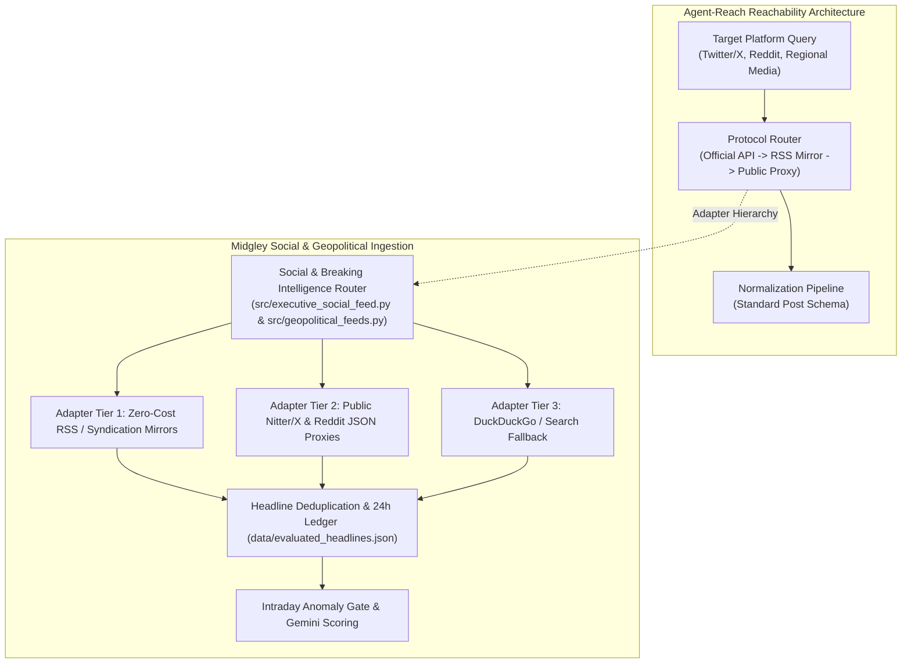

# Technical Evaluation & Integration Specification: Agent-Reach Resilient Web & Social Reachability

**Candidate Repository:** [Panniantong/Agent-Reach](https://github.com/Panniantong/Agent-Reach)  
**Evaluation Date:** September 2026  
**Target Milestone:** v2.0 "Hubbert"  
**Integration Focus:** `src/executive_social_feed.py`, `src/geopolitical_feeds.py`, `src/intraday_event_monitor.py`

---

## 1. Executive Summary & Repository Overview

[Agent-Reach](https://github.com/Panniantong/Agent-Reach) is an open-source reachability and content extraction layer engineered for AI agents. It specializes in retrieving unstructured discussions, breaking updates, and community sentiment across walled-garden and high-friction social platforms (Twitter/X, Reddit, TikTok, Bilibili, and regional news aggregators) by orchestrating multi-protocol fetch fallbacks (syndication feeds, public mirrors, search proxies, and headless session pools).

### Core Architectural Features of Agent-Reach:
1. **Multi-Protocol Search & Crawl Adapters**: Standardized adapter pattern wrapping multiple upstream transport protocols behind a uniform `fetch_posts(query, source, limit)` interface.
2. **Anti-Bot & Barrier Evasion**: Automated rotation of headers, proxy pools, and rate-limit backoffs.
3. **Structured Post Normalization**: Maps disparate raw platform payloads into a uniform metadata schema (author, timestamp, text, engagement metrics, media links).
4. **Resilient Failover Cascade**: Cascades from primary API endpoints down to RSS syndication, public web mirrors (Nitter/Teddit clones), and cached snapshots.

---

## 2. Fit Analysis for Midgley Energy Modeling

Midgley's qualitative news and executive commentary pipeline relies on `src/executive_social_feed.py`, `src/geopolitical_feeds.py`, and `src/intraday_event_monitor.py`. Currently, social and breaking feeds are susceptible to breaking upstream changes or API paywalls.

### Key Integration Points:
- **Executive Policy Commentary (`src/executive_social_feed.py`)**: Integrate Agent-Reach resilient fallback cascades to ensure continuous monitoring of Trump Truth Social / X posts, White House press releases, and DOE statements without downtime or API fees.
- **Geopolitical & Maritime Intelligence (`src/geopolitical_feeds.py`)**: Expand maritime chokepoint tracking (Bab el-Mandeb, Strait of Hormuz, Suez, Malacca) to monitor shipping broker chatter and naval incident reports.
- **24-Hour Deduplication**: Maintain Midgley's SHA-256 normalized title ledger to avoid duplicate LLM processing calls.

---

## 3. Zero-Cost & Production Safeguards

1. **Zero Paid API Requirement**: All adapters prioritize free public syndication feeds and search engines.
2. **Quota-Aware Polling**: 15-minute global polling cache to prevent upstream rate-limiting.
3. **Hard Sanitization & Privacy**: All scraped content is stripped of tracking parameters, scripts, and personal user metadata before entering LLM scoring contexts.

---

## 4. Implementation Specification

- **Module Paths:** `src/executive_social_feed.py`, `src/geopolitical_feeds.py`
- **Configuration:** `config/reach_adapters.json`
- **Telemetry Metric:** Tracked via `src/connector_telemetry.py` under `reachability_success_rate`.

---

## 5. Next Steps

- Tracked feature issue opened for implementation in Milestone v2.0.
