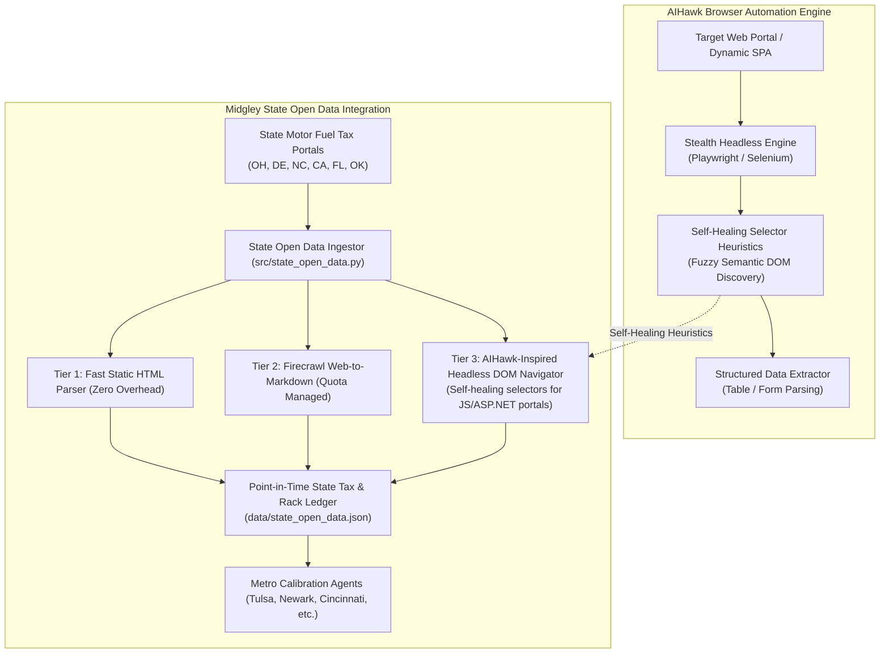

# Technical Evaluation & Integration Specification: AIHawk Autonomous DOM Traversal & State Fuel Portal Automation

**Candidate Repository:** [feder-cr/AIHawk](https://github.com/feder-cr/AIHawk)  
**Evaluation Date:** September 2026  
**Target Milestone:** v2.0 "Hubbert"  
**Integration Focus:** `src/state_open_data.py`, `src/firecrawl_scraper.py`, State Motor Fuel Tax & Rack Portals

---

## 1. Executive Summary & Repository Overview

[AIHawk](https://github.com/feder-cr/AIHawk) is an autonomous browser automation system designed for navigating high-complexity, dynamic DOM interfaces, complex multi-step web forms, dynamic single-page applications (SPAs), and anti-scraping protections with intelligent element discovery, session resilience, and self-healing selector heuristics.

### Core Architectural Features of AIHawk:
1. **Self-Healing DOM Selectors**: When hardcoded CSS/XPath selectors break due to portal redesigns, fuzzy semantic matching identifies target tables/inputs based on surrounding text, ARIA attributes, and DOM hierarchy.
2. **Stateful Session & Cookie Handling**: Manages complex session cookies, redirects, and dynamic JavaScript rendering states across multi-step navigation flows.
3. **Headless Anti-Detection**: Integrates stealth browser configurations (user-agent spoofing, webdriver flag masking, human-like interaction timing) to prevent IP blocking on public government portals.
4. **Structured Table & Form Extraction**: Converts complex paginated HTML tables and interactive dropdowns into clean tabular DataFrames/JSON.

---

## 2. Fit Analysis for Midgley Energy Modeling

Midgley's regional metro calibration agents depend on accurate, point-in-time state fuel tax rates, inspection fees, and rack price surveys across 6 metro areas (Oklahoma, Delaware, Ohio, Kentucky, North Carolina, California, and Florida).

Many state tax portals (e.g., Ohio Department of Taxation, North Carolina Department of Revenue, Delaware Division of Revenue) use complex ASP.NET/JavaScript forms, dynamic PDF viewer embeds, or periodically redesign their URL routes, causing static HTTP scrapers to fail.

### Key Target Portals for Midgley:
- **Ohio Department of Taxation (ODT)**: Motor Fuel Tax Rates ($0.385/gal) & cross-river Kentucky differentials.
- **Delaware Division of Revenue**: Motor Fuel & Special Fuel Tax Schedules ($0.230/gal).
- **North Carolina Department of Revenue (NCDOR)**: Variable Motor Fuels Tax rates (adjusted semi-annually).
- **California Department of Tax and Fee Administration (CDTFA)**: Excise Tax ($0.596/gal) and Cap-and-Trade / LCFS regulatory surcharges.
- **Florida Department of Revenue**: State Fuel Tax & Local Option Tax tables ($0.365/gal statewide average).

---

## 3. Zero-Cost & Operational Safeguards

1. **Lazy Execution / Headless on Demand**: Headless browser automation runs only when static HTML parsers and cached data fail or during scheduled monthly tax audits.
2. **Quota Preservation**: Protects Firecrawl API credits by resolving complex portals locally via headless Playwright.
3. **Point-in-Time Ledger**: All parsed rates are committed to `data/state_open_data.json` with effective date ranges, eliminating redundant web fetches.

---

## 4. Implementation Specification

- **Module Path:** `src/state_open_data.py`
- **Fallback Engine:** Local headless scraper using self-healing DOM heuristics.
- **Verification CLI:** `python -m src.state_open_data --check-all --force-refresh`

---

## 5. Next Steps

- Tracked feature issue opened for implementation in Milestone v2.0.
