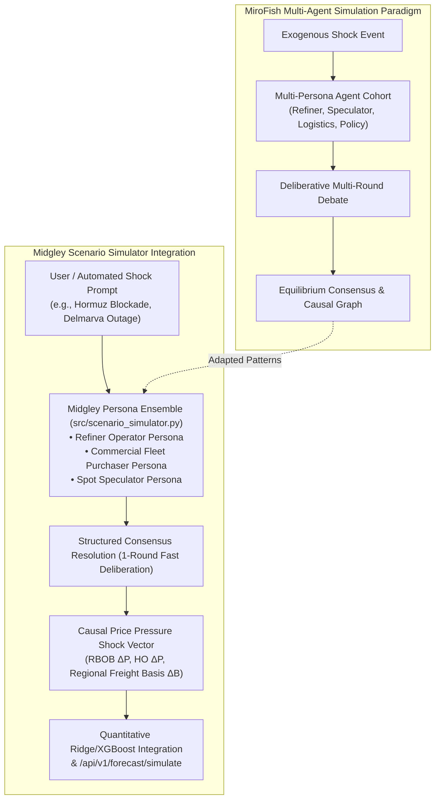

# Technical Evaluation & Integration Specification: MiroFish Multi-Agent Financial Simulation

**Candidate Repository:** [666ghj/MiroFish](https://github.com/666ghj/MiroFish)  
**Evaluation Date:** September 2026  
**Target Milestone:** v2.0 "Hubbert"  
**Integration Focus:** `src/scenario_simulator.py`, `src/event_analyzer.py`, Multi-Agent Consensus & Shock Propagation

---

## 1. Executive Summary & Repository Overview

[MiroFish](https://github.com/666ghj/MiroFish) is an open-source multi-agent financial market simulation framework. It models complex market ecosystems through heterogeneous LLM agent personas (e.g., retail traders, institutional funds, macro economists, central bank policymakers, and supply chain operators) that observe breaking news, debate market equilibrium, and execute simulated trades across a shared market graph.

### Core Architectural Features of MiroFish:
1. **Heterogeneous Persona Modeling**: Assigns specialized utility functions, risk tolerances, and domain priors to distinct agents.
2. **Multi-Agent Consensus & Debate Rounds**: Agents iterate over multiple deliberation rounds to resolve conflicting interpretations of exogenous shocks.
3. **Graph-Based Shock Propagation**: Models causal contagion through directed scenario graphs rather than point-estimate regressions.
4. **Behavioral Divergence Metrics**: Quantifies market sentiment dispersion and disagreement index across agent cohorts.

---

## 2. Fit Analysis for Midgley Energy Modeling

Midgley currently evaluates qualitative shocks via a single-pass extraction pipeline in `src/event_analyzer.py` and linear shock multipliers. While fast and token-efficient, single-pass extraction can miss multi-hop downstream effects (e.g., how a diesel crack spread spike impacts ethanol blending logistics or regional rack arbitrage).

### Proposed Persona Taxonomy for Fuel Markets:
- **Refiner Margin Operator (`Agent_Refiner`)**: Focuses on crude slate costs, 3-2-1 crack spreads, turnaround scheduling, and catalyst supply.
- **Logistics & Pipeline Arbitrageur (`Agent_Logistics`)**: Focuses on Colonial Pipeline batch cycles, barge freight rates (Ohio/Mississippi River drafts), and terminal rack storage inventory.
- **Commercial Fleet & Retail Buyer (`Agent_Consumer`)**: Focuses on price elasticity, demand destruction thresholds, and seasonal driving trends.
- **Macro Speculator & Regulatory Analyst (`Agent_Macro`)**: Focuses on Cboe OVX tail risks, OPEC+ policy compliance, and tariff/sanction impacts.

---

## 3. Zero-Cost & Token-Efficiency Adaptations

To operate within Midgley's zero-cost open-source deployment principles:
1. **Single-Round Deliberation (Fast Path)**: MiroFish defaults to multi-turn chatter. Midgley will adopt a single-round structured prompt contract where all 4 personas respond in a single batched JSON response to prevent token explosion.
2. **Deterministic Fallback Engine (Tier 3)**: When LLM keys are absent, the simulation defaults to a deterministic matrix of historical supply/demand elasticities (e.g., Tulsa PADD 2 refinery outage = $+0.18/\text{gal}$ regional basis, Colonial Pipeline disruption = $+0.25/\text{gal}$ PADD 1B/1C basis).
3. **Graph Provenance Export**: Generates Mermaid and JSON decision graph artifacts for the public web dashboard.

---

## 4. Implementation Specification

- **Module Path:** `src/scenario_simulator.py`
- **Exposed Endpoint:** `POST /api/v1/forecast/simulate`
- **CLI Tooling:** `python -m src.scenario_simulator --event "Gulf Coast Cat 4 Hurricane" --metro Tulsa_OK`

---

## 5. Next Steps

- Tracked feature issue opened for implementation in Milestone v2.0.
