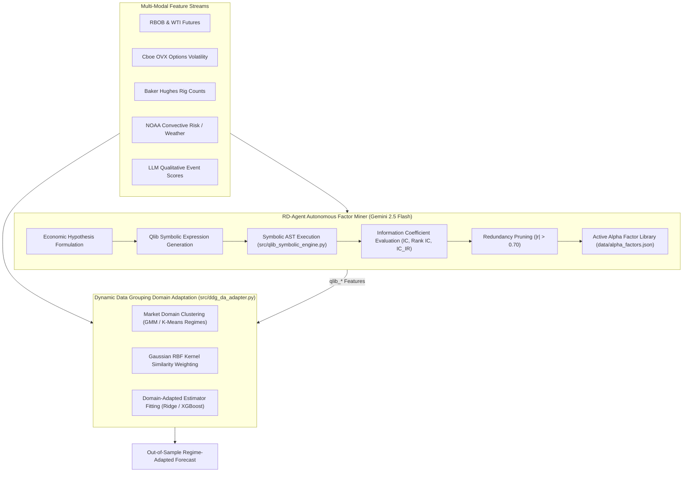

# Microsoft Qlib & RD-Agent Integration Guide

This document details the architecture, symbolic operators, LLM factor mining loop, and Dynamic Data Grouping Domain Adaptation (DDG-DA) framework ingested from Microsoft Research's **Qlib** quantitative platform ([microsoft/qlib](https://github.com/microsoft/qlib)) and **RD-Agent** ([microsoft/RD-Agent](https://github.com/microsoft/RD-Agent)) into the `midgley` quantitative fuel forecasting system (Issue #127, Milestone **v2.0 "Hubbert"**).

---

## Architectural Diagram



---

## 1. Qlib Symbolic Expression Engine (`src/qlib_symbolic_engine.py`)

The Qlib Symbolic Engine parses mathematical expressions into abstract syntax trees (AST) to evaluate rolling time-series features without lookahead bias.

### Supported Symbolic Operators

| Operator | Description | Formula / Mechanics |
| :--- | :--- | :--- |
| `Ref(x, d)` | Lagged observation by $d$ business days ($d \ge 0$) | $x_{t-d}$ |
| `Mean(x, d)` | Rolling arithmetic mean over $d$ days | $\frac{1}{d} \sum_{i=0}^{d-1} x_{t-i}$ |
| `Std(x, d)` | Rolling standard deviation over $d$ days | $\sqrt{\frac{1}{d} \sum (x_{t-i} - \mu)^2}$ |
| `Delta(x, d)` | Absolute change over $d$ days | $x_t - x_{t-d}$ |
| `Roc(x, d)` | Rate of change over $d$ days | $\frac{x_t - x_{t-d}}{\|x_{t-d}\| + \epsilon}$ |
| `ZScore(x, d)` | Normalized rolling Z-score | $\frac{x_t - \text{Mean}(x, d)}{\text{Std}(x, d) + \epsilon}$ |
| `Slope(x, d)` | Rolling OLS linear regression slope over $d$ days | $\text{OLS}(x, d).\text{slope}$ |
| `Corr(x, y, d)` | Rolling Pearson correlation between $x$ and $y$ | $\text{Corr}(x_{t:t-d}, y_{t:t-d})$ |
| `Rank(x, d)` | Percentile rank normalized between 0.0 and 1.0 | $\text{PercentileRank}(x_t \mid x_{t:t-d})$ |

---

## 2. Autonomous RD-Agent Factor Miner (`src/alpha_factor_miner.py`)

Inspired by Microsoft Research's RD-Agent, the factor miner executes an autonomous hypothesis-driven loop powered by **Gemini 2.5 Flash**:

1. **Hypothesis Formulation**: Gemini 2.5 Flash analyzes current feature taxonomies (volatility, refining margins, physical supply, weather, qualitative shocks) and proposes new non-linear factor hypotheses.
2. **Symbolic Factor Expression**: Hypotheses are converted into valid Qlib symbolic expression strings.
3. **Empirical IC Evaluation**:
   - **Pearson Information Coefficient ($IC$)**: $\text{Corr}(f_t, r_{t+h})$
   - **Spearman Rank IC ($Rank IC$)**: $\text{RankCorr}(f_t, r_{t+h})$
   - **IC Information Ratio ($IC_{IR}$)**: $\frac{\text{Mean}(IC)}{\text{Std}(IC)}$
4. **Redundancy Pruning**: Filters out candidate factors exhibiting correlation $|r| > 0.70$ with existing baseline features or previously selected alpha factors.
5. **Persistent Library**: Saves active high-IC factors ($|IC| \ge 0.03$) to `data/alpha_factors.json`.

---

## 3. Dynamic Data Grouping Domain Adaptation (`src/ddg_da_adapter.py`)

Fuel markets undergo non-stationary regime changes (OPEC emergency cuts, tariff shocks, hurricane disruptions). The DDG-DA module combats concept drift:

- **Dynamic Data Grouping (DDG)**: Segments historical feature vectors into $K$ market regimes (domains) using Gaussian Mixture Models (GMM).
- **Domain Adaptation (DA)**: Computes Gaussian RBF kernel similarity weights $w_i$ between historical training instances and the recent market window:
  $$w_i = \exp\left(-\frac{\|\mathbf{x}_i - \bar{\mathbf{x}}_{\text{recent}}\|^2}{2\sigma^2}\right)$$
- **Regime-Adapted Model Fitting**: Base estimators (Ridge, XGBoost, Random Forest) are trained using sample weights $w_i$, prioritizing historical periods with similar market dynamics.

---

## Usage Example

```python
from src.feature_engineering import create_feature_matrix, prepare_chronological_splits
from src.alpha_factor_miner import AlphaFactorMiner
from src.ddg_da_adapter import DDGDAAdapter

# 1. Mine Alpha Factors
miner = AlphaFactorMiner()
mined_factors = miner.mine_alpha_factors(
    df, target_col="gasoline_rbob", forecast_horizon=5, output_file="data/alpha_factors.json"
)

# 2. Build Feature Matrix with Active Qlib Factors
df_features = create_feature_matrix(market_df, events_df, forecast_horizon=5)
splits = prepare_chronological_splits(df_features, train_ratio=0.8, forecast_horizon=5)

# 3. Fit DDG-DA Adapted Model
ddg_da = DDGDAAdapter(n_domains=3)
predictions = ddg_da.fit_predict_adapted(
    splits["X_train_hybrid"], splits["y_train"], splits["X_test_hybrid"], model_type="ridge"
)
```
